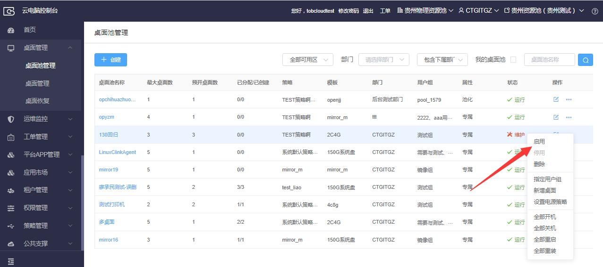
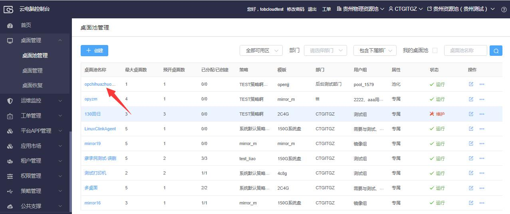
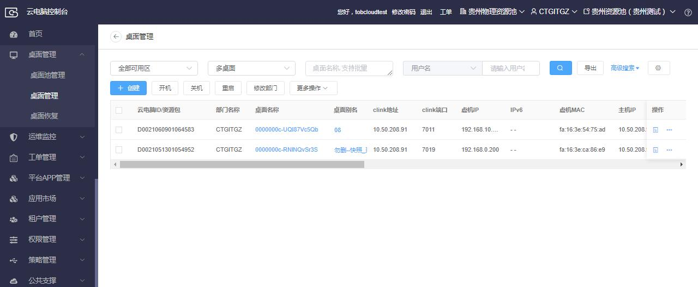
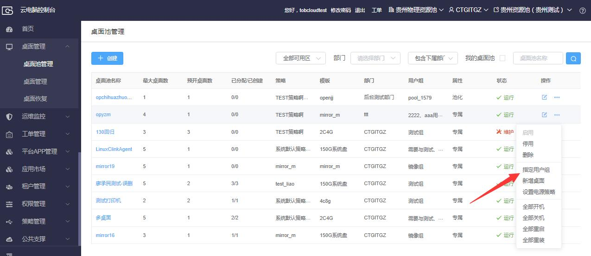
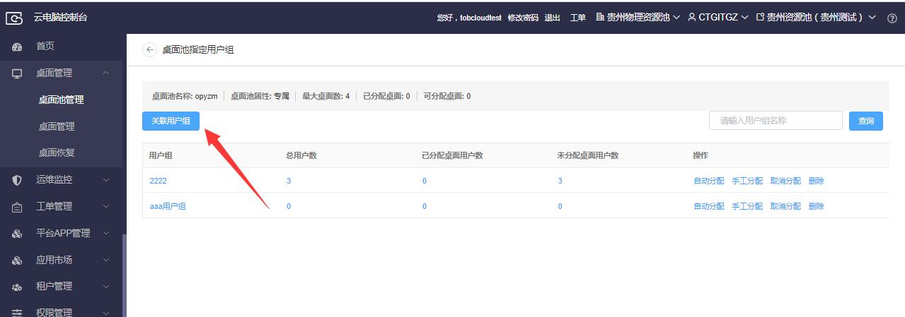
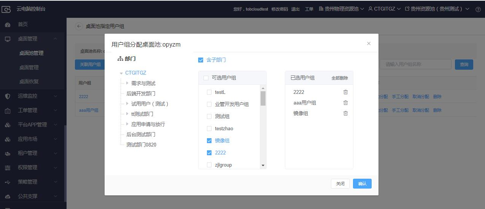
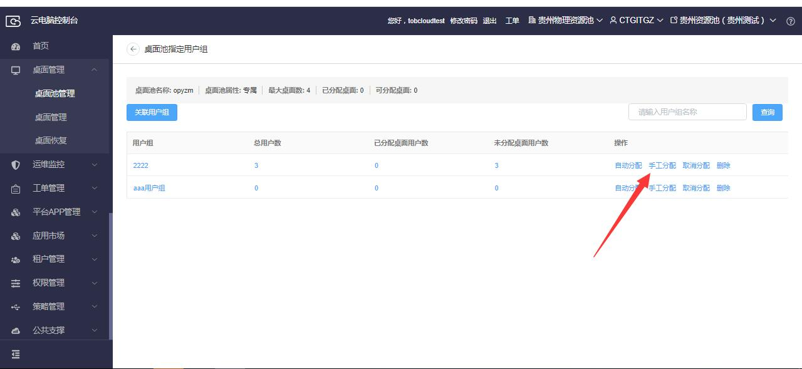

## 2.3  创建青牛云电脑

### 2.3.1 创建桌面池

【操作场景】通过桌面池可以进行云电脑的批量创建和统一管理。

 

【操作步骤】

步骤1 点击桌面管理菜单下的桌面池管理，进入桌面池管理页面。

步骤2 点击新增按钮，进入新增桌面池页面。

步骤3 选择可选区和类型、输入桌面池名称、桌面名称前缀（可选）、选择桌面池属性、最大桌面数、预开桌面数、部门、模板、镜像、策略，点击确定按钮，创建后桌面池状态为维护状态。

步骤4 启用桌面池，启用后桌面池状态为运行状态，会自动按预开桌面数生成桌面。

步骤5 点击桌面池名称，查看桌面池下的桌面。

### 2.3.2 专属桌面池分配桌面

【操作场景】将专属桌面池里的桌面分配给用户，使用户可访问云电脑。

 

【操作步骤】

步骤1 选择一个未关联用户组的专属桌面池，点击指定用户组，进入指定用户组页面。

步骤2 点击关联用户组，弹出关联用户组弹窗。

步骤3 选择用户组，点击确认。

步骤4点击手工分配，进入手工分配桌面页面。

步骤5选择需分配桌面用户，点击自动分配，弹出确认弹窗，确认后将自动给指定用户分配云电脑。

### 2.3.3 专属桌面池关联用户组

【操作场景】对专属桌面池关联用户组，使桌面可以分配给用户组下的用户。

【操作步骤】

步骤1选择一个未关联用户组的共享桌面池，点击指定用户组，进入指定用户组页面。

步骤2点击关联用户组，弹出关联用户组弹窗。

步骤3选择用户组，点击确认。

 

 
