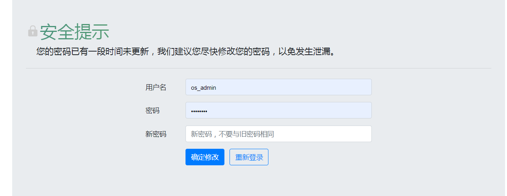

## 3.1  首页
首页展示租户下资源的统计，右上角会显示租户有多少资源池，但是首页统计不区分资源池，切换资源池统计数据不会发生变化。

### 3.1.1 桌面和用户统计

根本不同region切换不同的租户，每个租户首页显示的是所有租户合计在线用户数，用户总数，用户组数，在线桌面数，桌面总数，桌面池数。

### 3.1.2 桌面运行情况

展示总规划、已创建、已分配、闲置中的专属桌面和共享桌面的数量。

### 3.1.3 资源使用情况

展示vCPU、内存、系统盘存储、数据盘存储的已使用数量和总额。

### 3.1.4 桌面分类占比

展示根据专属桌面模板和共享桌面模板创建的桌面数量占比、桌面活跃度、用户活跃度。

### 3.1.5 密码定期修改

3个月或3个月以上没有修改过密码的账号，登录时自动跳转到修改密码页面，修改密码后才能登录

新密码必须与原密码不一致

新密必须校验强密码规则

### 3.1.6 首次登陆修改密码

新建的业务管理台账号，首次登陆需要修改密码

新密码必须与原密码不一致

新密必须校验强密码规则

