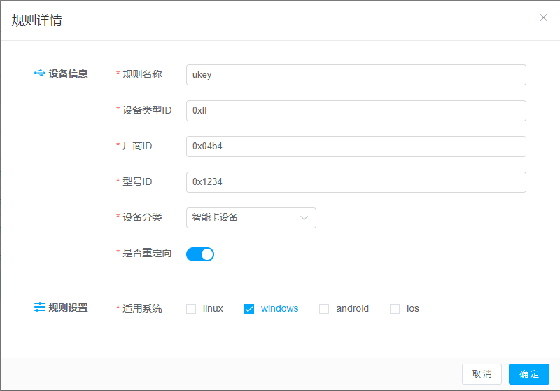

## 3.10  策略管理

### 3.10.1 基础策略管理

#### 3.10.1.1   新增基础策略

【操作场景】

​    手工自定义创建基础策略规则。

【操作步骤】

步骤1 进入【策略管理 -> 基础策略管理】列表。

步骤2 进入基础策略管理列表，点击列表右上角【新建】按钮。

步骤3 弹出【新增策略】界面，根据界面提示，设置对应参数并点击【提交】按钮。

 

说明:

1. USB重定向开启: 云电脑中插入图像设备、视屏设备、打印设备、存储设备、智能卡设备、其他设备，能识别并操作图像设备、视屏设备、打印设备、存储设备、智能卡设备、其他设备。
2. USB重定向关闭:云电脑中插入图像设备、视屏设备、打印设备、存储设备、智能卡设备、其他设备后，无法识别。
3. 剪切板开启: 如使用vnc viewer客户端连接云电脑，可在本地PC拷贝文字到云电脑。
4. 剪切板关闭: 如使用vnc viewer客户端连接云电脑，无法在本地PC拷贝文字到云电脑。
5. 外网访问开启: 云电脑可以上外网，也可以关联时间策略，指定时间段访问外网，默认是不限时。
6. 外网访问关闭: 云电脑不可上外网。
7. 桌面水印开启：云电脑的桌面和连接页面展示水印
8. 桌面水印关闭：云电脑的桌面和连接页面不展示水印
9. 禁止连接设备勾选PC（现仅有PC项）：不能登录PC客户端
10. 禁止连接设备不勾选勾选PC（现仅有PC项）：可以登录PC客户端
11. 桌面网络互通开启：两台虚机在vxlan网络模式下要求必须是同一个策略，同一个vpc，开启网络互通，两台虚机能网络互通；两台虚机在vlan网络模式下同一个基础策略情况下，都开启网络互通，两台虚机能网络互通。
12. 桌面网络互通关闭：不能网络互通
13. USB只读开启：不能拷贝云电脑内的文件到U盘中，仅能拷贝U盘的文件到云电脑
14. USB只读关闭：不影响U盘的拷贝
15. 非工作时段（异常登录提醒）开启：在选定的控制时间段登录云电脑，会有非工作时段登录提醒。
16. 非工作时段（异常登录提醒）关闭：登录云电脑没有异常登录提醒。
17. 文件重定向开启：云电脑能读取到本地机的硬盘、U盘登录存储设备，并能读写移动复制存储设备中的文件到云电脑中。
18. 文件重定向关闭：不能读取到本地机的存储设备。
19. 网络带宽策略: 对云电脑进行上传与下载网络带宽限制，也可自定义选择。
20. 网络黑名单策略: 指定某些URL地址，云电脑不能访问。

#### 3.10.1.2   查看基础策略

【操作场景】

​    查看基础策略信息。 

 

【操作步骤】

步骤1 进入【策略管理->基础策略管理】列表。

步骤2 进入基础策略管理列表，点击【详情】按钮，弹出【桌面策略详情】窗口。

 

​       说明: 只能查看策略信息，不可编辑。

#### 3.10.1.3   修改基础策略

【操作场景】

​    如果有云电脑在修改之前已使用该策略，修改策略后云电脑会对新规则生效，需谨慎操作。

【操作步骤】

步骤1 进入【策略管理->基础策略关联】列表。

步骤2 进入基础策略管理列表，选中需要编辑的策略，点击【编辑】按钮，弹出【编辑策略】窗口。

步骤3 在【编辑策略】窗口中，根据界面提示，修改对应参数并点击【提交】按钮。

 

#### 3.10.1.4   删除基础策略

【操作场景】

​    删除基础策略：如果基础策略未被桌面池绑定，可进行删除；当桌面策略被桌面池绑定，则不可删除基础策略。

【操作步骤】

步骤1 进入【策略管理 -> 基础策略管理】列表。

步骤2 进入基础策略管理列表，选中已被桌面池绑定策略，点击【删除】按钮。

步骤3 在弹出二次确认框，选择【确定】按钮。

步骤4 提示“删除桌面策略失败，当前桌面策略被桌面池绑定”。

 

说明: 根据不同用户角色创建的基础策略，只有创建者才能进行编辑与删除。

#### 3.10.1.4   策略-终端登录管理-自动关闭终端电源和自动断开连接

【操作场景】

​    在策略中设置终端自动关闭终端电源和自动断开连接

【操作步骤】

步骤1 进入【策略管理 -> 基础策略管理】列表。

步骤2 新建策略或编辑已有策略，进入策略编辑页面

步骤3 点击终端登录管理

步骤4 设置关闭终端电源和自动断开桌面连接

说明: 设置成功后，根据设置的时间，长时间未操作云电脑，会自动进行关闭电源或自动断开连接的操作

 

#### 3.10.1.5   策略-屏幕安全

【操作场景】

​    在策略中设置屏幕安全

【操作步骤】

步骤1 进入【策略管理 -> 基础策略管理】列表。

步骤2 新建策略或编辑已有策略，进入策略编辑页面

步骤3 点击屏幕安全

步骤4 重新连接桌面

#### 3.10.1.6   策略-音频模式

【操作场景】

​    在策略中设置音频模式

【操作步骤】

步骤1 进入【策略管理 -> 基础策略管理】列表。

步骤2 新建策略或编辑已有策略，进入策略编辑页面

步骤3 点击音频模式

步骤4 重新连接桌面

#### 3.10.1.7   策略-大规模集群资源池策略中去掉网络互通

【操作场景】

​    大规模集群资源池策略中去掉网络互通

【操作步骤】

步骤1 进入运营管理台，资源池-计算资源池中把资源池类型选择为“Tricircle集群”

步骤2 策略中的网络互通去除，不能被设置

步骤3 资源池-计算资源池中把资源池类型选择为“普通集群”

步骤4 策略中的网络互通展示并可以设置

### 3.10.2 时间策略管理

#### 3.10.2.1   新增时间策略

【操作场景】

​    手工自定义创建时间策略规则。

【操作步骤】

步骤1 进入【策略管理 -> 时间策略管理】。

步骤2 进入时间策略管理列表，左上角点击【新建】按钮。

步骤3 弹出新建时间策略窗口，根据界面提示，设置对应参数并点击【提交】按钮。

 

说明：时间策略对应【基础策略】开启外网访问规则，进行关联使用。

#### 3.10.2.2     查看时间策略

【操作场景】

​    查看时间策略规则信息。

【操作步骤】

步骤1 进入【策略管理->时间策略管理】。

步骤2 进入时间策略管理列表，点击【详情】按钮，弹出【时间策略详情】窗口。

​    

说明: 只能查看策略信息，不可编辑。

#### 3.10.2.3     修改时间策略

【操作场景】

​    查看修改时间策略信息。

【操作步骤】

步骤1 进入【策略管理->时间策略管理】。

步骤2 进入时间策略管理列表，选中需要编辑的策略，点击【编辑】按钮，弹出【编辑时间策略】窗口。

步骤3 在【编辑时间策略】窗口中，根据界面提示，修改对应参数并点击【提交】按钮。

 

说明: 如果有云电脑在修改之前已使用该时间策略，修改策略后云电脑会对新规则生效，请谨慎操作。

#### 3.10.2.4     删除时间策略

【操作场景】

​    当前时间策略被策略绑定，不可删除时间策略。

【操作步骤】

步骤1 进入【策略管理 -> 时间策略管理】。

步骤2 进入时间策略管理列表，选中已被策略绑定时间策略，点击【删除】按钮。

步骤3 在弹出二次确认框，选择【确定】按钮。

步骤4 提示“删除时间策略失败，当前时间策略被策略绑定”。

步骤5 如果时间策略未被策略绑定，可进行删除。

 

说明: 根据不同用户角色创建的时间策略，只有创建者才能进行编辑与删除。

### 3.10.3 电源策略查询

#### 3.10.3.1   电源策略查询

【操作场景】

​    查询对云电脑、桌面池设置的电源策略。可在桌面管理、桌面池管理页面对云电脑设置电源策略。

【操作步骤】

步骤1 进入【策略管理 -> 电源策略查询】

步骤2 可根据策略对象类型、对象ID、桌面名称查询电源策略。

### 3.10.4 设备规则管理

#### 3.10.4.1   设备规则查询

【操作场景】

​    查询设备规则信息

【操作步骤】

步骤1 进入【策略管理 -> 设备规则管理 -> 查询】

步骤2 可根据设备分类、规则名称查询设备规则。

#### 3.10.4.2   设备规则新建

【操作场景】

​    新建设备规则信息

【操作步骤】

步骤1 进入【策略管理 -> 设备规则管理 -> 新建】

步骤2 弹出新建窗口，填入相关信息（其中设备类型ID、厂商ID、型号ID建议使用usbDeview工具查询），点击确定

#### 3.10.4.2   设备规则编辑

【操作场景】

​    编辑设备规则信息

【操作步骤】

步骤1 进入【策略管理 -> 设备规则管理】

步骤2 选定待编辑的数据，点击对应的编辑按钮

步骤3 弹出编辑窗口，修改相关信息（其中设备类型ID、厂商ID、型号ID建议使用usbDeview工具查询），点击确定

#### 3.10.4.2   设备规则删除

【操作场景】

​    删除设备规则信息

【操作步骤】

步骤1 进入【策略管理 -> 设备规则管理】

步骤2 选定待删除的数据，点击对应的删除按钮

步骤3 确认删除

#### 3.10.4.3   设备规则审核

【操作场景】

​    设备规则审核

【操作步骤】

步骤1 进入【策略管理 -> 设备规则管理】

步骤2 点击规则审核

步骤3 选择待审核状态的规则，点击审核按钮，弹出审核弹窗，点击同意审核成功

#### 3.10.5.1 新建快照策略

【操作场景】

​    新建快照策略

【操作步骤】

步骤1 进入【策略管理 -> 快照备份策略 ->新建快照策略】

步骤2 切换到新建快照策略页面，输入策略名称，选择执行周期时长，点击提交按钮

(快照策略创建生效后，后台将在指定时间段内自动创建相关桌面的快照)

#### 3.10.5.2 编辑快照策略

【操作场景】

​    编辑快照策略

【操作步骤】

步骤1 进入【策略管理 -> 快照备份策略】

步骤2 选定待编辑的数据，点击对应的编辑按钮

步骤3 切换到快照策略编辑窗口，修改相关信息（策略名称、执行周期等），点击提交

#### 3.10.5.3 分配快照策略

【操作场景】

​    编辑快照策略

【操作步骤】

步骤1 进入【策略管理 -> 快照备份策略->分配】

步骤2 选定待分配的快照策略数据，点击对应的分配按钮

步骤3 切换到快照策略分配窗口，点击分配列表中左侧的勾选框，点击确定即可把快照策略分配给对应的桌面

#### 3.10.5.4   快照策略删除

【操作场景】

​    删除快照策略

【操作步骤】

步骤1 进入【策略管理 -> 快照备份策略】

步骤2 选定待删除的快照策略数据，点击对应的删除按钮

步骤3 确认删除

#### 3.10.5.5 新建备份策略

【操作场景】

​    新建备份策略

备份策略说明：

全量备份：根据选择的系统盘、数据盘存储内容进行全量备份。

增量备份：根据选择的系统盘、数据盘的最新备份作为参照进行增量备份，如果没有备份，系统则会先创建全量备份。

差异备份：根据选择的系统盘、数据盘的最新全量备份作为参照进行差异备份，如果没有全量备份，系统则会先创建全量备份。

【操作步骤】

步骤1 进入【策略管理 -> 快照备份策略】

步骤2 点击“备份策略”tab页 

步骤3 点击新建备份策略按钮切换到新建备份策略页面，输入策略名称、备份类型、备份内容、是否自动删除备份、周期时长等，点击提交按钮即可(备份内容：分系统盘和数据盘，策略生效后按此参数对相关桌面进行备份；是否自动删除备份：如果租户的备份数量已达到上限，当选择“是”时，系统将自动删除最早的备份，当选择“否”时，则停止自动创建备份)

备份策略创建生效后，后台将在指定时间段内自动创建相关桌面的备份

#### 3.10.5.6 编辑备份策略

【操作场景】

​    编辑备份策略

【操作步骤】

步骤1 进入【策略管理 -> 快照备份策略 -> 备份策略】

步骤2 选定待编辑的数据，点击对应的编辑按钮

步骤3 切换到快照策略编辑窗口，修改相关信息（策略名称、执行周期、备份内容、是否自动删除备份等），点击提交

#### 3.10.5.7 分配备份策略

【操作场景】

​    分配备份策略

【操作步骤】

步骤1 进入【策略管理 -> 快照备份策略->备份策略->分配】

步骤2 选定待分配的备份策略数据，点击对应的分配按钮

步骤3 切换到备份策略分配窗口，点击分配列表中左侧的勾选框，点击确定即可把备份策略分配给对应的桌面

#### 3.10.5.8   备份策略删除

【操作场景】

​    删除备份策略

【操作步骤】

步骤1 进入【策略管理 -> 快照备份策略->备份策略】

步骤2 选定待删除的备份策略数据，点击对应的删除按钮

步骤3 确认删除