## 3.11  公共支撑

### 3.11.1 镜像管理

#### 3.11.1.1   查看镜像信息

【操作场景】

​    镜像分为两种类型：公共镜像、自定义镜像。

1. 系统服务器上传的镜像为公共镜像。
2. 将云电脑生成快照，而后生成的镜像为自定义镜像。

【操作步骤】

步骤1 进入【公共支撑 -> 镜像管理】列表。

步骤2 进入镜像管理列表，点击【查看】按钮，弹出镜像详情窗口。

说明:镜像管理列表，默认展示全部正常状态的镜像，也可通过搜索条件自定义展示镜像列表。

 

#### 3.11.1.2   创建自定义镜像

【操作场景】

​    卓面关机状态下手动创建自定义镜像。

【操作步骤】

步骤1 进入【公共支撑 -> 自定义镜像】列表。

步骤2 进入自定义镜像列表，点击【创建自定义镜像】按钮，选择【已关机】按钮。

步骤3 选择对应的已经关机的卓面，输入镜像名称与描述项，点击【】按钮。

#### 3.11.1.3   删除镜像

【操作场景】

​    以下场景对镜像进行删除

1. 自定义镜像正常状态，可删除。
2. 自定义镜像停用状态，可删除。
3. 公共镜像正常状态，不可删除。
4. 公共镜像停用状态，不可删除。

【操作步骤】

步骤1 进入【公共支撑 -> 镜像管理】列表。

步骤2 进入镜像管理列表，选择自定义镜像，点击【更多】按钮，选择【删除】按钮。

步骤3 弹出二次确认框，选择【确定】按钮对镜像删除，不可恢复，请谨慎操作。

说明:如果选择公共镜像，点击【更多】按钮后，没有【删除】按钮。

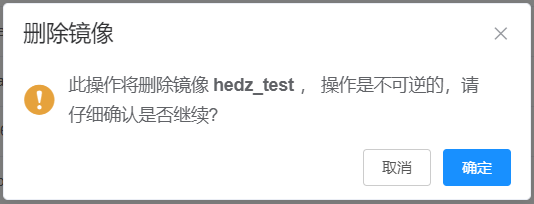

#### 3.11.1.4   共享镜像

【操作场景】

​    用户有一个自定义镜像

【操作步骤】

1、登录业务管理台，进入镜像管理页面，进入自定义镜像，选择一个自定义镜像，点击共享

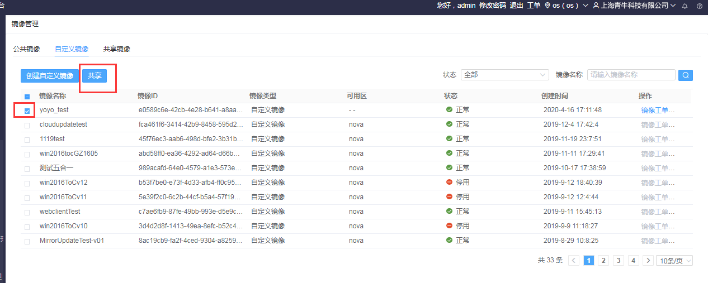

2、弹出共享弹窗，输入需要共享的租户的租户编码，点击添加，显示出租户，点击确认，共享完成

3、登录共享了镜像的租户，进入镜像管理，进入共享镜像，点击查看详情按钮

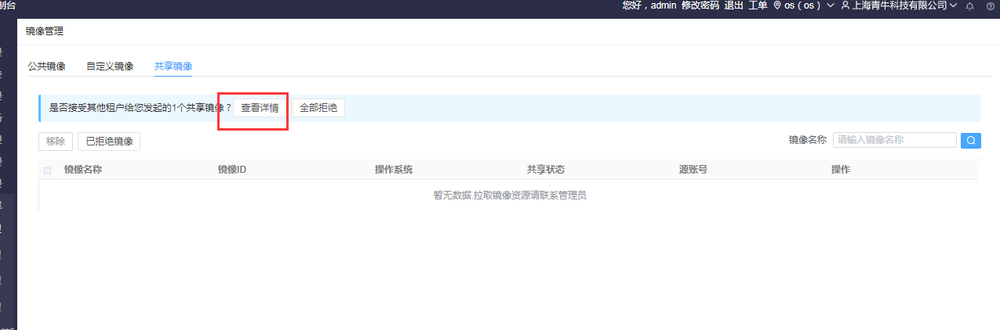

4、弹出共享镜像详情弹窗，勾选镜像，点击确认，接收成功

#### 3.11.1.5   自定义镜像检测

【操作场景】

​    创建自定义镜像增加桌面检测流程，增加自定义镜像创建桌面检测验证流程

【操作步骤】

1、登录业务管理台，点击公共支撑模块，点击进入镜像管理页面，点击进入自定义镜像页面

2、点击创建自定义镜像按钮，弹出创建自定义镜像页面，点击勾选一个已更新1.30版本的补丁桌面，点击确定按钮，弹出创建自定义镜像注意事项表，需要阅读下拉到底部才能继续，点击创建镜像

3、跳转到镜像检测页面

4、检测完成后提示，检测通过，创建自定义镜像

5、创建出一个状态为未验证的自定义镜像，点击更多，点击已完成验证，弹出提示框，提示使用镜像创建云电脑

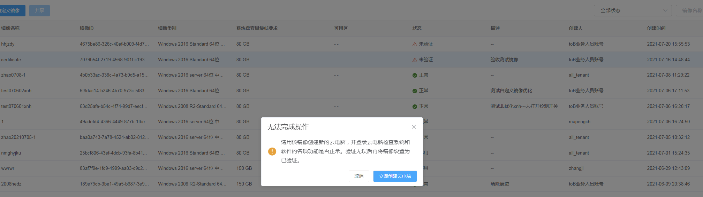

6、点击确定跳转到创建云电脑页面，选填完信息后，点击确定创建云电脑（最多创建5台），点击确定后跳转到自定义镜像页面

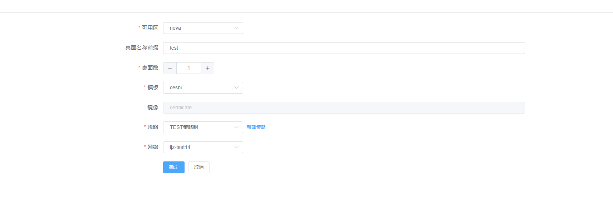

7、创建完桌面后，再次点击更多，点击已完成验证按钮，弹出确认操作按钮，是否确认将镜像设置为已验证状态，点击确定

8、弹出检测桌面页面，检测完成后，自定义镜像状态变成正常状态

### 3.11.2 快照管理

#### 3.11.2.1   查看工单详情

【操作场景】

​    查看工单详情信息。

【操作步骤】

步骤1 进入【公共支撑->快照管理】列表。

步骤2 进入快照管理列表，点击【查看工单】按钮，跳转到任务工单管理列表。

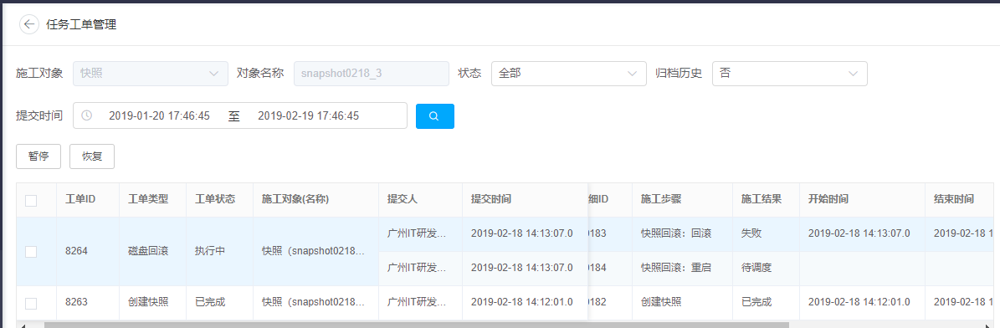

步骤3 可对任务工单执行施工结果状态为【失败】，进行【重新执行】操作。

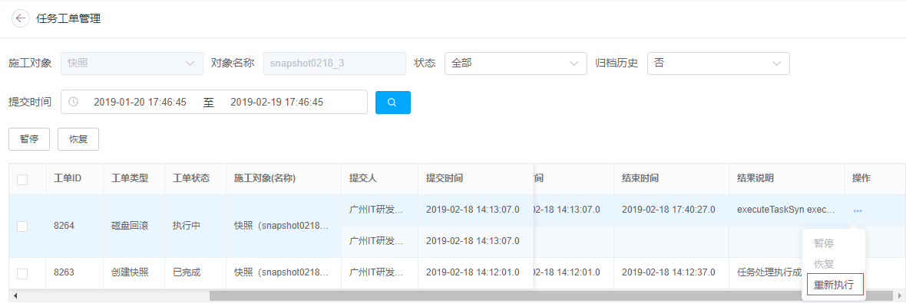

 

步骤4 可对任务工单执行结果为【待调度】，进行【暂停】操作。

 

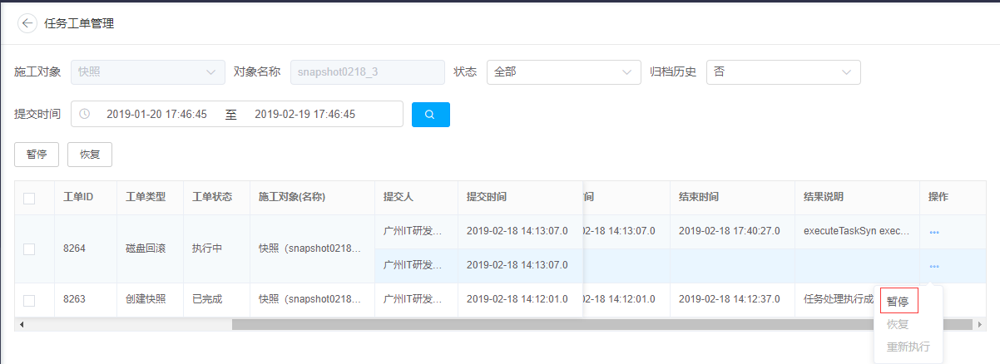

 

说明：

1. 任务工单施工结果为【已完成】，不可进行操作。
2. 施工结果为【已完成】，点击【暂停】按钮，提示“存在"已完成"的工单，不允许执行【批量暂停】操作”。
3. 施工结果为【已完成】，点击【恢复】按钮，提示“存在"已完成"的工单，不允许执行【批量恢复】操作”。

#### 3.11.2.2   查看快照详情

【操作场景】

通过桌面管理菜单对云电脑进行创建快照。桌面管理云电脑状态为离线运行、在线运行、关机，才能对云电脑进行创建快照。

 

【操作步骤】

步骤1 进入【公共支撑->快照管理】列表。

步骤2 进入快照管理列表，点击【查看】按钮，弹出【快照详情】窗口。

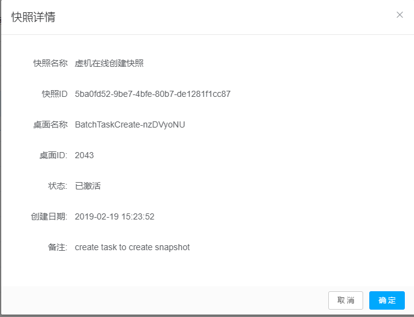

#### 3.11.2.4   删除快照

【操作场景】

​    对快照进行删除操作。

【操作步骤】

步骤1 进入【公共支撑 -> 快照管理】列表。

步骤2 进入快照管理列表，点击【更多】按钮，选择【删除快照】，弹出二次确认框。

步骤3 删除快照界面，选择【确定】按钮，对快照进行删除，不可恢复，请谨慎操作。

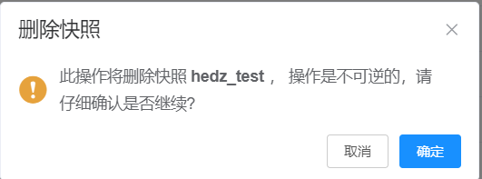

步骤4 快照成功创建镜像，点击【更多】按钮，选择【删除快照】，弹出二次确认框。

步骤5 删除快照界面，选择【确定】按钮，对快照进行删除，提示快照已生成镜像，不允许删除

### 3.11.3 模板管理

#### 3.11.3.1   新增模板

【操作场景】

​    自定义创建云电脑模板参数。  
模板不区分az，区分region。

【操作步骤】

步骤1 进入【公共支撑 -> 模板管理】列表

步骤2 进入快照管理列表，点击列表右上角【新建模板】按钮。

步骤3 在弹出【新增模板】窗口，根据界面字段提示，设置对应参数并点击【确认】按钮。

步骤4 创建桌面池时，可使用该模板进行创建云电脑

说明: 模板类型有专属与共享的区别：专属对应的所属部门，共享则所有部门都可以使用。

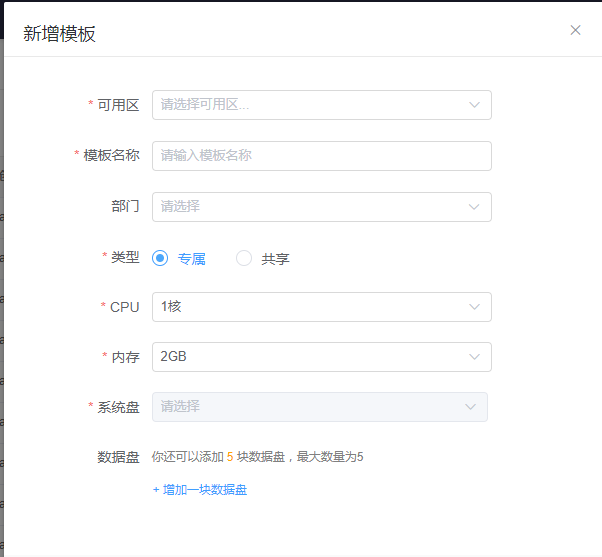

#### 3.11.3.2     修改模板

【操作场景】

​    手工自定义修改云电脑模板参数。针对已经存在的云电脑，修改模板后，需要重装后才能生效。

【操作步骤】

步骤1 进入【公共支撑 -> 模板管理】列表。

步骤2 进入快照管理列表，选中模板信息，点击【编辑】按钮。

步骤3 在弹出【编辑模板】窗口，根据界面字段提示，设置对应参数并点击【确认】按钮。

#### 3.11.3.3   删除模板

【操作场景】

​    对模板进行删除操作。

【操作步骤】

步骤1 进入【公共支撑 -> 模板管理】列表。

步骤2 进入快照管理列表，选中模板信息，点击【删除】按钮。

步骤3 弹出二次确认框，选择【确定】按钮，删除模板后不可恢复，请谨慎操作。

### 3.11.4 证书管理

   实现SSL证书管理。

#### 3.11.4.1   证书查询

【操作场景】

   查询证书

【操作步骤】

步骤1 进入【公共支撑 -> 证书管理】

步骤2 可根据证书编号、批次号、证书类型、证书状态查询

#### 3.11.4.2   证书创建

【操作场景】

​    新增证书

【操作步骤】

步骤1 进入【公共支撑 -> 证书管理】

步骤2 点击 “创建证书”按钮，弹出创建证书窗口

步骤3  填写生失效时间与证书数量(默认1)，点击“确定”按钮

#### 3.11.4.3   证书批量删除

【操作场景】

​    证书删除操作

【操作步骤】

步骤1 进入【公共支撑 -> 证书管理】

步骤2 选择需要删除的证书，点击 “批量删除”按钮

步骤3 弹出二次删除确认框

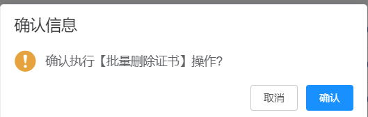

#### 3.11.4.4  证书批量启动

【操作场景】

证书启动操作

【操作步骤】

步骤1 进入【公共支撑 -> 证书管理】

步骤2 选择需要启动的证书，点击 “批量启动”按钮

步骤3 弹出二次启动确认框

#### 3.11.4.1   证书颁发信息

【操作场景】

 查看证书颁发详细信息

【操作步骤】

步骤1 进入【公共支撑 -> 证书管理】

步骤2 点击 “证书颁发信息”按钮，可查看证书颁发信息

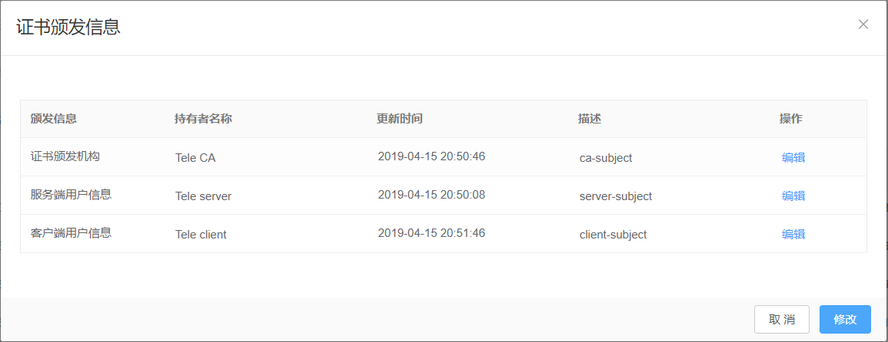

步骤3 可对证书颁发信息进行编辑，点击“编辑”按钮

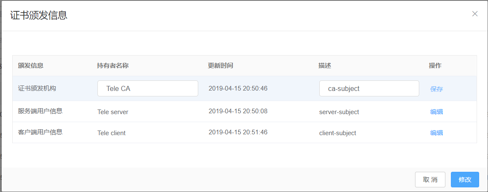

### 3.11.5 license管理
license是后端经过一定算法生成的字符串，定义了虚机的可使用时长，作为后续虚机使用的收费标准，license只有一个地方管理，就是路由平台。

#### 3.11.5.1 license查询

【操作场景】

 查询筛选license

【操作步骤】

步骤1 进入【公共支撑 -> licese管理】

步骤2 “根据 查询条件填写”点击“查询”按钮

#### 3.11.5.2 license导入

【操作场景】

  导入license

【操作步骤】

步骤1 进入【公共支撑 -> licese管理】

步骤2 点击“导入”按钮，进入导入license界面

步骤3 点击“模板下载”按钮，根据模板字段填写对应信息

步骤4 填写批次号名称，选择模板文件，点击“上传文件”按钮

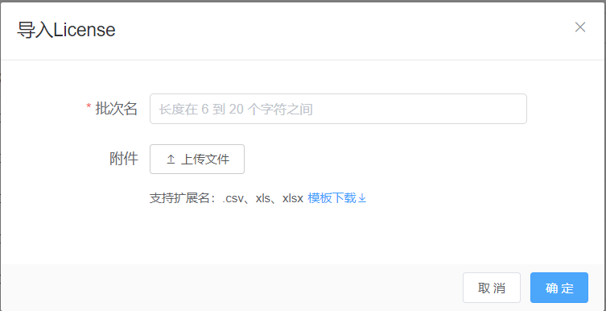

#### 3.11.5.3 license 删除

【操作场景】

删除闲置中状态的license

【操作步骤】

步骤1 进入【公共支撑 -> licese管理】

步骤2 筛选状态为“闲置中”状态的license

步骤3 勾选license数据，点击“删除”按钮

### 3.11.6 信令管理

#### 3.11.6.1 信令查询

【操作场景】

  查询信令

【操作步骤】

步骤1 进入【公共支撑 >信令管理】

步骤2 根据输入信令ID、桌面名称条件，点击“查询”按钮。

#### 3.11.6.2 新增信令

【操作场景】

   新增信令

【操作步骤】

步骤1 进入【公共支撑 >信令管理】

步骤2 选择命令类型，然后选择桌面池，选择要发送信令的桌面，输入命令，点击发送信令。

步骤3 删除选择好的桌面

### 3.11.7 告警日志

#### 3.11.7.1 告警日志查询

【操作场景】

用户在使用云电脑过程中，客户端或者底层服务检测到云电脑卡顿时，会上报卡顿信息，可在告警日志页面查询到云电脑上报的卡顿信息。

【操作步骤】

步骤1 进入【公共支撑 >告警日志】

步骤2 可以选择输入用户账号、或者业务名称、或者桌面名称、或者上报时间段，进行筛选查询

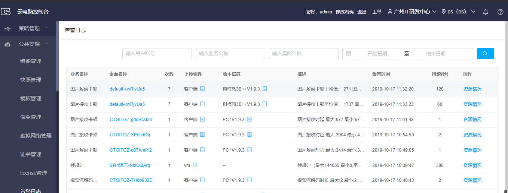

步骤3 可选择某一条告警信息，点击“资源情况”，查询该云电脑本身的资源情况，以及该云电脑所在物理机的资源情况和网络情况

### 3.11.8 桌面镜像管理

#### 3.11.8.1 镜像桌面创建

【操作场景】

  镜像桌面创建。

【操作步骤】

步骤1 进入【公共支撑 >镜像桌面管理】

步骤2 点击创建镜像桌面按钮，跳转到镜像桌面创建页面

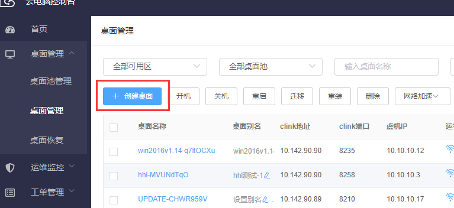

步骤3 点击输入桌面名称前缀、选择镜像、选择策略、选择网络，点击确认按钮生成镜像桌面

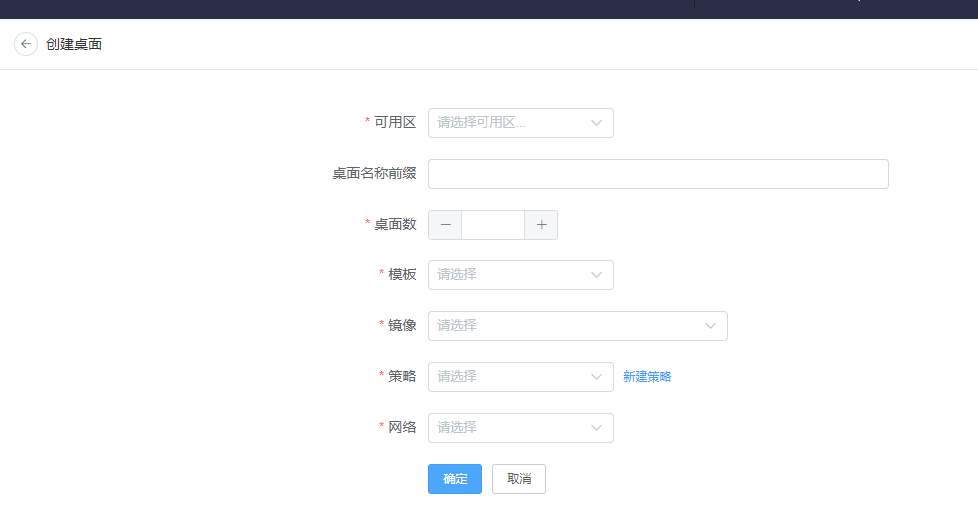

#### 3.11.8.2 镜像桌面查询

【操作场景】

  镜像桌面查询

【操作步骤】

步骤1 进入【公共支撑 >镜像桌面管理】

步骤2 在查询列表中输入查询条件，输入桌面名称、输入桌面ID、选择运行状态，点击查询

#### 3.11.8.3 镜像桌面分配

【操作场景】

 镜像桌面分配

【操作步骤】

步骤1 进入【公共支撑 >镜像桌面管理】

步骤2 选择一个已关机的桌面，点击该桌面的“...”按钮，点击手动分配桌面按钮，弹出手动分配桌面弹窗，选择用户组和用户，点击确定分配成功

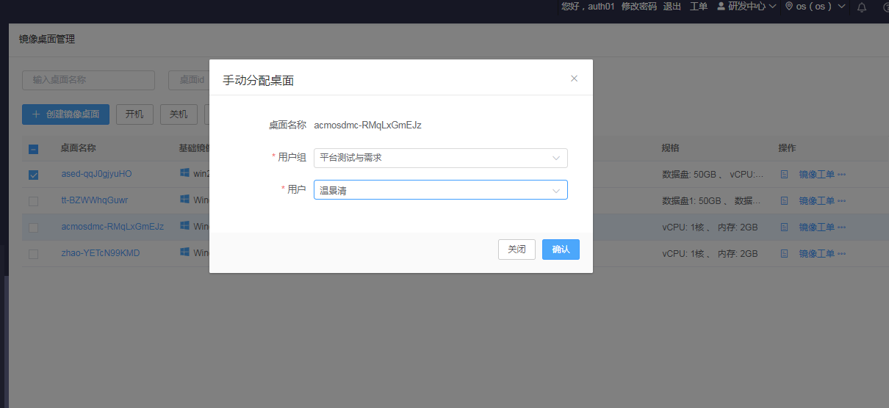

#### 3.11.8.4镜像桌面关机

【操作场景】

  镜像桌面关机

【操作步骤】

步骤1 进入【公共支撑 >镜像桌面管理】

步骤2 选择一个镜像桌面点击关机按钮

#### 3.11.8.5 镜像制作

【操作场景】

 镜像制作

【操作步骤】

步骤1 进入【公共支撑 >镜像桌面管理】

步骤2 选择一个已关机的桌面，点击该桌面的“...”按钮，点击镜像制作按钮，镜像开始制作并上传到运营管理平台的基础镜像中

#### 3.11.8.6 镜像工单

【操作场景】

 镜像工单

【操作步骤】

步骤1 进入【公共支撑 >镜像桌面管理】

步骤2 选择一个正在制作镜像的桌面，点击镜像工单按钮，跳转到镜像工单页面，查看镜像制作进度

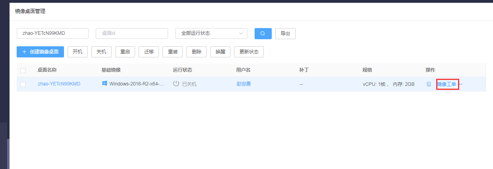

### 3.11.9 数据上报

#### 3.11.9.1 上报数据记录查询

【操作场景】

记录查询

步骤1 进入【公共支撑 >数据上报】

步骤2 选择文件类型、创建日期，点击查询按钮，列表显示要查看的数据上传记录状态

#### 3.11.9.2 重新执行

【操作场景】

重新执行

步骤1 进入【公共支撑 >数据上报】

步骤2 选择一个导出失败或者上传失败的记录，点击‘重新执行’按钮，后台自动执行该失败操作，成功后，状态显示为成功

#### 3.11.9.3 自定义执行

【操作场景】

自定义执行

步骤1 进入【公共支撑 >数据上报】

步骤2 点击页面的自定义执行按钮，打开自定义执行窗口，选择文件类型、创建日期，点击确定，对所选日期范围内的导出或上传失败的文件进行批量重新执行操作

