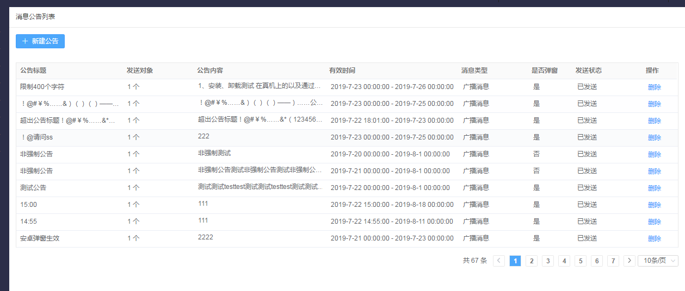
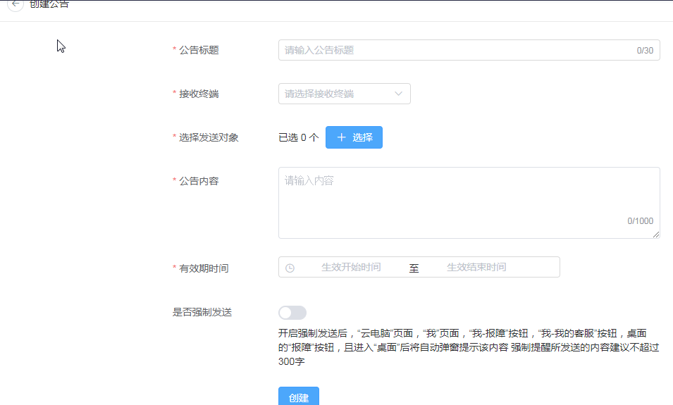
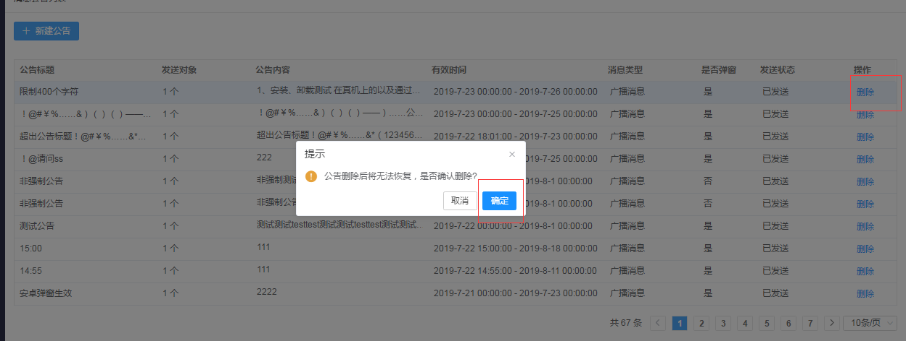

## 3.12 公告管理

### 3.12.1 公告管理

#### 3.12.1.1   查看消息公告列表

【操作场景】

   公告管理有两个功能：新建公告、删除公告。

1. 点击新建公告，弹出新建页面，填写公告内容，提交发布成功。
2. 选择要删除公告，点击删除按钮，点击确定，删除成功。

 

【操作步骤】

步骤1 进入【公告管理 】进入公告列表页面。

说明:公告管理列表，默认展示全部历史的公告。

 

#### 3.12.1.2   新建公告

【操作场景】

​    手动创建公告。

 

【操作步骤】

步骤1 进入【公告管理】进入公告列表页面。

步骤2 点击【新建公告】按钮

步骤3 跳转到新建公告页面，输入公告标题、选择接收终端、选择发送对象、输入公告内容、选择有效期时间、选择是否强制发送，点击【创建】按钮。

 

 

#### 3.12.1.3   删除公告

【操作场景】

​    以下场景对公告进行删除

1. 已过期公告，可删除。
2. 未过期失效，不可删除。

【操作步骤】

步骤1 进入【公告管理】进入公告列表页面。

步骤2 公告列表最右端，点击【删除】按钮。

步骤3 弹出二次确认框，选择【确定】按钮对公告删除，不可恢复，请谨慎操作。

