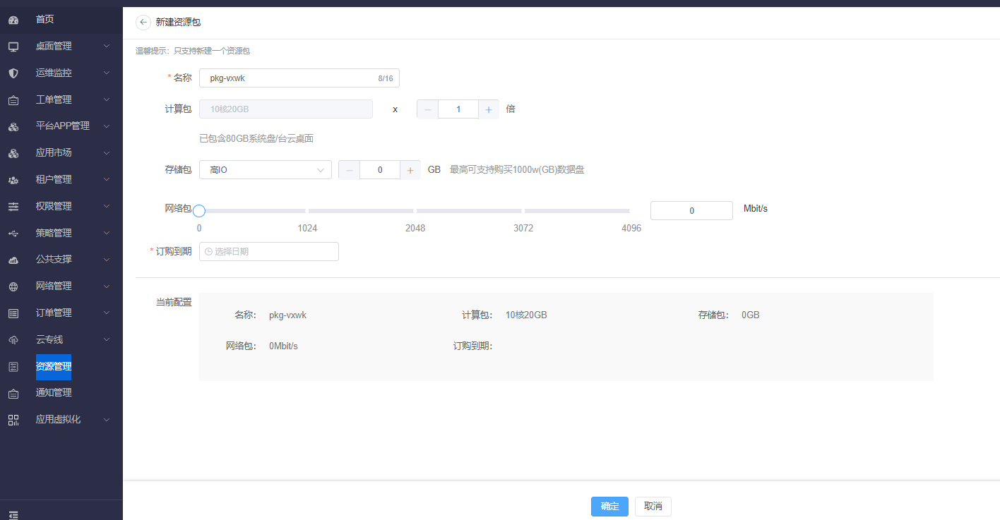
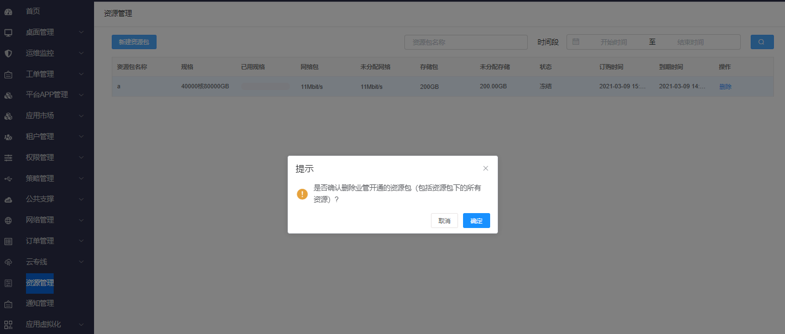
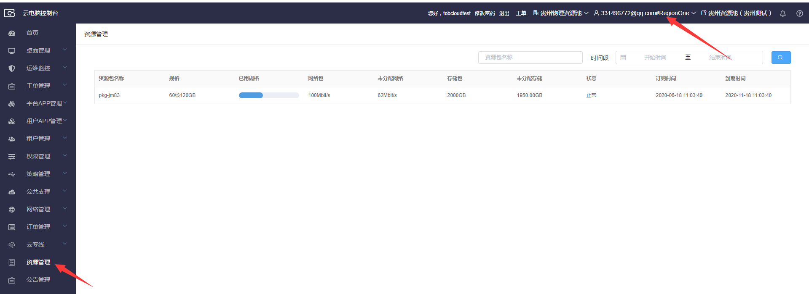

## 3.13  资源管理

### 3.13.1 资源管理

#### 3.13.1.1 新建资源包

【操作场景】

新建资源包

【操作步骤】

步骤1 进入【资源管理】列表

步骤2 点击新建资源包按钮进行新建资源包

#### 3.13.1.2 删除资源包

【操作场景】

新建资源包

【操作步骤】

步骤1 进入资源管理列表

步骤2 创建资源包

步骤3 操作--点击删除 

#### 3.13.1.3 查询资源包

【操作场景】

查询资源包

【操作步骤】

 步骤1：登录云电脑控制台后，点击左侧菜单中的“资源管理”。

步骤2：切换控制台上侧的租户为在toB控制台上已开通服务的租户；此时列表中可展示该租户下的资源包详情。

###### 

###### 

