## 3.15  网络管理

### 3.15.1 虚拟网络管理

​    通过虚拟网络实现隔离用户的网络环境。

#### 3.15.1.1   虚拟网络查询

【操作场景】

​    查询用户虚拟网络。

【操作步骤】

步骤1 进入【公共支撑 -> 虚拟网络管理】

步骤2 可根据部门、网络名称、状态、是否共享进行查询。

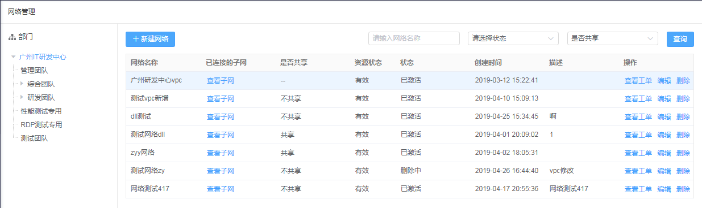

步骤3 选中某个网络，可查询该网络关联工单。


#### 3.15.1.2   虚拟网络新建

【操作场景】

​    新建网络和子网。

【操作步骤】

步骤1 进入【公共支撑 -> 虚拟网络管理】

步骤2 点击“新建网络按钮”  
注：网络创建分为vlan和vxlan模式，后端会自动判断是哪种模式


!

步骤3 vlan模式不需要填写子网信息，vxlan需要配置网络基本信息和子网，最多只能创建三个子网。

注：vlan没有分布式和集中式网络模式选择，vxlan分为集中式和分布式网络，如果选择集中式，该vpc需要开通宽带才能上外网，分布式不需要宽带即可上外网

#### 3.15.1.3   虚拟网络修改

【操作场景】

​    修改虚拟网络网络配置。

【操作步骤】

步骤1 进入【公共支撑 -> 虚拟网络管理】

步骤2 选中需要修改的网络，点击“编辑”


### 3.15.1.4 新增ipv6虚拟网络

【操作场景】

```
新建网络和子网。
```

【操作步骤】

步骤1 运管先打开ipv6开关

步骤2 创建双栈(ipv4和ipv6) vpc，勾选子网的ipv6开关；勾选后每个ipv4子网都会生成一个与之相对应的ipv6子网(每个V6子网的网段不相同)


### 3.15.1.5   编辑--存量ipv4虚拟网络编辑成双栈vpc

【操作场景】

```
编辑网络和子网。	
```

【操作步骤】

步骤1 运管打开ipv6开关

步骤2 选择存量ipv4虚拟网络编辑成双栈vpc


### 3.15.1.6   编辑--修改vpc和子网名称

【操作场景】

```
修改vpc和子网名称。	
```

【操作步骤】

步骤1 打开业管，进入虚拟网络管理模块

步骤2 选择存量vpc进行修改名称

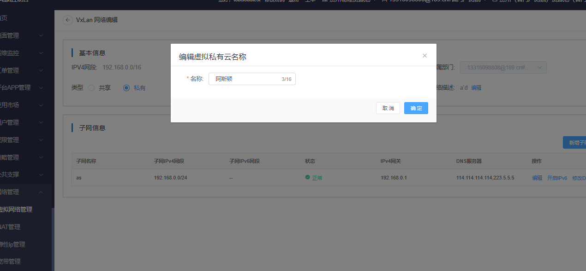

### 3.15.1.7   新建--开启组播功能

【操作场景】

```
新建--开启组播功能
```

【操作步骤】

步骤1 登录业务管理台，点击进入网络管理模块，点击进入创建vpc

步骤2 新建vpc开启组播功能

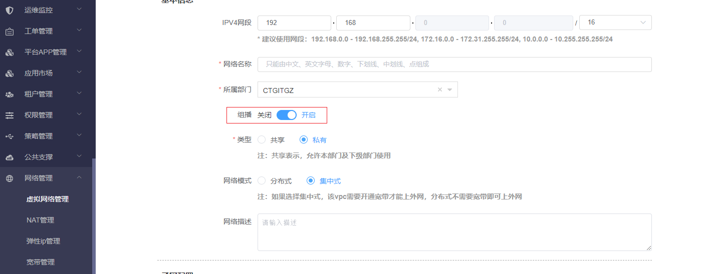

### 3.15.1.8   编辑--开启组播功能

【操作场景】

```
编辑--开启组播功能
```

【操作步骤】

步骤1 登录业务管理台，点击进入网络管理模块，点击进入编辑vpc

步骤2 编辑vpc开启组播功能


### 3.15.1.9   VLAN支持修改DNS

【操作场景】

```
VLAN支持修改DNS
```

【操作步骤】

步骤1 登录业务管理台，点击进入网络管理模块，点击进入虚拟网络管理页面，选择一个VLAN的vpc

步骤2 点击编辑按钮，跳转到vlan网络编辑页面，在子网DNS服务器中点击修改DNS，输入新的DNS，点击确定，保存成功，并点击提交，修改DNS成功

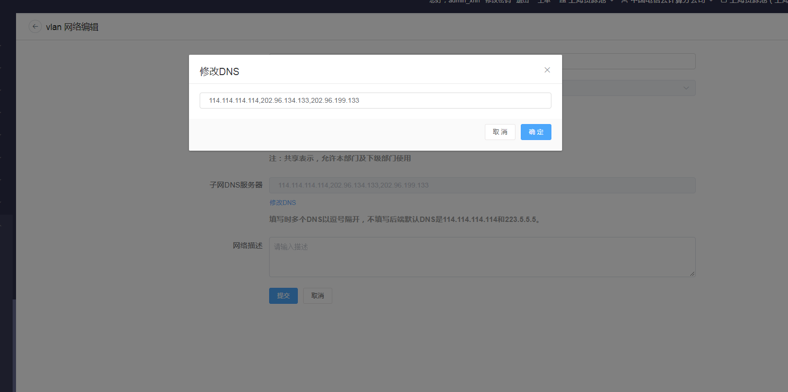


### 3.15.1.10   VPC支持增加路由

【操作场景】

```
VPC支持配置路由
```

【操作步骤】

步骤1 进入【公共支撑 -> 虚拟网络管理】

步骤2 选中需要修改的网络，点击“编辑”

步骤3  点击“路由表”tab页

步骤4 点击“添加路由信息”按钮

步骤5 在弹出添加路由输入框中，选择源地址，输入目的地址和下一跳地址，点击确定即可


### 3.15.1.11   VPC支持删除路由

【操作场景】

```
VPC支持配置路由
```

【操作步骤】

步骤1 进入【公共支撑 -> 虚拟网络管理】

步骤2 选中需要修改的网络，点击“编辑”

步骤3  点击“路由表”tab页

步骤4 在路由记录中，选择需要删除的路由，点击“删除”按钮即可


#### 3.15.2.1 创建NAT网关

【操作场景】

```
创建NAT网关
```

【操作步骤】

步骤1 登录业务管理台，点击进入网络管理模块，点击进入NAT管理页面

步骤2 点击创建NAT网关按钮

步骤3 输入名称、选择虚拟私有云、选择子网、选择规格，点击立即申请


#### 3.15.2.2 NAT网关配置SNAT规则

【操作场景】

```
NAT网关配置SNAT规则
```

【操作步骤】

步骤1 登录业务管理台，点击进入网络管理模块，点击进入NAT管理页面

步骤2 点击配置规则按钮

步骤3 点击添加SNAT规则，选择子网，勾选弹性IP，点击确定

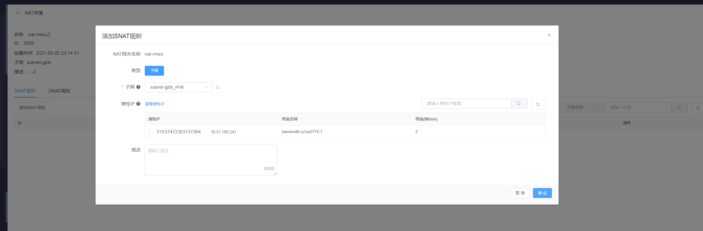

#### 3.15.2.3 NAT网关配置DNAT规则

【操作场景】

```
NAT网关配置DNAT规则
```

【操作步骤】

步骤1 登录业务管理台，点击进入网络管理模块，点击进入NAT管理页面

步骤2 点击配置规则按钮

步骤3 点击DNAT规则，点击添加DNAT规则，选择端口类型，选择支持协议，选择弹性IP，输入公网端口，输入私网端口，查看可用云电脑IP，然后填充私网IP，点击确定


#### 3.15.2.4 删除NAT网关

【操作场景】

```
删除NAT网关
```

【操作步骤】

步骤1 登录业务管理台，点击进入网络管理模块，点击进入NAT管理页面

步骤2 点击删除按钮，点击确定


#### 3.15.2.5 NAT网关SNAT连接数监控

【操作场景】

```
NAT网关SNAT连接数监控
```

【操作步骤】

步骤1 登录业务管理台，点击进入网络管理模块，点击进入NAT管理页面

步骤2 点击更多，点击查看监控按钮


#### 3.15.2.6 NAT网关增加云专线SNAT规则

【操作场景】

```
NAT网关增加云专线SNAT规则
```

【操作步骤】

步骤1 登录业务管理台，点击进入网络管理模块，点击进入NAT管理页面

步骤2 点击配置规则，进入NAT网关配置规则页面，点击添加SNAT规则

步骤3 进入添加SNAT规则页面，点击云专线，输入专线vpc客户侧网段，然后选择一个弹性IP，点击确定，云专线SNAT规则配置成功

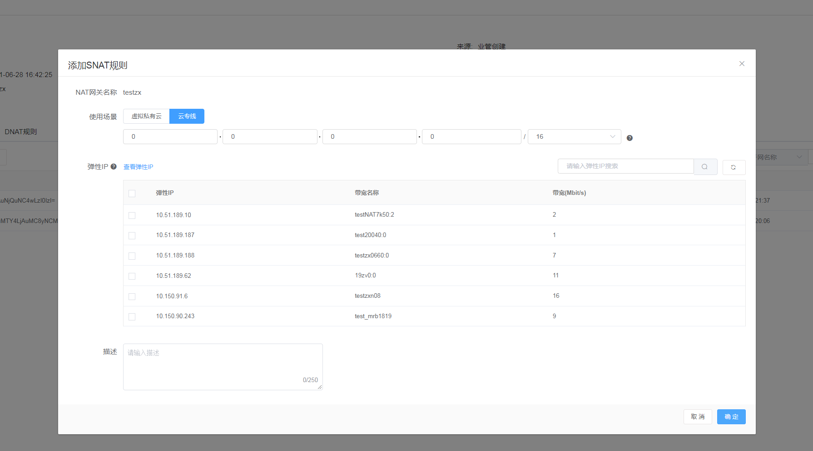

### 3.15.3 弹性IP管理

#### 3.15.3.1 新建弹性IP

【操作场景】

```
创建弹性IP
```

【操作步骤】

步骤1 登录业务管理台，点击进入网络管理模块，点击进入弹性ip管理页面

步骤2 点击云电脑弹性IP，点击开通弹性ip

步骤3 弹出创建弹窗，选择带宽大小，输入带宽名称，选择购买数量，点击确定，开通成功


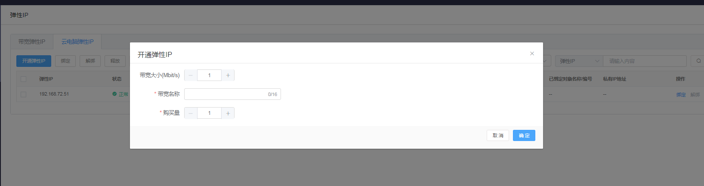

#### 3.15.3.2 绑定弹性IP

【操作场景】

```
绑定弹性IP
```

【操作步骤】

步骤1 登录业务管理台，点击进入网络管理模块，点击进入弹性ip管理页面

步骤2 点击云电脑弹性IP，勾选多个弹性ip，点击绑定按钮，选择对应的桌面数，点击确定绑定成功 

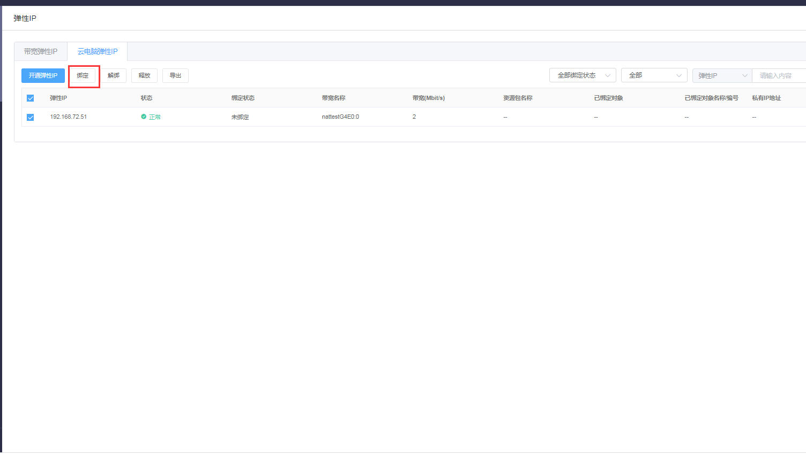

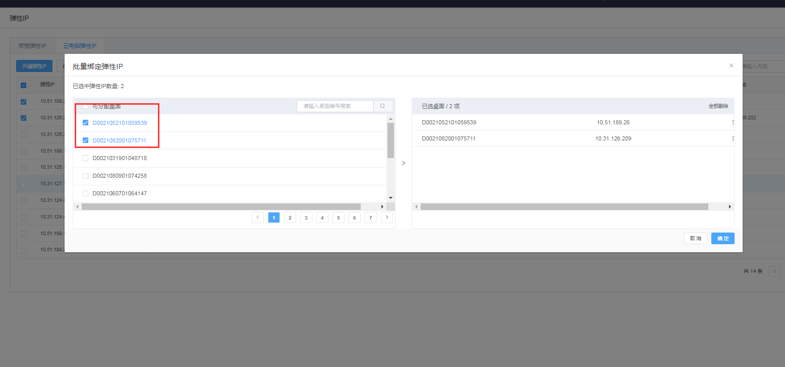

步骤3 选择一个弹性ip，点击绑定按钮，选择一个桌面，点击确定绑定成功 


#### 3.15.3.3 解绑弹性ip

【操作场景】

```
解绑弹性ip
```

【操作步骤】

步骤1 登录业务管理台，点击进入网络管理模块，点击进入弹性ip管理页面

步骤2 点击云电脑弹性IP，勾选多个弹性ip，点击解绑按钮，弹出解绑弹窗，点击确定，解绑成功


步骤3 选择一个弹性ip，点击解绑按钮，弹出解绑弹窗，点击确定，解绑成功

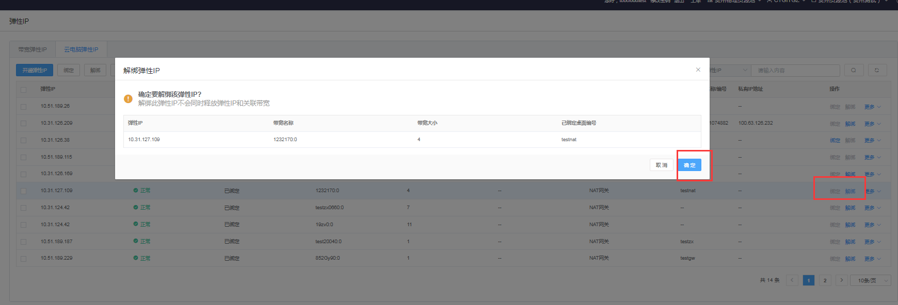

#### 3.15.3.4 释放弹性ip

【操作场景】

```
释放ip查询
```

【操作步骤】

步骤1 登录业务管理台，点击进入网络管理模块，点击进入弹性ip管理页面

步骤2 点击云电脑弹性IP，勾选多个弹性ip，点击释放按钮，弹出释放弹窗，点击确定，删除成功

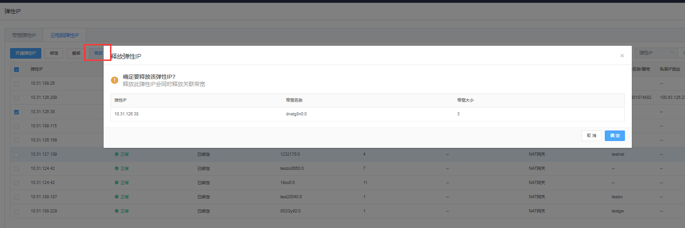


步骤3 点击云电脑弹性IP，选择一个弹性ip，点击更多，点击释放，弹出释放弹窗，点击确定，删除成功

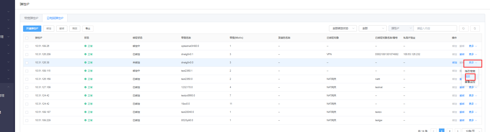

#### 3.15.3.5 修改带宽

【操作场景】

```
修改带宽
```

【操作步骤】

步骤1 登录业务管理台，点击进入网络管理模块，点击进入弹性ip管理页面

步骤2 点击云电脑弹性IP，选择一个弹性ip，点击更多，点击修改带宽，弹出修改带宽弹窗，修改带宽后，点击确定，修改成功

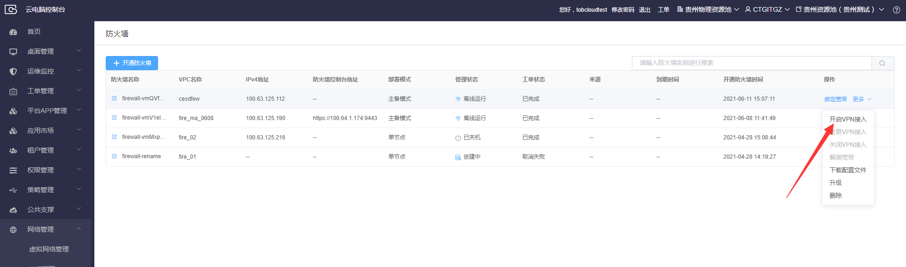

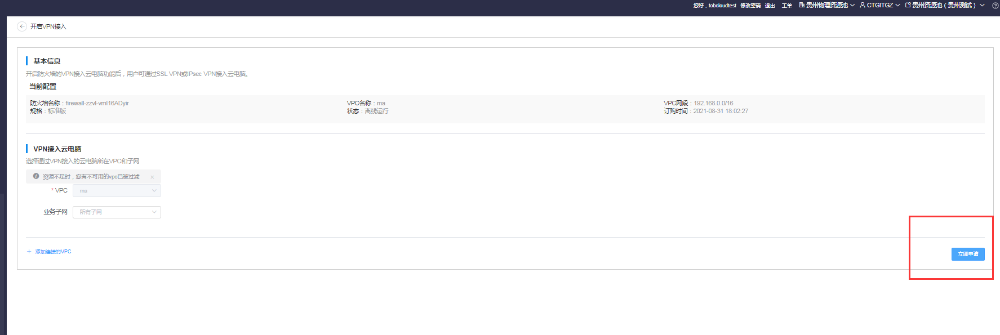

#### 3.15.3.6 弹性ip查看功能

【操作场景】

```
弹性ip查询
```

【操作步骤】

步骤1 登录业务管理台，点击进入网络管理模块，点击进入弹性ip管理页面

步骤2 点击带宽弹性ip中查询项选择弹性ip、带宽名称、桌面编号、私有IP、资源包名称，输入查询字段点击搜索按钮

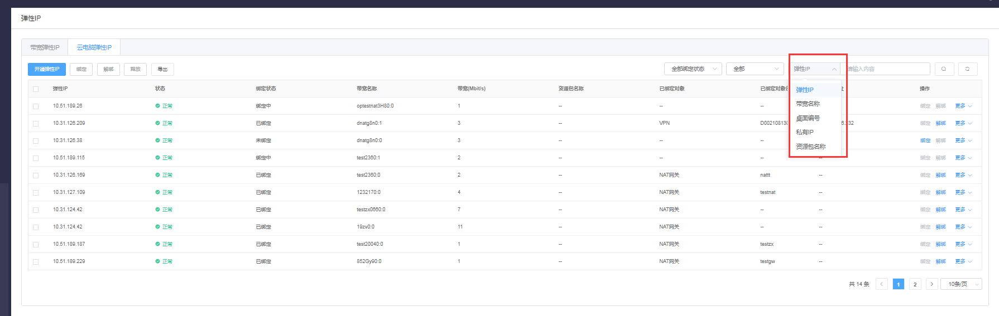

步骤3 点击云电脑弹性ip中查询项选择绑定状态、状态、输入弹性ip，点击查询

#### 3.15.3.7  实际使用带宽监控

【操作步骤】

步骤1 登录业务管理台，点击进入网络管理模块，点击进入弹性ip管理页面

步骤2 点击上方到云电脑弹性IP页

步骤3 选择需要查询的弹性IP，点击右侧的“查看监控”按钮

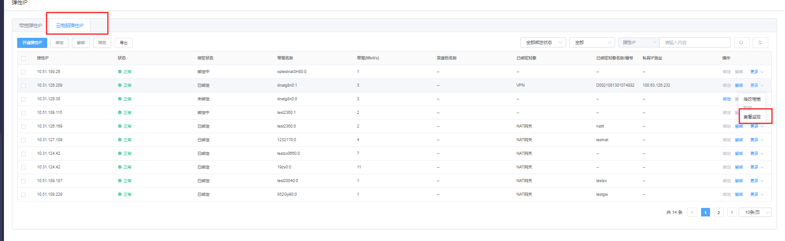


### 3.15.4 带宽管理

管理虚拟网络的带宽功能

#### 3.15.4.1 开通带宽

【操作场景】

```
开通带宽
```

【操作步骤】

步骤1 登录业务管理台，点击进入网络管理模块，点击进入带宽管理页面

步骤2 点击开通带宽按钮，跳转到带宽创建页面，输入带宽名称，选择带宽大小，选择vpc、业务子网，点击立即申请，带宽创建成功


#### 3.15.4.2 带宽变更

【操作场景】

```
修改带宽大小
```

【操作步骤】

步骤1 登录业务管理台，点击进入网络管理模块，点击进入带宽管理页面

步骤2 选择一个带宽点击变更按钮，弹出变更带宽弹窗，选择带宽大小，点击确定，修改成功


#### 3.15.4.3 带宽切换vpc

【操作场景】

```
带宽切换vpc
```

【操作步骤】

步骤1 登录业务管理台，点击进入网络管理模块，点击进入带宽管理页面

步骤2 选择一个带宽点击vpc设置按钮，弹出切换vpc弹窗，选择一个vpc和业务子网，点击确定，修改vpc成功


#### 3.15.4.4  带宽子网设置

【操作场景】

```
变更子网
```

【操作步骤】

步骤1 登录业务管理台，点击进入网络管理模块，点击进入带宽管理页面

步骤2 选择一个带宽点击子网设置按钮，弹出子网设置弹窗，勾选子网或去除勾选子网，点击确定，变更子网成功

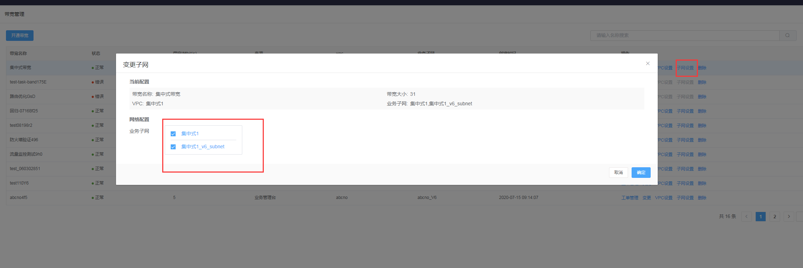

#### 3.15.4.5  实际使用带宽监控

【操作步骤】

步骤1 登录业务管理台，点击进入网络管理模块，点击进入带宽管理页面

步骤2 选择一个带宽(其下有实际使用过带宽上外网的虚机在运行)，点击“更多”下的“查看监控”按钮，即可查看该带宽的实际使用流量情况

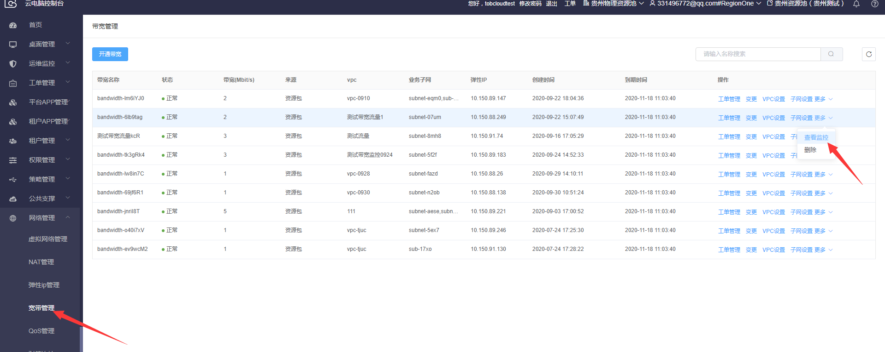


### 3.15.5 QoS管理

#### 3.15.5.1 新建qos规则

【操作场景】

```
新建qos规则
```

【操作步骤】

步骤1 登录业务管理台，点击进入网络管理模块，点击进入QoS管理页面

步骤2 点击新建按钮，点击添加，展示出带宽控制列，输入带宽速度限制，点击确定，QoS规则创建成功


#### 3.15.5.2 修改qos规则

【操作场景】

```
修改qos规则
```

【操作步骤】

步骤1 登录业务管理台，点击进入网络管理模块，点击进入QoS管理页面

步骤2 选择一个qos规则点击修改按钮，修改速度限制，点击确定，qos规则成功


### 3.15.6 对等连接

#### 3.15.6.1 新建对等连接

【操作场景】

```
实现对等连接
```

【前置条件】

1 新建两个vpc且用这两个vpc创建桌面

【操作步骤】

步骤1 登录业务管理台，点击进入网络管理模块，点击进入对等连接管理页面

步骤2 点击对等连接，输入正确参数，选择要建立连接的连接两个vpc，点击创建成功

步骤3 点击对等连接名称进入对等连接详情，再本端路由添加对端路由，再对端路由添加本端路由

步骤4 进入两个vpc的桌面，关闭防火墙后，两个桌面互ping成功

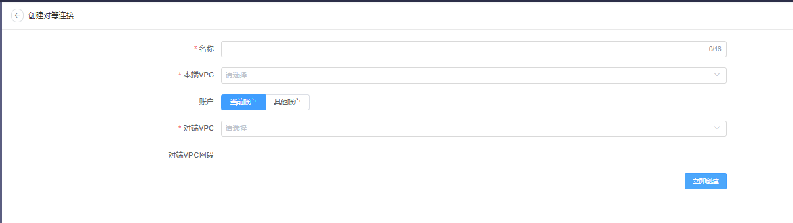

 【注意事项】若跨租户实现对等连接或者不同策略实现连接，则需要再桌面添加对端的安全组

#### 3.15.6.2 修改对等连接

【操作场景】

```
修改对等连接
```

【前置条件】

1.已经实现对等连接

【操作步骤】

步骤1 登录业务管理台，点击进入网络管理模块，点击进入对等连接管理页面

步骤2 点击操作--修改，可进行修改对等连接名称

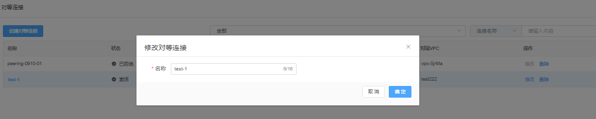

#### 3.15.6.3 删除对等连接

【操作场景】

```
删除对等连接
```

【前置条件】

1.已经实现对等连接

【操作步骤】

步骤1 登录业务管理台，点击进入网络管理模块，点击进入对等连接管理页面

步骤2 点击操作--删除，可进行删除对等连接

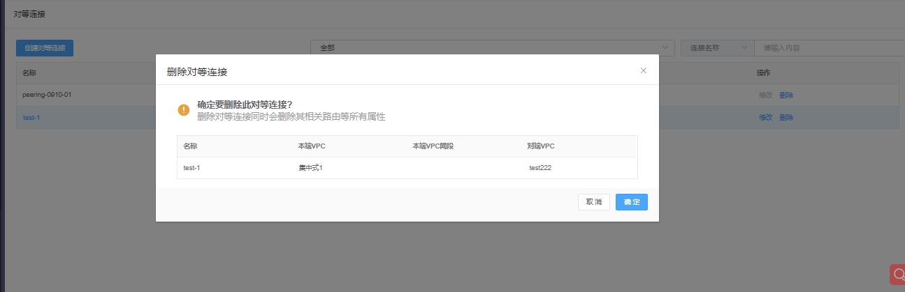

### 3.15.7 云防火墙

#### 3.15.7.1 新建防火墙

【操作场景】

```
新建防火墙
```

【前置条件】

1.新建vpc，且用该带宽创建好带宽

【操作步骤】

步骤1 登录业务管理台，点击进入网络管理模块，点击进入防火墙管理页面

步骤2 点击新建云防火墙按钮，选择想要实现防火墙功能的vpc，点击立即创建

步骤3 创建云防火墙完成后，进行绑定带宽，选择vpc对应的带宽绑定到云防火墙

步骤4 绑定带宽完成后，将生成的配置文件导入到云防火墙登录页面，fw登录页的地址为云防火墙配置地址


#### 3.15.7.2 解绑带宽

【操作场景】

```
解绑带宽
```

【前置条件】

1.云防火墙已经绑定好带宽

【操作步骤】

步骤1 登录业务管理台，点击进入网络管理模块，点击进入防火墙管理页面

步骤2 选择想要解绑云防火墙，点击操作--更多---解绑带宽，选择带宽后进行解绑

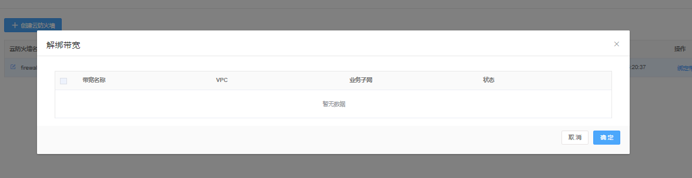

#### 3.15.7.3 删除云防火墙

【操作场景】

```
删除云防火墙
```

【前置条件】

1.云防火墙已经解绑带宽

【操作步骤】

步骤1 登录业务管理台，点击进入网络管理模块，点击进入防火墙管理页面

步骤2 选择想要删除云防火墙，点击操作--更多---删除，确定后就会删除云防火墙

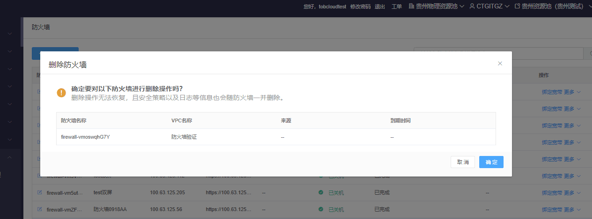

#### 3.15.7.4 云防火墙支持绑定带宽

【操作场景】

```
云防火墙支持绑定带宽
```

【前置条件】

1.vpc已经创建带宽

【操作步骤】

步骤1 登录业务管理台，点击进入网络管理模块，点击进入防火墙管理页面

步骤2 创建防火墙，选择已经创建带宽的vpc


#### 3.15.7.5 云防火墙升级

【操作场景】

```
云防火墙支持升级
```

【前置条件】

1.创建防火墙成功

【操作步骤】

步骤1 登录业务管理台，点击进入网络管理模块，点击进入防火墙管理页面

步骤2 选择要升级的防火墙，可进行短信或者规格升级，路径：更多--升级


#### 3.15.7.6 云防火墙指定版本创建

【操作场景】

```
云防火墙指定版本创建
```

【操作步骤】

步骤1 登录业务管理台，点击进入网络管理模块，点击进入防火墙管理页面

步骤2 选择要创建的防火墙镜像版本，点击创建


#### 3.15.7.7 云防火墙主备模式创建

【操作场景】

```
云防火墙主备模式创建
```

【操作步骤】

步骤1 登录业务管理台，点击进入网络管理模块，点击进入防火墙管理页面

步骤2 选择要创建的防火墙镜像版本，选择主备模式，点击创建


#### 3.15.7.8 云防火墙开启VPN接入

【操作场景】

```
云防火墙开启VPN接入(开启防火墙的VPN接入云电脑功能后，用户可通过SSL VPN或IPsec VPN接入云电脑)
```

【操作步骤】

步骤1 登录业务管理台，点击进入网络管理模块，点击进入防火墙管理页面

步骤2 选择要开启VPN接入的防火墙，点击“更多”下面的“开启VPN接入”按钮


步骤3 选择需要连接的VPC或子网，点击“立即申请”按钮


#### 3.15.7.9 云防火墙变更VPN接入

【操作场景】

```
云防火墙变更VPN接入
```

【操作步骤】

步骤1 登录业务管理台，点击进入网络管理模块，点击进入防火墙管理页面

步骤2 选择要变更VPN接入的防火墙（已开启VPN接入），点击“更多”下的“变更VPN接入”按钮

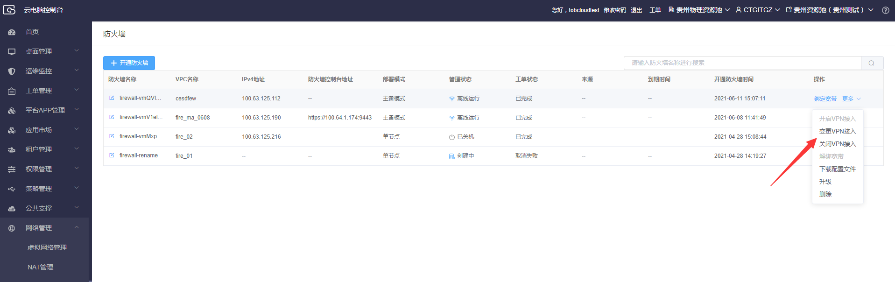

步骤3 选择需要变更连接的VPC或子网，点击“立即申请”按钮；变更后新的VPC或子网下的桌面可通过防火墙VPN接入。


#### 3.15.7.10 云防火墙关闭VPN接入

【操作场景】

```
云防火墙关闭VPN接入
```

【操作步骤】

步骤1 登录业务管理台，点击进入网络管理模块，点击进入防火墙管理页面

步骤2 选择要关闭VPN接入的防火墙（已开启VPN接入），点击“更多”下的“关闭VPN接入”按钮


步骤3 弹出关闭VPN接入确认框，确认即可

#### 3.15.7.11 新建云防火墙开启上网行为功能

【操作场景】

```
新建云防火墙开启上网行为功能
```

【操作步骤】

步骤1 登录业务管理台，点击进入网络管理模块，点击进入防火墙管理页面

步骤2 新建云防火墙，开启上网行为功能

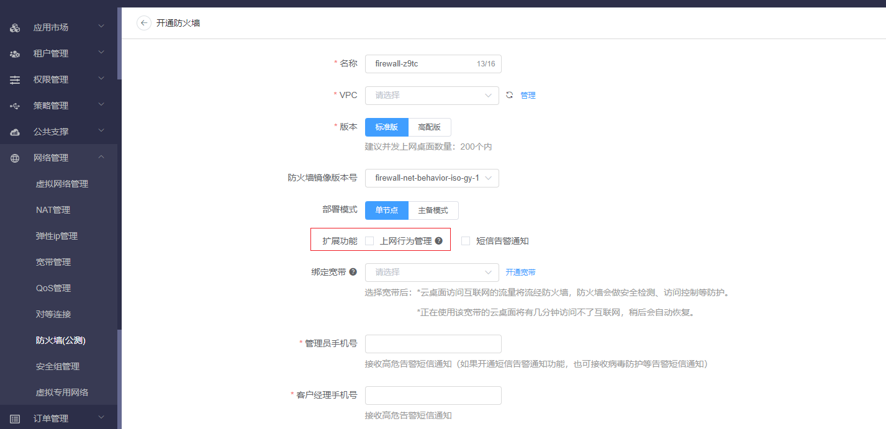

#### 3.15.7.12 升级云防火墙---开启上网行为

【操作场景】

```
升级云防火墙---开启上网行为
```

【操作步骤】

步骤1 登录业务管理台，点击进入网络管理模块，点击进入防火墙管理页面

步骤2 选择未开启上网行为的防火墙进行升级开启上网行为功能


#### 3.15.7.13 防火墙-存储空间扩容

【操作场景】

```
防火墙-存储空间扩容
```

【操作步骤】

步骤1 登录业务管理台，点击进入网络管理模块，点击进入防火墙管理页面

步骤2 选择已开启上网行为的防火墙进行存储空间扩容

#### 3.15.7.14 防火墙-新建专线防火墙

【操作场景】

```
防火墙-新建专线防火墙
```

【操作步骤】

步骤1 登录业务管理台，点击进入网络管理模块，点击进入防火墙管理页面

步骤2 点击开通防火墙

步骤3 防护类型选择专线并进行创建专线防火墙


#### 3.15.7.15 专线防火墙--绑定专线

【操作场景】

```
专线防火墙--绑定专线
```

【操作步骤】

步骤1 登录业务管理台，点击进入网络管理模块，点击进入防火墙管理页面

步骤2 选择已创建的专线防火墙，进行绑定专线

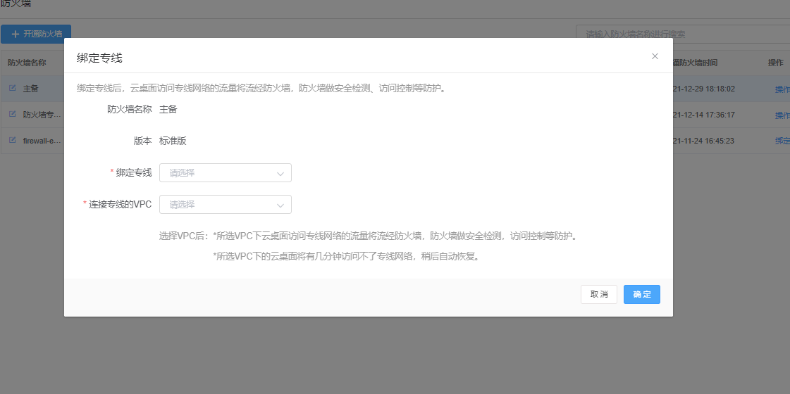

#### 3.15.7.16 专线防火墙--解绑专线

【操作场景】

```
专线防火墙--解绑专线
```

【操作步骤】

步骤1 登录业务管理台，点击进入网络管理模块，点击进入防火墙管理页面

步骤2 选择已创建的专线防火墙，进行解绑专线


3.15.8 安全组管理

#### 3.15.8.1 新建安全组

【操作场景】

```
新建安全组
```

【操作步骤】

步骤1 登录业务管理台，点击进入网络管理模块，点击进入安全组管理页面

步骤2 点击新建安全组按钮，选择协议端口、选择方向规则、选择规则类型、输入IP地址，点击确定，安全组创建成功

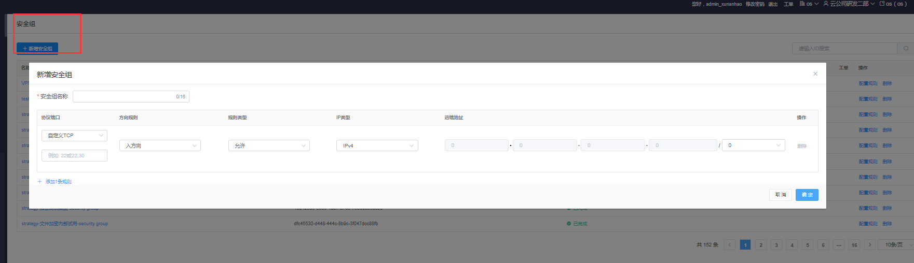

#### 3.15.8.2 安全组-配置规则

【操作场景】

```
配置规则
```

【操作步骤】

步骤1 登录业务管理台，点击进入网络管理模块，点击进入安全组管理页面

步骤2 选择一个安全组点击配置规则按钮，跳转到安全组详情页面，在页面中添加规则、修改已有规则，删除已有规则

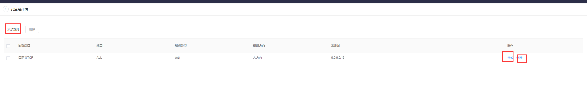


### 3.15.9 网络ACL

#### 3.15.9.1 新建网络ACL

【操作场景】

```
新建网络ACL
```

【操作步骤】

步骤1 登录业务管理台，点击进入网络管理模块，点击进入网络ACL

步骤2 选择新建ACL按钮，弹出创建ACL窗口

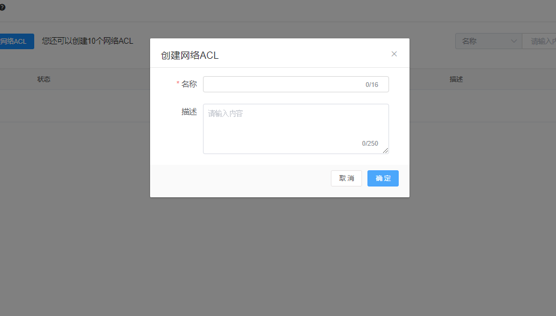

#### 3.15.9.2 添加ACL规则

【操作场景】

```
添加ACL规则
```

【操作步骤】

步骤1 登录业务管理台，点击进入网络管理模块，点击进入网络ACL

步骤2 创建ACL完成后，弹出二次弹出弹窗，点击添加规则

步骤3 点击添加规则，可进行添加出入方向规则


#### 3.15.9.3 ACL关联子网

【操作场景】

```
ACL关联子网
```

【操作步骤】

步骤1 登录业务管理台，点击进入网络管理模块，点击进入网络ACL

步骤2 创建ACL完成后，在ACL管理界面--操作，点击选择关联子网

步骤3 选择要关联的子网，点击确定

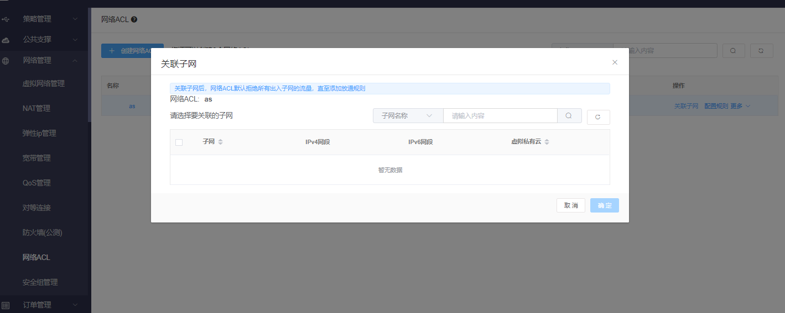

#### 3.15.9.4 关闭ACL

【操作场景】

```
关闭ACL
```

【操作步骤】

步骤1 登录业务管理台，点击进入网络管理模块，点击进入网络ACL

步骤2 创建ACL完成后，在ACL管理界面--操作--更多，点击关闭

步骤3 选择要关闭，点击确定


#### 3.15.9.5 修改ACL规则

【操作场景】

```
修改ACL规则
```

【操作步骤】

步骤1 登录业务管理台，点击进入网络管理模块，点击进入网络ACL

步骤2 进去已经创建好的ACL规则管理

步骤3 操作--修改，可选择要修改的规则进行修改

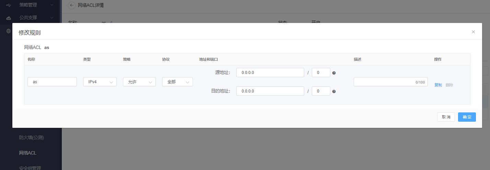

#### 3.15.9.6 关闭ACL规则

【操作场景】

```
关闭ACL规则
```

【操作步骤】

步骤1 登录业务管理台，点击进入网络管理模块，点击进入网络ACL

步骤2 进去已经创建好的ACL规则管理

步骤3 操作--更多--关闭，可选择要关闭的规则进行关闭

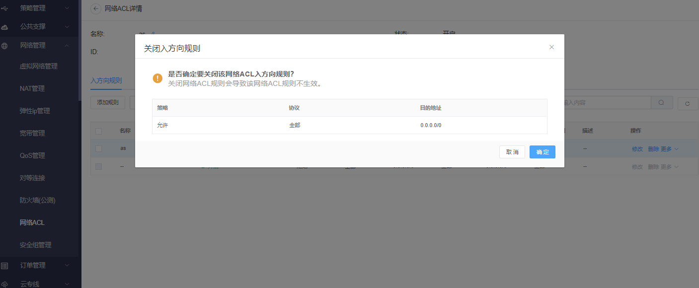

#### 3.15.9.7 插入ACL规则

【操作场景】

```
插入ACL规则
```

【操作步骤】

步骤1 登录业务管理台，点击进入网络管理模块，点击进入网络ACL

步骤2 进去已经创建好的ACL规则管理

步骤3 操作--更多--向前插规则（向后插规则），可进行添加规则


#### 3.15.9.8 删除ACL规则

【操作场景】

```
删除ACL规则
```

【操作步骤】

步骤1 登录业务管理台，点击进入网络管理模块，点击进入网络ACL

步骤2 进去已经创建好的ACL规则管理

步骤3 操作--更多--删除，选择要删除的规则进行删除


#### 3.15.9.9 删除ACL

【操作场景】

```
删除ACL
```

【操作步骤】

步骤1 登录业务管理台，点击进入网络管理模块，点击进入网络ACL

步骤2 点击要删除的ACL，操作--更多--删除，点击删除

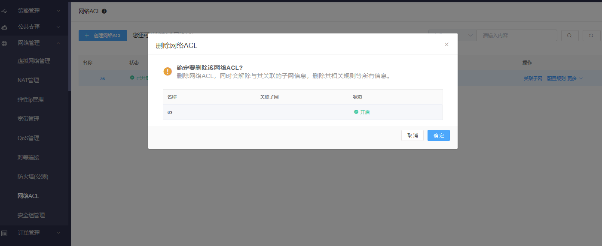

#### 3.15.9.10 添加ACL规则(ipv6规则)

【操作场景】

```
添加ACL规则(ipv6规则)
```

【操作步骤】

步骤1 登录业务管理台，点击进入网络管理模块，点击进入网络ACL详情

步骤2 添加规则，协议勾选ipv6，输入正确的ipv6地址和位数

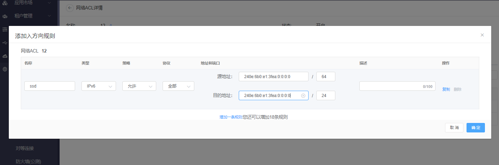


### 3.15.10 虚拟专用网络

#### 3.15.10.1  开通VPN

【操作场景】

```
开通VPN(深信服VPN或青牛云VCPE)
```

【操作步骤】

步骤1 登录业务管理台，点击进入网络管理模块，点击进入虚拟专用网络菜单

步骤2 点击页面左上方的“开通VPN”按钮，选择类型、输入镜像、VPC等参数点击确定，即可开始创建VPN主机


#### 3.15.10.2  变更规格

【操作场景】

```
VPN主机变更规格
```

【操作步骤】

步骤1 登录业务管理台，点击进入网络管理模块，点击进入虚拟专用网络菜单

步骤2  选择VPN主机列表中的VPN主机，点击页面右侧操作一列下的“管理”按钮，再点击“变更规格”


步骤3  进入规格变更页面，选择需要变更的参数，点击确定即可

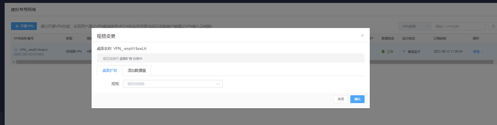


#### 3.15.10.3  变更连接VPC

【操作场景】

```
变更连接VPC
```

【操作步骤】

步骤1 登录业务管理台，点击进入网络管理模块，点击进入虚拟专用网络菜单

步骤2  选择VPN主机列表中的VPN主机，点击页面右侧操作一列下的“管理”按钮，再点击“变更连接VPC”

步骤3  进入变更连接VPC页面，选择需要新增或修改的VPC子网等，点击确定即可


#### 3.15.10.4  配置客户侧网络

【操作场景】

```
配置客户侧网络（使用深信服IPsecVPN或VCPE功能时需配置）
```

【操作步骤】

步骤1 登录业务管理台，点击进入网络管理模块，点击进入虚拟专用网络菜单

步骤2  选择VPN主机列表中的VPN主机，点击页面右侧操作一列下的“管理”按钮，再点击“配置客户侧网络”

步骤3  进入配置用户侧页面，输入IP和掩码，点击确定即可

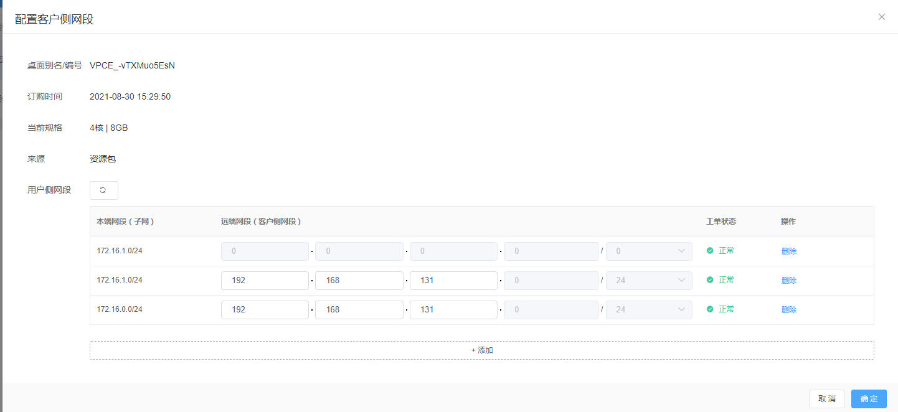


#### 3.15.10.5  绑定弹性IP

【操作场景】

```
绑定弹性IP
```

【操作步骤】

步骤1 登录业务管理台，点击进入网络管理模块，点击进入虚拟专用网络菜单

步骤2  选择VPN主机列表中的VPN主机，点击页面右侧操作一列下的“管理”按钮，再点击“绑定弹性IP”

步骤3  进入弹性IP选择页面，选中后点击确定即可


#### 3.15.10.6  解绑弹性IP

【操作场景】

```
解绑弹性IP（针对已绑定了弹性IP的VPN主机）
```

【操作步骤】

步骤1 登录业务管理台，点击进入网络管理模块，点击进入虚拟专用网络菜单

步骤2  选择VPN主机列表中的VPN主机，点击页面右侧操作一列下的“管理”按钮，再点击“解绑弹性IP”，随后确认即可


#### 3.15.10.7  变更安全组

【操作场景】

```
变更安全组
```

【操作步骤】

步骤1 登录业务管理台，点击进入网络管理模块，点击进入虚拟专用网络菜单

步骤2  选择VPN主机列表中的VPN主机，点击页面右侧操作一列下的“管理”按钮，再点击“变更安全组”

步骤3  进入变更安全组选择页面，选择需要变更的安全组后，点击确定即可


#### 3.15.10.8  创建快照

【操作场景】

```
创建快照(支持深信服VPN主机)
```

【操作步骤】

步骤1 登录业务管理台，点击进入网络管理模块，点击进入虚拟专用网络菜单

步骤2  选择VPN主机列表中的VPN主机，点击页面右侧操作一列下的“管理”按钮，再点击“创建快照”

步骤3  输入快照名称、快照描述，后点击确认即可触发开始创建快照


#### 3.15.10.9  还原

【操作场景】

```
还原（针对已创建过快照的深信服VPN主机可操作）
```

【操作步骤】

步骤1 登录业务管理台，点击进入网络管理模块，点击进入虚拟专用网络菜单

步骤2  选择VPN主机列表中的VPN主机，点击页面右侧操作一列下的“管理”按钮，再点击“还原”

步骤3  选择该VPN主机创建好的快照，后点击确认即可触发快照还原


#### 3.15.10.10  删除

【操作场景】

```
删除VPN主机
```

【操作步骤】

步骤1 登录业务管理台，点击进入网络管理模块，点击进入虚拟专用网络菜单

步骤2  选择VPN主机列表中的VPN主机，点击页面右侧操作一列下的“管理”按钮，再点击“删除”；随后确认删除即可


### 3.15.11 访问网络管理

#### 3.15.11.1  新建访问网络管理

【操作场景】

```
设置网络访问控制策略，根据业务需求限制不同终端的网络访问
```

【操作步骤】

步骤1 登录业务管理台，点击进入网络管理模块，点击进入访问网络管理

步骤2 点击新建按钮，输入名称和描述，点击确定按钮，新建成功，创建成功后

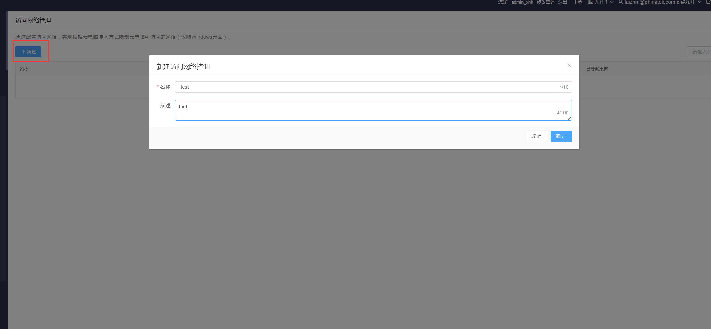

#### 3.15.11.2  查询访问网络控制策略

【操作场景】

```
查询访问网络控制策略
```

【操作步骤】

步骤1 登录业务管理台，点击进入网络管理模块，点击进入访问网络管理

步骤2 点击查询输入框，输入需要查询的访问网络控制策略名称，点击查询，查询成功


#### 3.15.11.3  查看分配桌面

【操作场景】

```
查看分配桌面
```

【操作步骤】

步骤1 登录业务管理台，点击进入网络管理模块，点击进入访问网络管理

步骤2 点击页面中的查看按钮，弹出访问网络控制策略分配的云电脑


#### 3.15.11.4 配置规则

#### 3.15.11.4.1  添加规则

【操作场景】

```
配置访问网络控制策略规则
```

【操作步骤】

步骤1 登录业务管理台，点击进入网络管理模块，点击进入访问网络管理

步骤2 点击页面中配置规则按钮，进入配置规则页面

步骤3 点击配置规则页面中的，添加规则按钮，弹出添加规则页面，输入需求的规则，点击确定保存成功，云电脑分配策略后，根据添加的规则生效


#### 3.15.11.4.2  修改规则

【操作场景】

```
修改访问网络控制策略规则
```

【操作步骤】

步骤1 登录业务管理台，点击进入网络管理模块，点击进入访问网络管理

步骤2 点击页面中配置规则按钮，进入配置规则页面

步骤3 选择一个已添加的规则，点击修改，弹出修改页面，编辑需要修改的内容，点击确定，修改成功，云电脑再次登录时根据修改的内容生效


#### 3.15.11.4.3  删除规则

【操作场景】

```
删除访问网络控制策略规则
```

【操作步骤】

步骤1 登录业务管理台，点击进入网络管理模块，点击进入访问网络管理

步骤2 点击页面中配置规则按钮，进入配置规则页面

步骤3 勾选需要删除的规则，点击批量删除，点击确定，删除成功

步骤3 选中需要删除的规则，在操作中点击删除按钮，点击确定，删除成功

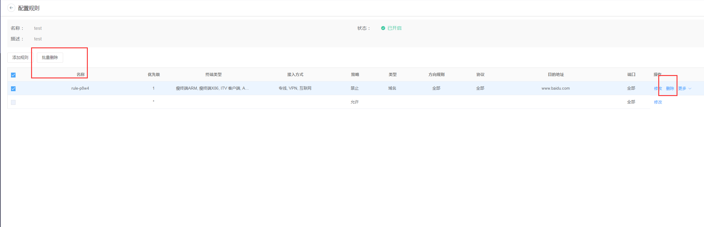

#### 

#### 3.15.11.4.4 向前插入创建和向后插入创建

【操作场景】

```
向前插入创建和向后插入创建
```

【操作步骤】

步骤1 登录业务管理台，点击进入网络管理模块，点击进入访问网络管理

步骤2 点击页面中配置规则按钮，进入配置规则页面

步骤3 按照需要的顺序，选择规则进行向前插入创建，创建成功后，规则顺序排在选择的规则前面，优先级更高

步骤3 按照需要的顺序，选择规则进行向后插入创建，创建成功后，规则顺序排在选择的规则后面，优先级比前一个规则低


#### 3.15.11.5  修改策略

【操作场景】

```
修改策略
```

【操作步骤】

步骤1 登录业务管理台，点击进入网络管理模块，点击进入访问网络管理

步骤2 选择一个策略，点击页面中的更多按钮，点击修改，弹出，修改页面，可以修改策略名称和描述


#### 3.15.11.6  复制策略

【操作场景】

```
复制策略
```

【操作步骤】

步骤1 登录业务管理台，点击进入网络管理模块，点击进入访问网络管理

步骤2 选择一个策略，点击页面中的更多按钮，点击复制，复制一条策略，策略内的规则同样复制，名称复制，带后缀“-复制”


#### 3.15.11.7  策略开启和关闭

【操作场景】

```
复制策略
```

【操作步骤】

步骤1 登录业务管理台，点击进入网络管理模块，点击进入访问网络管理

步骤2 选择一个状态为开启的策略，点击页面中的更多按钮，点击关闭，策略不再生效

步骤3 选择一个状态为关闭的策略，点击页面中的更多按钮，点击开启，策略生效


#### 3.15.11.7  删除策略

【操作场景】

```
删除策略
```

【操作步骤】

步骤1 登录业务管理台，点击进入网络管理模块，点击进入访问网络管理

步骤2 选择需要删除的策略，点击页面中的更多按钮，点击删除按钮，点击确定，删除成功

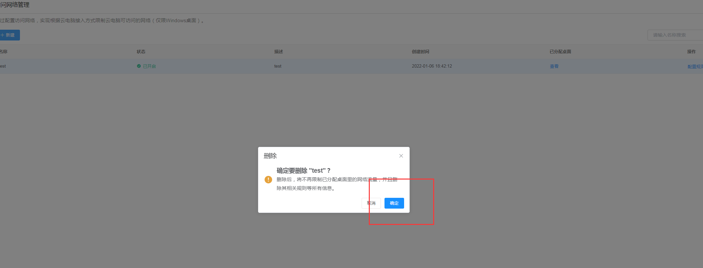