## 3.16  租户平台APP管理

### 3.16.1 应用市场-租户

#### 3.16.1.1 应用类型管理

【操作场景】

新增应用类型

【操作步骤】

步骤1 进入【应用市场-租户->应用类型管理】列表。

步骤2 点击【新增应用类型】按钮，填写应用类型名称、应用类型别名、排序优先级，点击【确定】按钮。

【操作场景】

编辑应用类型

【操作步骤】

步骤1 进入【应用市场-租户->应用类型管理】列表。

步骤2 点击【编辑】，在弹窗中编辑应用类型信息，点击【确定】按钮。

【操作场景】

删除应用类型

【操作步骤】

步骤1 进入【应用市场-租户->应用类型管理】列表。

步骤2 点击【删除】，在弹窗中点击【确定】按钮。

#### 3.16.1.2 APP管理

【操作场景】

新增应用进行统一管理

【操作步骤】

步骤1 进入【应用市场-租户 -> APP管理】列表。

步骤2 点击【新增】按钮，填写应用名称，选择应用类型，上传应用图标，填写应用简介，点击【确定】按钮

【操作场景】

​    查看应用详情  

【操作步骤】

步骤1 进入【应用市场-租户 -> APP管理】列表。

步骤2 点击【更多】按钮，弹出详情，点击详情查看

 

【操作场景】

​    编辑应用

【操作步骤】

步骤1 进入【应用市场-租户 -> APP管理】列表。

步骤2 点击【更多】-【编辑】按钮，弹出编辑应用窗口

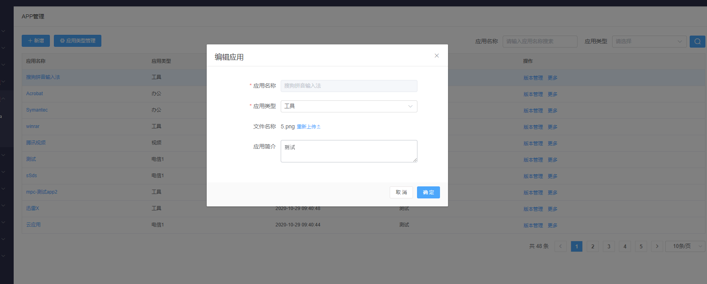

【操作场景】

​    删除应用

【操作步骤】

步骤1 进入【应用市场-租户 -> APP管理】列表。

步骤2 点击【更多】-【删除】按钮，弹出删除应用窗口，点击【确定】。

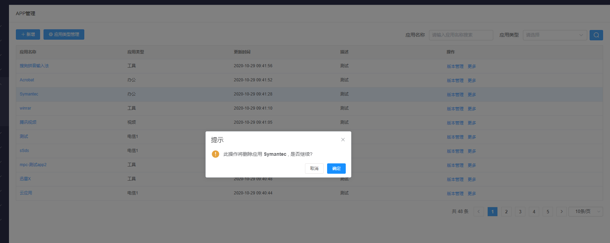

【操作场景】

​    应用查询

【操作步骤】

步骤1 进入【应用市场-租户 -> APP管理】列表。

步骤2 再查询框输入应用名称，选择应用类型，点击查询按钮。

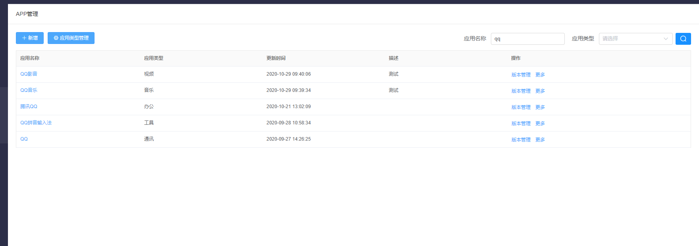

【操作场景】

​    新增应用版本进行统一管理

【操作步骤】

步骤1 进入【应用市场-租户 -> APP管理-> 版本管理】列表。

步骤2 点击【新增版本】按钮，填写版本名称、版本序号、注册表DisplayName、注册表DisplayVersion、安装包MD5、版本说明，选择是否支持静默安装，上传应用缩略图，上传应用安装包（应用安装包为zip时，需填写安装路径），点击【确定】。

【操作场景】

​    查看应用版本信息详情

【操作步骤】

步骤1 进入【应用市场租户 -> APP管理】列表。

步骤2 点击【版本管理】，或者点击应用名称进入版本管理界面。

步骤3 选择需要查看的版本号，点击【查看】按钮。

步骤4 弹出查看版本信息详情界面。

 【操作场景】

  应用版本编辑、下载、删除操作

【操作步骤】

 步骤1  【应用市场-租户 -> APP管理】列表。

 步骤2    点击【版本管理】，或者点击应用名称进入版本管理界面。

 步骤3    点击更多，选择编辑

 步骤4    点击更多，选择下载，或者点击版本名称。

 步骤5    已下架状态的应用版本点击更多，选择删除，点击删除弹窗提示是否确认删除

 步骤6   点击删除弹窗提示是否确认删除

【操作场景】

​    对应用版本进行上下架

【操作步骤】

步骤1 进入【应用市场 租户-> APP管理】列表。

步骤2 对不是上架状态的版本点击【上架】按钮。

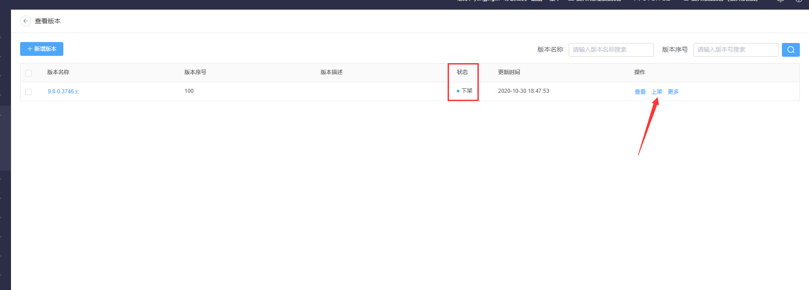

步骤3 对已上架状态的版本点击【下架】按钮。

【操作场景】

​    应用版本查询

【操作步骤】

步骤1 进入【应用市场 -租户-> APP管理】列表。

步骤2 搜索框输入版本名称、版本序号，点击查询按钮。

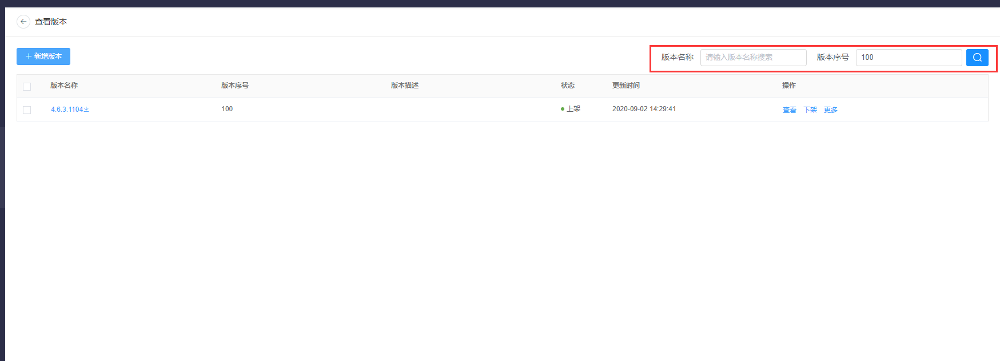

### 3.16.2 应用管控

【操作场景】

  新增应用管控规则进行统一管理

【操作步骤】

步骤1 进入【应用管控】列表。

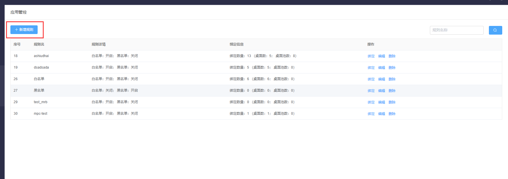

步骤2 点击【新增规则】按钮，跳转到新建规则页面。

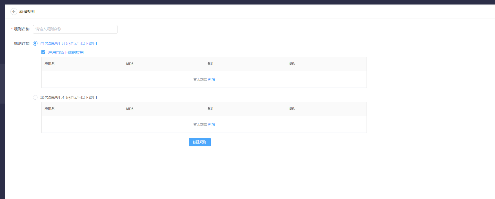

步骤3 填写规则名称，选择规则详情——白名单规则。

步骤4 点击【白名单规则-只可运行以下应用-新增】，输入应用名称、MD5、备注，点击【确定】按钮，点击【新建规则】。

步骤5 点击【黑名单规则-不允许运行以下应用-新增】，输入应用名称、MD5、备注，点击【确定】按钮，点击【新建规则】。

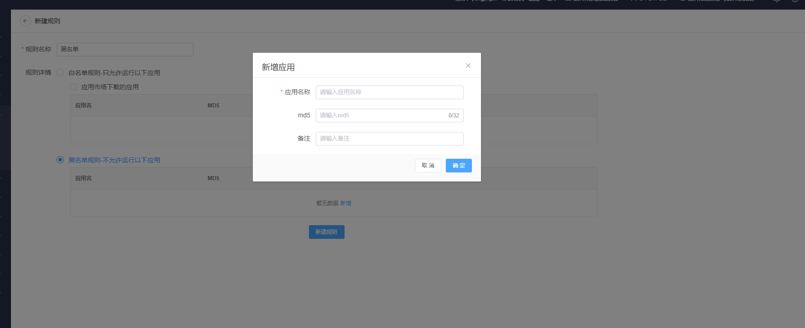

【操作场景】

编辑规则

【操作步骤】

步骤1 进入【应用管控】列表。

步骤2 点击编辑按钮，跳转至编辑规则页面。

步骤3 编辑后点击保存按钮.

【操作场景】

查询应用规则

【操作步骤】

步骤1 进入【应用管控】列表。

步骤2 输入规则名称点击查询按钮。

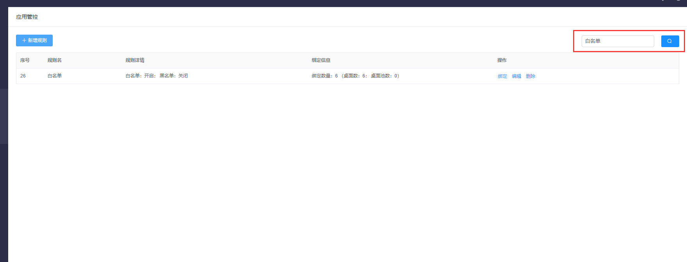

【操作场景】

  删除规则

【操作步骤】

步骤1 进入【应用管控】列表。

步骤2 点击删除，弹框点击确定按钮。

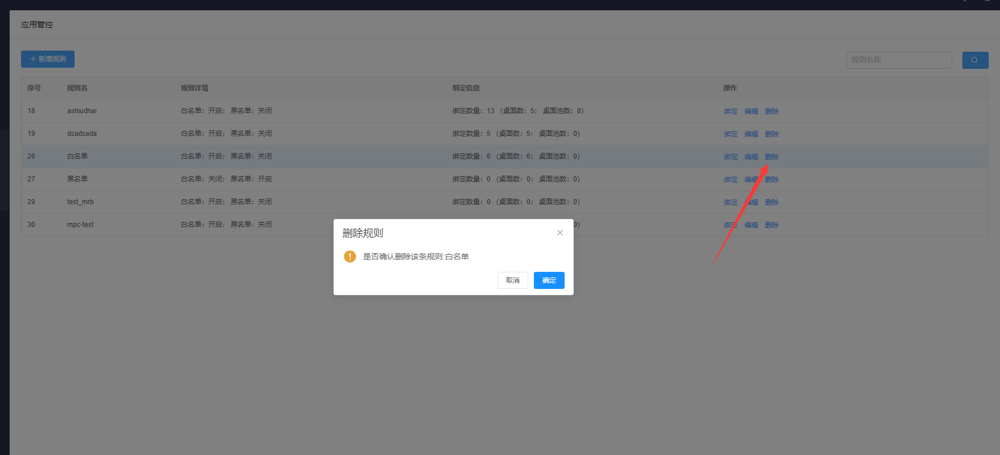

【操作场景】

绑定规则——绑定桌面、桌面池

【操作步骤】

步骤1 进入【应用管控 > 绑定】绑定规则页面。

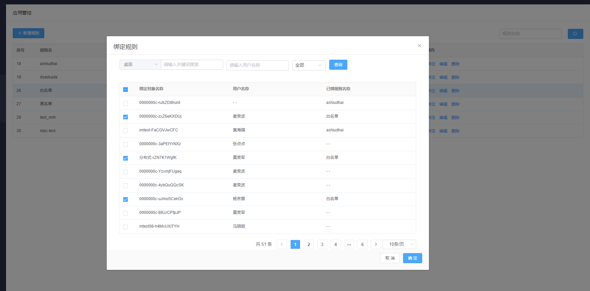

步骤2 选择“桌面”，输入桌面名称、用户名称，选择绑定状态，查询桌面。

步骤3 勾选桌面，点击确定按钮。

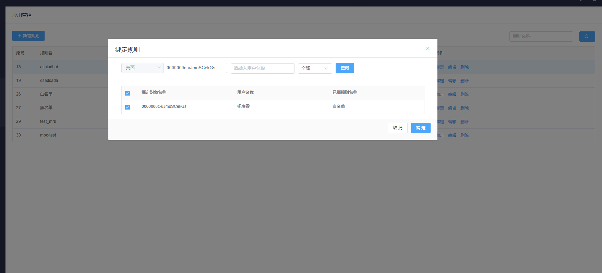

步骤4 选择“桌面”，输入桌面池名称，选择绑定状态，查询桌面池。

步骤5 勾选桌面池，点击确定按钮。

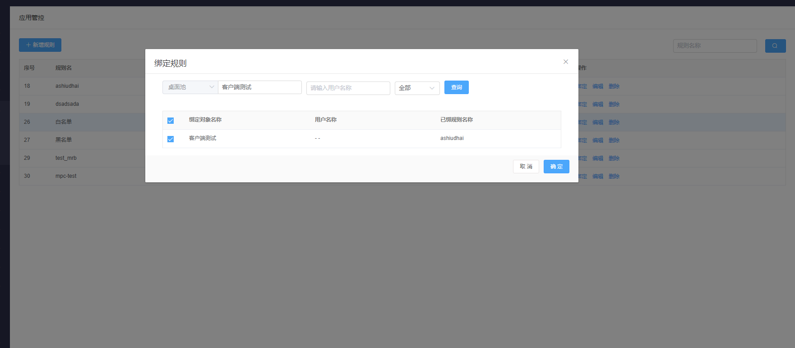

