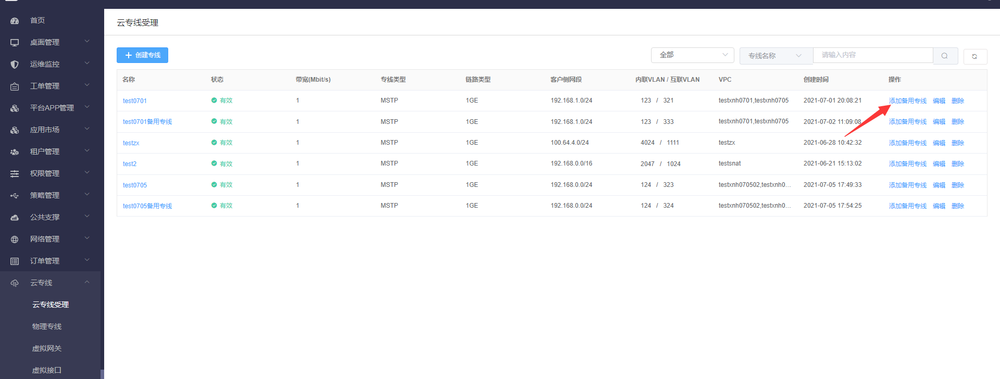
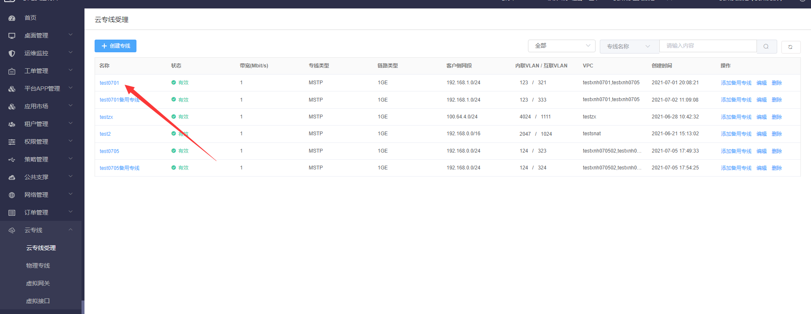
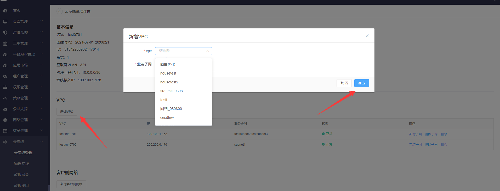

## 3.17  云专线

### 3.17.1 云专线受理

#### 3.17.1.1 创建云专线

【操作场景】

创建云专线

【操作步骤】

步骤1 进入【云专线】-【云专线受理】页

步骤2 点击“创建专线”按钮，输入专线名字、专线类型、VPC等必填参数后，点击立即创建即可

#### 3.17.1.2 添加备用专线

【操作场景】

添加备用专线

【操作步骤】

步骤1 进入【云专线】-【云专线受理】页

步骤2 选择需要添加备用专线的专线，点击“添加备用专线”按钮

步骤3 输入对应的必填参数，点击“立即创建”即可创建出VPC对应的备用专线。

#### 3.17.1.3 云专线新增VPC

【操作场景】

云专线新增VPC

【操作步骤】

步骤1 进入【云专线】-【云专线受理】页

步骤2  点击已创建好的云专线的名称，页面跳转到云专线受理详情页

步骤3  点击页面下方的“新增VPC“按钮，选择需要的VPC,点击”确定“即可

#### 3.17.1.4 云专线新增客户侧网络

【操作场景】

云专线新增客户侧网络

【操作步骤】

步骤1 进入【云专线】-【云专线受理】页

步骤2  点击已创建好的云专线的名称，页面跳转到云专线受理详情页

步骤3  点击页面下方的“新增客户侧网络“按钮，填入需要新增的客户侧网段,点击”确定“即可

