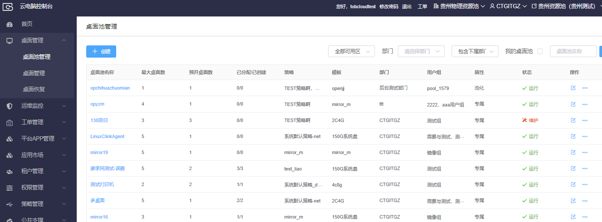
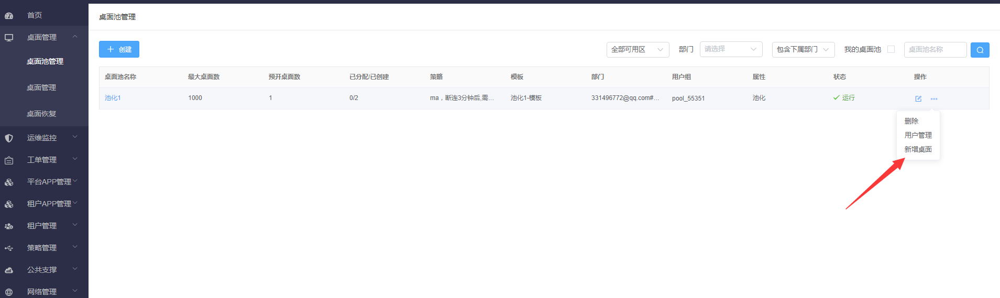

## 3.2  桌面池管理

### 3.2.1 创建桌面池

【操作场景】创建桌面池，通过桌面池可以对云电脑的进行批量创建和统一管理。

 

【操作步骤】

步骤1 点击桌面管理菜单下的桌面池管理，进入桌面池管理页面。

步骤2 点击新增按钮，进入新增桌面池页面。

步骤3 选择可用区，输入桌面池名称、桌面名称前缀（可选），选择桌面池属性、最大桌面数、预开桌面数、部门、模板、镜像、策略，点击下一步按钮可以进行关联用户组操作(也可建好桌面池后再关联)，创建后桌面池状态为维护状态。

### 3.2.2 编辑桌面池

【操作场景】编辑桌面池，修改桌面池的相关属性（桌面名称前缀、最大桌面数、预开桌面数、模板、镜像、策略），后续桌面将按修改后的属性创建。

 

【操作步骤】

步骤1 选择一个桌面池，点击编辑按钮，进入编辑桌面池页面。

步骤2 可修改桌面名称前缀（可选）、最大桌面数、预开桌面数、模板、镜像、策略，点击确定后编辑成功。

 

### 3.2.3 启用桌面池

【操作场景】启用桌面池时，在桌面数小于预留桌面数时会自动创建云电脑。

 

【操作步骤】

步骤1 选择一个维护状态的桌面池，点击启用，弹出确认弹窗。

步骤2 点击确认，启用桌面池成功，桌面池状态变为运行。

......

### 3.2.4 停用桌面池

【操作场景】停用桌面池，停用后可进行桌面池的删除操作。

 

【操作步骤】

步骤1 选择一个运行状态的桌面池，点击停用，弹出确认弹窗。

步骤2 点击确认，停用桌面池成功，桌面池状态变为维护。

### 3.2.5 删除桌面池

【操作场景】删除桌面池。

 

【准备事项】桌面池状态为维护，且桌面池下无桌面。

 

【操作步骤】

步骤1 选择桌面池，点击删除，弹出确认弹窗。

步骤2 点击确认，桌面池被删除。

### 3.2.6 指定用户组

【操作场景】指定桌面池的用户组，使可进行云电脑的分配。

 

【操作步骤】

步骤1 选择一个桌面池，点击指定用户组，进入指定用户组页面。

步骤2 点击关联用户组，弹出关联用户组弹窗。

步骤3 选择用户组，点击确认。

### 3.2.7 专属桌面池自动分配

【操作场景】将专属桌面池下的桌面自动分配给用户。

 

【操作步骤】

步骤1 选择一个运行状态的专属桌面池（存在未分配的桌面），点击指定用户组，进入指定用户组页面。

步骤2 点击自动分配按钮，弹出确认弹窗。

步骤3 点击确认按钮，自动将未分配的桌面按顺序分配给用户，若可分配的人数大于可分配桌面数，按顺序分配直到达到分配完为止。

### 3.2.8 专属桌面池手工分配

【操作场景】将专属桌面池下的桌面手工分配给用户。

 

【操作步骤】

步骤1 选择一个运行状态的专属桌面池（存在未分配的桌面），点击指定用户组，进入指定用户组页面。

步骤2 点击手工分配按钮，进入手工分配页面。

步骤3 选择一个未分配桌面的用户，点击分配，弹出确认弹窗，确认后会给该用户分配桌面。

步骤4 选择多个用户，点击批量分配桌面，会顺序给所选用户分配桌面，已分配桌面的用户会跳过分配。

### 3.2.9 专属桌面池手工取消分配

【操作场景】对专属桌面池下的桌面进行取消分配，取消访问该桌面的权限。

 

【操作步骤】

步骤1 选择一个运行状态的专属桌面池（存在已分配的桌面），点击指定用户组，进入指定用户组页面。

步骤2 点击手工分配按钮，进入手工分配页面。

步骤3 选择一个已分配桌面的用户，点击取消分配，弹出确认弹窗，确认后会取消分配给该用户的桌面。

步骤4 选择多个用户，点击批量取消分配，会顺序给所选用户取消分配，未分配桌面的用户会跳过。

### 3.2.10     新增桌面

【操作场景】在桌面池里新增云电脑。

 

【操作步骤】

步骤1 选择一个桌面池（此桌面池的已创建数要小于最大桌面数），点击新增桌面，弹出弹窗。

步骤2 填写新增桌面数（新增桌面数加已创建数不得大于最大桌面数），点击确定，会自动创建对应数量的桌面。

 

### 3.2.11     全部开机

【操作场景】将桌面池下所有关机状态的桌面开机。

 

【操作步骤】

步骤1 选择一个有关机状态桌面的桌面池，点击全部开机，弹出确认弹窗。

步骤2 点击确认，将该桌面池下所有关机状态的桌面开机。

......

### 3.2.12     全部关机

【操作场景】将桌面池下所有运行状态的桌面关机。

 

【操作步骤】

步骤1 选择一个有运行状态桌面的桌面池，点击全部关机，弹出确认弹窗。

步骤2 点击确认，将该桌面池下所有运行状态的桌面关机。

### 3.2.13     全部重装

【操作场景】将桌面池下所有桌面按桌面池的属性重装。

 

【操作步骤】

步骤1 选择一个桌面池，点击全部重装，弹出确认弹窗。

步骤2点击确认，将该桌面池下所有桌面重装。

### 3.2.14     全部重启

【操作场景】将桌面池下所有关机和运行的桌面重启。

 

【操作步骤】

步骤1 选择一个存在关机或运行状态桌面的桌面池，点击全部重启，弹出确认弹窗。

步骤2 点击确认，将该桌面池下所有关机和运行的桌面重启。

### 3.2.15     设置电源策略

【操作场景】对桌面池下所有桌面设置自动开机/关机策略

 

【操作步骤】

步骤1 选择一个桌面池，点击设置电源策略，弹出确认弹窗。

步骤2 如果没有时间策略，可以点击添加时间策略转跳到时间策略页面

步骤3 选择开机时间的时间策略（时间段最好大于10分钟），可以在该时间策略内对该桌面池下所有桌面进行自动开机，选择关机时间的时间策略（时间段最好大于10分钟），可以在该时间策略内对该桌面池下所有桌面进行自动关机，选择休眠时间的时间策略（时间段最好大于10分钟），可以在该时间策略内对该桌面池下所有桌面进行休眠；如果选择“限制连接时间”的策略，则在指定时间段内，用户将被限制连接桌面

### 3.2.16     创建gpu桌面--桌面池创建gpu

【操作场景】创建gpu桌面--桌面池创建gpu

 

【操作步骤】

步骤1.创建gpu桌面--桌面池创建gpu
步骤2.可用区选择gpu、类型选择GPU优化型、输入桌面池名称、桌面名称前缀、输入桌面数、选择license、选择部门、选择桌面模板、选择gpu镜像、选择策略、选择网络、选择子网

### 3.2.17     池化桌面策略

【操作场景】增加高低峰时段开机桌面数量配置

 

【操作步骤】

步骤1.进入桌面池管理，选择一个池化桌面池点击更多，点击池化桌面策略
步骤2.弹出策略设置页面，选择高峰时间策略，配置高峰开机数量；选择低峰时间策略，配置低峰开机数量，点击确定保存。

### 3.2.18     创建池化桌面

【操作场景】在业务管理台创建池化桌面(公有云需要扣减资源包，私有云需要license)

 

【操作步骤】

步骤1.进入桌面池管理页面，点击“创建”按钮弹出下拉菜单选择创建池化桌面

步骤2.页面切换至池化桌面创建页面，输入模板、策略、网络、镜像等必填参数后，点击确定。随后后台会根据参数自动创建出相应的池化桌面

### 3.2.19     修改池化桌面

【操作场景】在业务管理台修改已创建好的池化桌面

 

【操作步骤】

步骤1.进入桌面池管理页面，点击池化桌面池右侧的操作下的编辑按钮

步骤2.页面切换至池化桌面编辑页面，修改后点击确定即可

### 3.2.20     池化桌面-用户管理

【操作场景】在业务管理台对池化桌面对应的用户进行管理

 

【操作步骤】

步骤1.进入桌面池管理页面，点击池化桌面池右侧的操作下的“用户管理”

步骤2.页面切换至池化桌面的用户管理页面，此处可以进行池化桌面的用户导入和用户移除、用户查询操作

### 3.2.21     池化桌面-新增桌面

【操作场景】在业务管理台对池化桌面池新增桌面

【操作步骤】

步骤1.进入桌面池管理页面，点击池化桌面池右侧的操作下的“新增桌面”，输入要新增的桌面个数，点击确定即可

