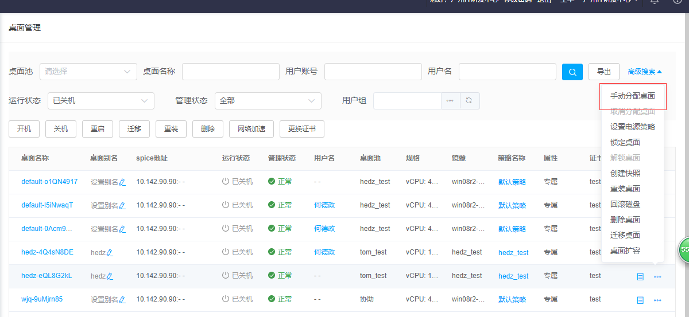
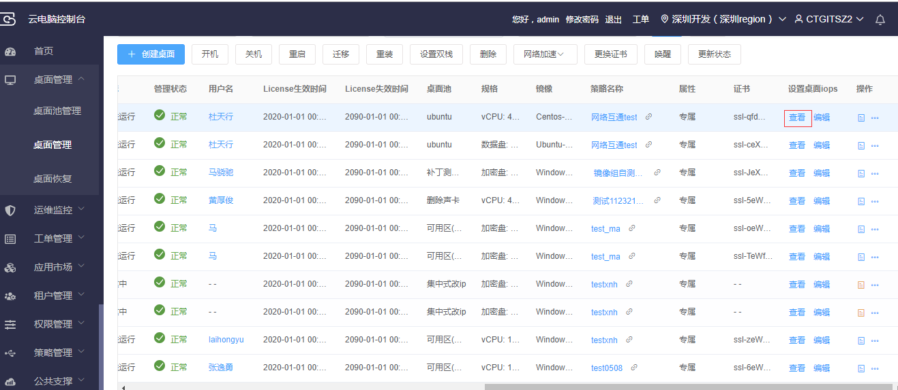
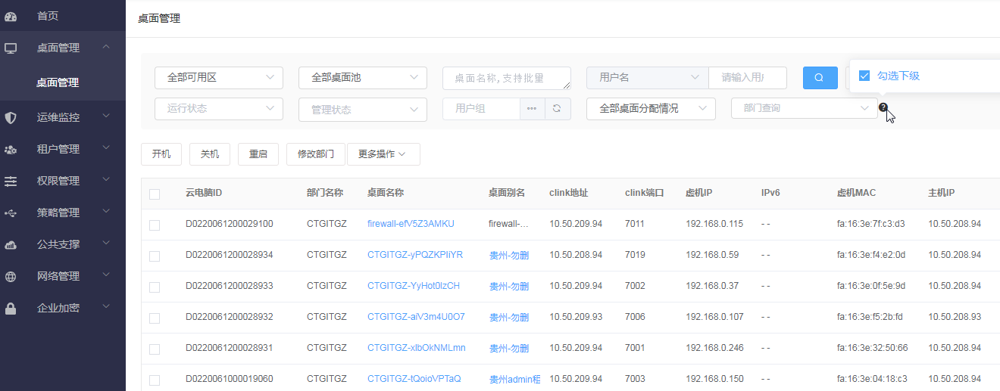
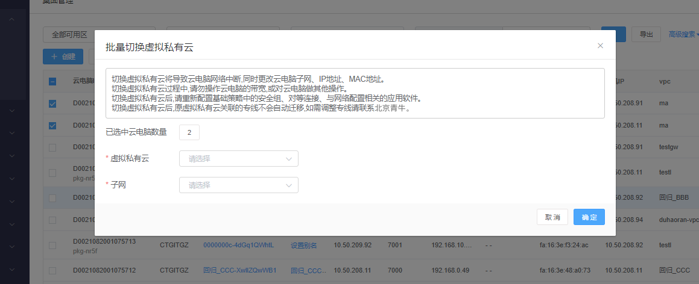
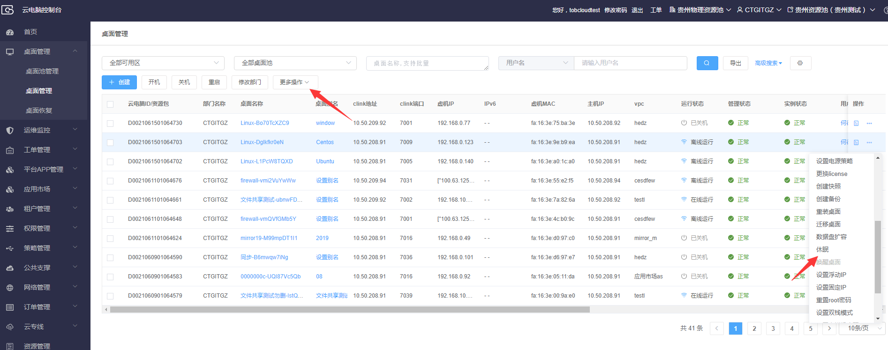
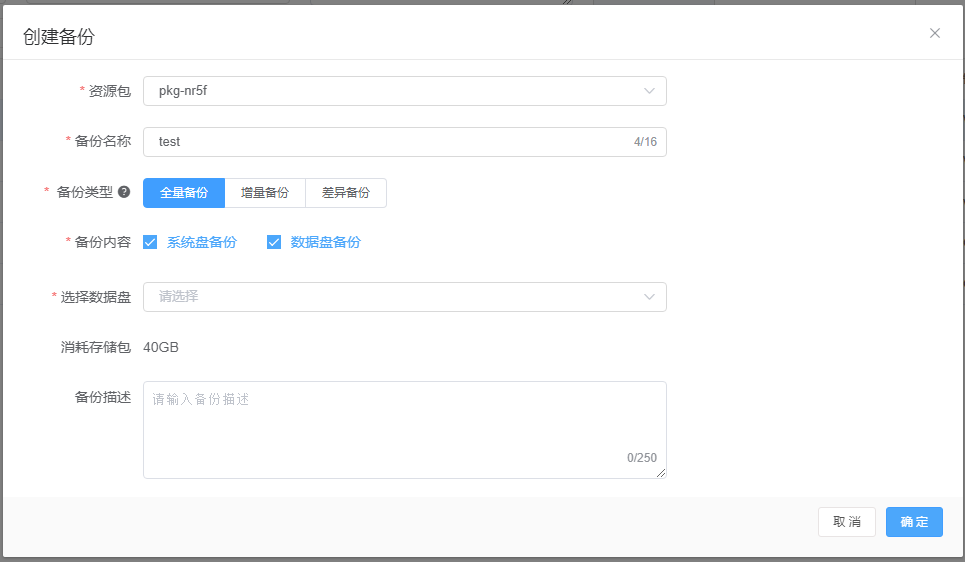
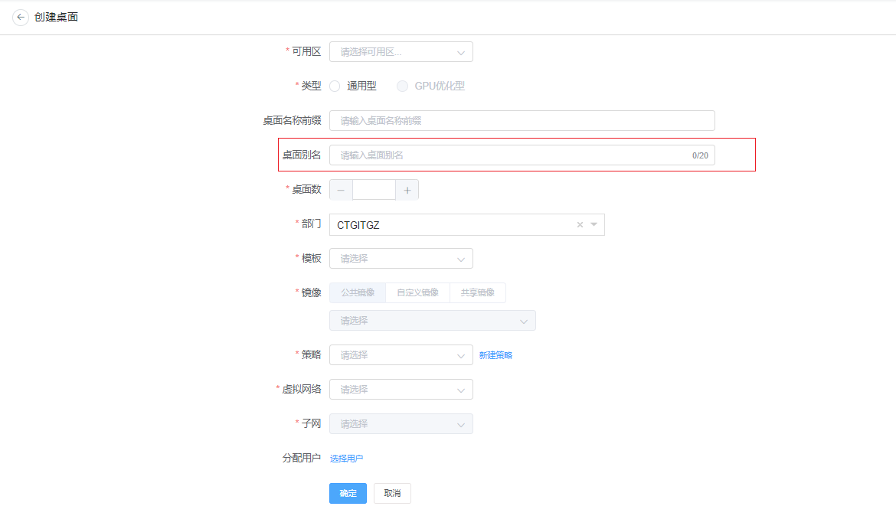

## 3.3  桌面管理

### 3.3.1 专属桌面手工分配

【操作场景】将专属桌面池下的桌面手工分配给指定用户。

 

【操作步骤】

步骤1 在“桌面管理”页面，选择一个未分配的桌面（对应的桌面池已指定用户组），点击手工分配桌面。

步骤2 选择用户组和用户，点击确定，确定后将该桌面分配给指定用户。

### 3.3.2 专属桌面取消分配

【操作场景】将专属桌面池下的已分配的桌面取消分配，取消用户的访问权限。

 

【操作步骤】

步骤1 在“桌面管理”页面，选择一个已分配的桌面，点击取消分配桌面。

步骤2 点击确认，确认后该桌面取消分配。

### 3.3.3 锁定桌面

【操作场景】对桌面进行锁定，使用户无法访问该桌面。

 

【操作步骤】

步骤1 在“桌面管理”页面，选择一个运行或关机状态的桌面，点击锁定桌面。

步骤2 点击确认，确认后该桌面被锁定,锁定后连接云电脑提示被锁定。

### 3.3.4 解锁桌面

【操作场景】解锁被锁定的桌面，使用户可访问该桌面。

 

【操作步骤】

步骤1 在“桌面管理”页面，选择一个被锁定的桌面，点击解锁桌面。

步骤2 点击确认，桌面解锁，解锁后云电脑可正常连接。

### 3.3.5 重装单个桌面

【操作场景】对云电脑进行重装，将云电脑的系统盘恢复到镜像的初始状态。

 

【操作步骤】

步骤1 在“桌面管理”页面，选择一个云电脑，点击重装桌面。

步骤2 点击确认，确认后该桌面被重装，系统盘恢复到镜像的初始状态，数据盘里的数据保留。

### 3.3.6 批量重装桌面

【操作场景】对多个云电脑进行批量重装。

 

【操作步骤】

步骤1 在“桌面管理”页面，选择多个云电脑，点击重装。

步骤2 点击确认，确认后所选桌面被重装。

 

### 3.3.7 迁移单个桌面

【操作场景】迁移关机、或节点故障、或离线运行状态的云电脑到其他计算节点，离线运行状态的桌面迁移属于热迁移，迁移后，桌面内的运行内容保持不变

 

【操作步骤】

步骤1 在“桌面管理”页面，选择一个关机、或节点故障、或离线运行状态的桌面，点击迁移桌面。

步骤2 点击确认，确认后该桌面迁移到另一个节点。

 

### 3.3.8 批量迁移桌面

【操作场景】批量迁移关机、或节点故障、或离线运行状态的云电脑到其他计算节点，离线运行状态的桌面迁移属于热迁移，迁移后，桌面内的运行内容保持不变

 

【操作步骤】

步骤1 在“桌面管理”页面，选择多个关机、或节点故障、或离线运行状态的桌面，点击迁移桌面。

步骤2 点击确认按钮，确认后所选桌面迁移到另一个节点。

 

### 3.3.9 创建快照

【操作场景】

需要备份某个状态的云电脑时，可以选择给该桌面创建快照（可选系统盘、数据盘），保留此时的云电脑所有数据，包括此时的云电脑系统、软件配置、硬盘数据。不包括内存数据。快照可用于备份云电脑，在需要的时候可使用快照把云电脑还原到备份快照时的状态。

【准备事项】

桌面的状态需为离线运行、或在线运行、或已关机，管理状态为“正常”或“锁定”。

【操作步骤】

步骤1 点击桌面管理菜单下的桌面管理，进入桌面管理页面。

步骤2 选定桌面，点击操作栏的按钮。

步骤3 在下拉列表里点击创建快照。

步骤4 在弹出的表单里，填写快照名称、快照描述，点击确认。

以上步骤可参考下图

### 3.3.10     还原桌面

【操作场景】

当某种情况下想要恢复桌面到某个快照或备份版本的时候，可以还原桌面，可回滚到指定的快照或备份版本。如果该桌面没有快照或备份，该选项置灰。

【准备事项】

还原快照时桌面的状态需为离线运行、或在线运行或已关机。

还原备份时桌面的状态需为非异常。

【操作步骤】

步骤1 点击桌面管理菜单下的桌面管理，进入桌面管理页面。

步骤2 选定有快照或备份的桌面，点击操作栏的按钮。

步骤3 在下拉列表里点击还原桌面。

步骤4 在弹出的表单里，选择某个快照或备份，点击确认。

以上步骤可参考下图

### 3.3.11     删除桌面

【操作场景】

当要删除多余的桌面，释放资源时，可以使用删除桌面的功能。

【准备事项】

桌面的状态不能为创建中、删除中、已删除。

【操作步骤】

步骤1 点击桌面管理菜单下的桌面管理，进入桌面管理页面。

步骤2 选定桌面，点击操作栏的按钮。

步骤3 在下拉列表里点击删除桌面。

步骤4 在弹出的确认框上，点击确认。

以上步骤可参考下图

### 3.3.12     批量删除桌面

【操作场景】

当要批量删除多余的桌面，释放资源时，可使用批量删除功能，删除选定的一个或多个桌面。

【准备事项】

桌面的状态不能为创建中、删除中、已删除。

【操作步骤】

步骤1 点击桌面管理菜单下的桌面管理，进入桌面管理页面。

步骤2 勾选要删除的桌面。

步骤3 点击桌面列表上方的“删除”按钮。

步骤4 在弹出的确认框上，点击确认。

以上步骤可参考下图

### 3.3.13     桌面扩容

【操作场景】

已创建成功的桌面，需要继续扩充磁盘容量时，可以使用桌面扩容功能，给该桌面扩充磁盘容量，但是已有的磁盘不会改变。同样，也可以为卓面扩容CPU和内存。

【准备事项】

桌面的状态需为离线运行或已关机，管理状态为正常。

【操作步骤】

步骤1 点击桌面管理菜单下的桌面管理，进入桌面管理页面。

步骤2 选定桌面，点击操作栏的按钮。

步骤3 在下拉列表里点击桌面扩容。

步骤4 在弹出表单里，输入CPU、内存等数据，增加数据盘，点击确认。

以上步骤可参考下图

### 3.3.14     桌面开机

【操作场景】

​    1.对已关机状态云电脑，进行开机。

 

【操作步骤】

步骤1 点击桌面管理菜单下的桌面管理，进入桌面管理页面。

步骤2 选择状态为关机的云电脑，勾选复选框，点击【开机】按钮。

步骤3 弹出二次确认框，点击【确认】按钮，启动云电脑。

 

 

### 3.3.15     桌面关机

【操作场景】

​    对在线运行与离线运行的云电脑，进行关机。

【操作步骤】

步骤1 点击桌面管理菜单下的桌面管理，进入桌面管理页面。

步骤2 选择状态为在线运行或离线运行的桌面，勾选复选框，点击【关机】按钮。

步骤3 弹出二次确认框，点击【确认】按钮，进行关机。

### 3.3.16     桌面重启

【操作场景】

​    对在线运行与离线运行的云电脑，进行重启

【操作步骤】

步骤1 点击桌面管理菜单下的桌面管理，进入桌面管理页面。

步骤2 选择状态为在线运行或离线运行的云电脑，勾选复选框，点击【重启】按钮。

步骤3 弹出二次确认框，点击【确认】按钮，重启云电脑。

### 3.3.17     桌面删除

【操作场景】

​    对桌面进行删除

【操作步骤】

步骤1 点击桌面管理菜单下的桌面管理，进入桌面管理页面。

步骤2 选择状态为启动、在线运行、离线运行、重启中、重装中、关机中、已关机、异常、回滚中、扩容中、节点故障、迁移中的桌面，勾选复选框，点击【删除】按钮。

步骤3 弹出二次确认框，点击【确认】按钮确认删除，谨慎删除操作。

### 3.3.18     桌面恢复 

【操作场景】

​    在规定时间内对已删除的桌面进行恢复

【操作步骤】

步骤1 点击桌面恢复，进入桌面管理页面。

步骤2 选择一个或多个桌面，点击桌面恢复。

步骤3 弹出确认框，点击【确认】按钮确认恢复，将在原桌面池恢复被删除的桌面，数据和删除前保持一致。

### 3.3.19     设置电源策略

【操作场景】对桌面下自动开机/关机策略

 

【操作步骤】

步骤1 选择一个桌面，点击设置电源策略，弹出确认弹窗。

步骤2 如果没有时间策略，可以点击添加时间策略转跳到时间策略页面；如果所属桌面池

步骤3 选择开机时间的时间策略（时间段最好大于10分钟），可以在该时间策略内对该桌面进行自动开机，选择关机时间的时间策略（时间段最好大于10分钟），可以在该时间策略内对该桌面进行自动关机，选择休眠时间的时间策略（时间段最好大于10分钟），可以在该时间策略内对该桌面进行自动休眠

### 3.3.20     更换license

【操作场景】

​    	对桌面license过期进行更换

【操作步骤】

步骤1 选择过期桌面，点击列表菜单“更换license”按钮

步骤2  选择需要替换的license，点击“确定”按钮

### 3.3.21     数据盘扩容

【操作场景】

已创建成功的桌面，需要继续增加磁盘容量时，可以使用数据盘扩容功能，给该桌面增加磁盘容量，针对已有的磁盘增加容量。

【准备事项】

桌面的状态需为离线运行或已关机，管理状态为正常。

【操作步骤】

步骤1 点击桌面管理菜单下的桌面管理，进入桌面管理页面。

步骤2 选定桌面，点击操作栏的按钮。

步骤3 在下拉列表里点击数据盘扩容。

步骤4 在弹出表单里，选择一个已有的磁盘，输入扩容后的磁盘容量，点击确认。

以上步骤可参考下图

### 3.3.21     桌面唤醒

【操作场景】

桌面处于休眠状态时，需要先唤醒桌面，才能继续正常连接桌面。可以选择在业务控制台上手动唤醒桌面。

【准备事项】

桌面的状态需为已休眠，管理状态为正常。

【操作步骤】

步骤1 点击桌面管理菜单下的桌面管理，进入桌面管理页面。

步骤2 选定桌面，点击操作栏的按钮。

步骤3 在下拉列表里点击唤醒。

以上步骤可参考下图

### 3.3.21     专属策略编辑

【操作场景】

需要修改桌面池中其中一台云电脑的策略，点击策略列中的编辑按钮进行编辑

【准备事项】

桌面的状态正常，管理状态为正常。

【操作步骤】

步骤1 点击桌面管理菜单下的桌面管理，进入桌面管理页面。

步骤2 选定桌面，点击策略列中的编辑按钮。

步骤3 跳转到策略编辑页面，对策略内容进行修改。

注：专属策略名必需与已有的策略名不一致。

以上步骤可参考下图

### 3.3.22     设置桌面iops

【操作场景】

可直接在桌面管理，选择一个桌面，设置桌面iops点击编辑

【准备事项】

桌面的状态正常，管理状态为正常。

【操作步骤】

步骤1 点击桌面管理菜单下的桌面管理，进入桌面管理页面。

步骤2 选定桌面，点击设置桌面iops的编辑按钮。

步骤3 弹窗打开编辑页面，对iops进行读写设置。

步骤4 选定桌面，点击设置桌面iops的查看按钮。

步骤5 弹窗打开查看页面，显示iops设置内容。

注：读/写iops与总iops不能同时设置，读/写吞吐（B/s)与总吞吐(B/s)不能同时设置，(B/s)是byte字节。

以上步骤可参考下图

### 3.3.23     创建桌面

【操作场景】

可直接在桌面管理界面创建桌面，不需要先创建桌面池。

【准备事项】

当前租户下发的license足够创建桌面。

【操作步骤】

步骤1 点击桌面管理菜单下的桌面管理，进入桌面管理页面。

步骤2 点击创建桌面。

步骤3 跳转到创建页面，填写内容，确定。

以上步骤可参考下图

### 3.3.24     桌面视图-卡顿诊断

【操作场景】

1.云电脑内使用卡顿，客户端每天会上报一次卡顿信息。
2.客户端工具栏，用户使用卡顿诊断功能，主动上报卡顿报告。

【准备事项】

1.客户端更新到最新版本。
2.重启云电脑，使云电脑内的补丁更新到最新版本。
【操作步骤】

步骤1 点击桌面管理菜单下的桌面管理，进入桌面管理页面。

步骤2 选择某个桌面，点击桌面名称。

步骤3 跳转到桌面视图页面，切换到卡顿诊断面板。

步骤4 切换到“实时诊断”，查看客户端主动上报的卡顿信息；切换到“诊断报告”，查看用户使用卡顿诊断功能上报的卡顿信息。

以上步骤可参考下图

### 3.3.25     设置固定ip

【操作场景】

1.修改云电脑的固定ip

【准备事项】

1.云电脑必须要有子网
【操作步骤】

1、登录业务管理台，进入桌面管理页面，选择一台有子网且关机状态的云电脑

2、点击更多即“...”选择设置固定ip

3、弹出设置ip窗口输入一个未使用的ip号，点击确认

### 3.3.26     设置双栈桌面

【操作场景】

可直接在桌面管理界面设置双栈。

【操作步骤】

步骤1 点击桌面管理菜单下的桌面管理，进入桌面管理页面。

步骤2 选择单栈桌面设置双栈，前置条件在线、离线、关机桌面。

以上步骤可参考下图

### 3.3.27     创建Linux--直接创建Linux桌面(不通过桌面池)

【操作场景】

创建Linux--直接创建Linux桌面(不通过桌面池)。

【操作步骤】

步骤1 创建Linux--直接创建Linux桌面(不通过资源池)
步骤2 选择Linux镜像。

以上步骤可参考下图

### 3.3.27     创建备份

【操作场景】

需要备份某个状态的云电脑时，可以选择给该桌面创建备份，保留此时的云电脑所有数据，包括此时的云电脑系统、软件配置、硬盘数据。不包括内存数据。快照可用于备份云电脑，在需要的时候可使用备份把云电脑还原到创建备份时的状态。

【准备事项】

备份功能开启；桌面的状态需为已关机。

【操作步骤】

步骤1 点击桌面管理菜单下的桌面管理，进入桌面管理页面。

步骤2 选定桌面，点击操作栏的按钮。

步骤3 在下拉列表里点击创建备份。

步骤4 在弹出的表单里，填写备份名称、备份描述，点击确认。

以上步骤可参考下图

### 3.3.28     创建linux桌面

【操作场景】

满足业务管理台可以创建linux桌面并能接收到root密码的需求

【准备事项】

启用一个linux镜像到业务管理台

【操作步骤】

步骤1 登录业务管理台，进入桌面管理页面

步骤2 点击创建桌面。

步骤3 选择可用区选择nove、类型选择通用型、输入桌面前缀、输入桌面数、选择桌面模板、选择linux镜像、选择策略、选择网络、选择子网、输入接收邮箱

步骤4 收到root密码的邮件

以上步骤可参考下图

### 3.3.29     linux桌面重置密码

【操作场景】

满足业务管理台可以创建linux桌面并能接收到root密码，并能重置密码的需求

【准备事项】

已创建了一个linux桌面，且已分配给用户，且该用户有绑定邮箱

【操作步骤】

步骤1 登录业务管理台，进入桌面管理页面

步骤2 选择一个开机状态的linux桌面，点击更多，点击重置,收到root密码重置的邮件

步骤3 选择一个linux桌面,点击重装，重装完成后，收到root密码重置的邮件

以上步骤可参考下图

### 3.3.30    GPU扩容

【操作场景】

GPU桌面扩容功能

【准备事项】

已创建了一个GPU桌面

【操作步骤】

步骤1 登录业务管理台，进入桌面管理页面

步骤2 选择一个GPU桌面，点击更多，点击GPU扩容

步骤3 选择需要扩容的模板

以上步骤可参考下图

### 3.3.31    修改部门

【操作场景】

修改桌面所属部门

【操作步骤】

步骤1 点击“桌面管理”，勾选要修改部门的桌面后，点击“修改部门”。

步骤2 在弹出窗选择修改后的目标部门，点击“确认”。

以上步骤可参考下图

### 3.3.32    查询桌面

【操作场景】

查询桌面

【操作步骤】

步骤1 登录业务管理台，进入桌面管理页面。

步骤2 输入单个或多个搜索条件，点击查询。

步骤3 搜索某部门下的桌面时，旁边有个问号按钮，鼠标移动到上面会弹出“勾选下级”的选框，勾选的话，会自动勾选所选部门的所有下级部门；否则不会勾选。

以上步骤可参考下图

=======

### 3.3.33    切换vpc

【操作场景】

用户网络切换

【操作步骤】

步骤1 登录业务管理台，进入桌面管理页面。

步骤2 选择一台关机的桌面，点击更多，点击切换vpc

步骤3 选择vpc，选择子网，点击确定，切换vpc成功

以上步骤可参考下图

### 3.3.34    批量切换vpc

【操作场景】

用户网络切换

【操作步骤】

步骤1 登录业务管理台，进入桌面管理页面。

步骤2 选择多台关机的桌面，点击更多操作，点击切换vpc

步骤3 选择vpc，选择子网点击确定，切换vpc成功

以上步骤可参考下图

### 3.3.35    切换vpc-开启ipv6

【操作场景】

用户网络切换，开启ipv6

【操作步骤】

步骤1 登录业务管理台，进入桌面管理页面。

步骤2 选择一台关机的桌面，点击更多，点击切换vpc

步骤3 选择vpc，选择子网

步骤4 勾选ipv6,则vpc切换成功后桌面开启ipv6,不勾选ipv6，,则vpc切换成功后桌面不开启ipv6

以上步骤可参考下图

### 3.3.36    切换vpc-查看ip

【操作场景】

用户网络切换，开启ipv6

【操作步骤】

步骤1 登录业务管理台，进入桌面管理页面。

步骤2 选择一台关机的桌面，点击更多，点击切换vpc

步骤3 选择vpc，选择子网

步骤4 输入指定ip，切换vpc成功后桌面ip地址为指定ip地址，不输入指定ip则自动随机分配

步骤5 点击查看已使用ip，弹出弹窗，展示已使用的ip

以上步骤可参考下图

### 3.3.37    批量切换vpc-修改桌面

【操作场景】

用户网络切换，开启ipv6

【操作步骤】

步骤1 登录业务管理台，进入桌面管理页面。

步骤2 选择多台关机的桌面，点击更多，点击切换vpc

步骤3 点击桌面数按钮

步骤4 展示出桌面选择页面 ，支持查询筛选、增加和减少已选择的桌面

以上步骤可参考下图

### 3.3.38    单桌面修改计算机名

【操作场景】

修改计算机名

【操作步骤】

步骤1 登录业务管理台，进入桌面管理页面。

步骤2 选择一台桌面，点击更多，点击修改计算机名

步骤3 输入新的计算机名，点击确定，重启后生效

以上步骤可参考下图

### 3.3.39    批量修改计算机名

【操作场景】

修改计算机名

【操作步骤】

步骤1 登录业务管理台，进入桌面管理页面。

步骤2 勾选多台桌面，点击更多操作，点击修改计算机名

步骤3 输入新的计算机名，点击确定，重启后生效

步奏4 点击添加后缀，输入数字即可添加后缀

以上步骤可参考下图

### 3.3.40    单桌面设置IP和MAC地址

【操作场景】

设置IP和MAC地址

【操作步骤】

步骤1 登录业务管理台，进入桌面管理页面。

步骤2 选择一台桌面，点击更多，点击设置外网IP、客户端IP和MAC地址

步骤3 输入外网IP、客户端IP和MAC地址，点击确定后，登录需要外网IP、客户端IP和MAC地址匹配才能登录

以上步骤可参考下图

### 3.3.41    批量设置IP和MAC地址

【操作场景】

设置IP和MAC地址

【操作步骤】

步骤1 登录业务管理台，进入桌面管理页面。

步骤2 勾选多台桌面，点击更多操作，点击设置外网IP、客户端IP和MAC地址

步骤3 输入外网IP、客户端IP和MAC地址，点击确定后，登录需要外网IP、客户端IP和MAC地址匹配才能登录

以上步骤可参考下图

### 3.3.42   批量桌面进行扩缩容

【操作场景】

批量桌面进行扩缩容

【操作步骤】

步骤1 登录业务管理台，进入桌面管理页面。

步骤2 选择多台桌面（支持在线桌面、离线桌面、关机桌面）

步骤3 点击更多操作---桌面扩容

以上步骤可参考下图

### 3.3.43   重置虚拟机密码

【操作场景】

重置虚拟机密码

【操作步骤】

步骤1 登录业务管理台，进入桌面管理页面。

步骤2 选择一个关机的windows桌面

步骤3 点击操作展示出操作列表，点击重置虚拟机密码

以上步骤可参考下图

### 3.3.44   桌面管理页自定义展示字段

【操作场景】

桌面管理页自定义展示字段

【操作步骤】

步骤1 登录业务管理台，进入桌面管理页面。

步骤2 点击页面右侧的设置按钮，勾选需要展示的字段即可。

以上步骤可参考下图

### 3.3.45   桌面性能监控

【操作场景】

对用户的云电脑进行性能监控(CPU、内存、网络使用情况)

【操作步骤】

步骤1 登录业务管理台，进入桌面管理页面。

步骤2 点击所要监控的桌面的桌面名称字段，页面跳转至桌面视图页，点击下方的“监控信息”tab页即可看到桌面性能监控页

以上步骤可参考下图

### 3.3.46   修改桌面部门支持用户迁移至新部门

【操作场景】

修改桌面部门支持用户迁移至新部门

【操作步骤】

步骤1 登录业务管理台，进入桌面管理页面。

步骤2 选择要迁移的桌面，默认勾选【用户迁移至新部门】	

以上步骤可参考下图

### 3.3.47   桌面休眠

【操作场景】

在业管对指定桌面（需处于在线运行或离线运行状态）进行休眠操作

【操作步骤】

步骤1 登录业务管理台，进入桌面管理页面。

步骤2 选择要休眠的桌面，点击“操作”或“更多操作”下的“休眠”按钮

步骤3 确认休眠即可对指定桌面执行休眠操作

### 3.3.48   桌面唤醒

【操作场景】

在业管对指定桌面（需处于已休眠状态）进行唤醒操作

【操作步骤】

步骤1 登录业务管理台，进入桌面管理页面。

步骤2 选择要唤醒的桌面，点击“操作”或“更多操作”下的“唤醒桌面”按钮

步骤3 确认唤醒即可对指定桌面执行唤醒操作

### 3.3.49   系统盘扩容

【操作场景】

在业管对指定桌面进行系统盘扩容操作

【操作步骤】

步骤1 登录业务管理台，进入桌面管理页面。

步骤2 选择要系统盘扩容的桌面，点击“操作”下的“系统盘扩容”按钮

### 3.3.50   设置IP和Mac新增设备唯一码验证

【操作场景】

在业管对指定桌面进行设置IP和Mac新增设备唯一码验证

【操作步骤】

步骤1 登录业务管理台，进入桌面管理页面。

步骤2 选择要设置IP和Mac新增设备唯一码验证的桌面，点击“操作”下的设置IP和Mac新增设备唯一码验证按钮

### 3.3.51   非池化桌面支持重启/关机时重装

【操作场景】

桌面配置打开了“是否关机/重启时还原系统”策略，则操作桌面关机或重启

【操作步骤】

步骤1 登录业务管理台，进入桌面管理页面

步骤2 选择策略打开了“是否关机/重启时还原系统”策略项的桌面，点击页面上方的“关机”或“重启”按钮

步骤3  弹出将要重装的提示，点击确定就会触发重装，最后关机或重启

### 3.3.52   GPU桌面获取和释放license

【操作场景】

在业管对GPU电脑进行获取和释放license

【操作步骤】

步骤1 登录业务管理台，进入桌面管理页面。

步骤2 选择一个开机的GPU电脑，点击更多，点击释放license，云电脑内显卡程序结束

步骤3 选择一个释放了license的GPU电脑，点击更多，点击获取license，云电脑内显卡程序启动

### 3.3.53   休眠关机电源策略

【操作场景】

设置休眠状态的云电脑，在设置的时长后关机

【操作步骤】

步骤1 登录业务管理台，进入桌面管理页面。

步骤2 选择一个云电脑设置休眠电源策略，然后再设置一个休眠后关机策略

### 3.3.54 创建备份

【操作场景】

需要备份某个状态的云电脑时，可以选择给该桌面创建备份（可选系统盘、数据盘），保留此时的云电脑内数据。在需要的时候可使用备份文件把云电脑还原到备份时的状态。

全量备份：根据选择的系统盘、数据盘存储内容进行全量备份。

差异备份：根据选择的全量备份作为参照进行差异备份。

增量备份：根据选择的全量/差异/增量备份作为参照进行增量备份。

【准备事项】

桌面的状态需为非异常状态。

【操作步骤】

步骤1 点击桌面管理菜单下的桌面管理，进入桌面管理页面。

步骤2 选定桌面，点击操作栏的按钮。

步骤3 在下拉列表里点击创建备份。

步骤4 在弹出的表单里，填写备份名称、备份类型、备份内容等必填参数，点击确定。

以上步骤可参考下图

### 3.3.55 创建桌面增加别名

【操作场景】

创建桌面增加别名。

【操作步骤】

步骤1 点击桌面管理菜单下的桌面管理，进入桌面管理页面。

步骤2 进行创建桌面。

步骤3 添加自定义别名

以上步骤可参考下图

### 3.3.56 展示系统盘和数据盘的使用情况

【操作场景】

展示系统盘和数据盘的使用情况

【操作步骤】

步骤1 点击桌面管理菜单下的桌面管理，进入桌面管理页面。

步骤2 选择一个桌面点击桌面名称，跳转到桌面信息页面

步骤3 点击资源信息，在存储资源中查看可用大小

以上步骤可参考下图

