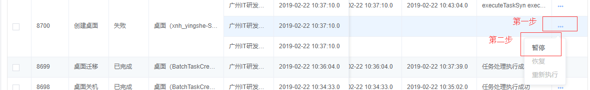
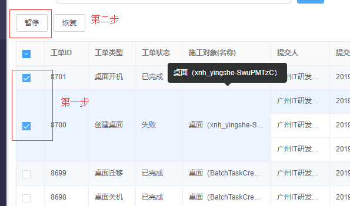
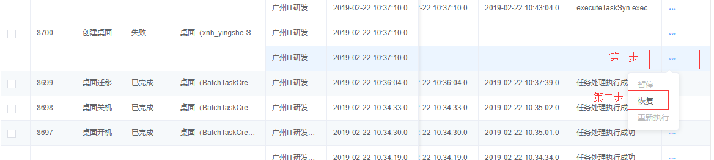
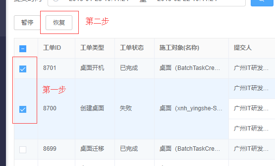
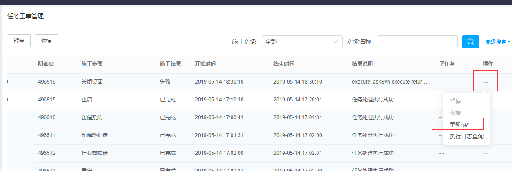
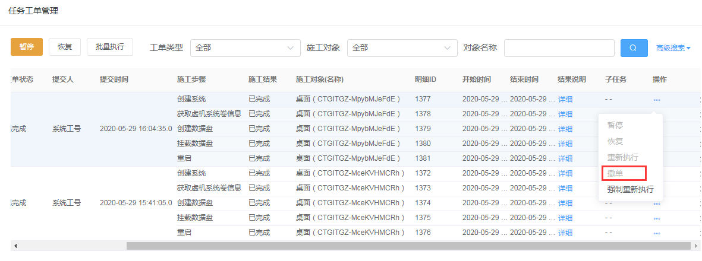
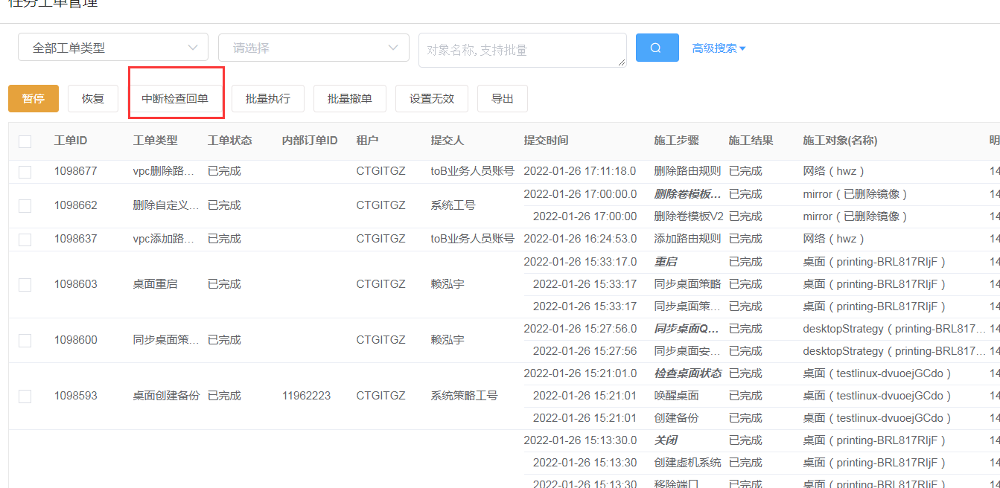
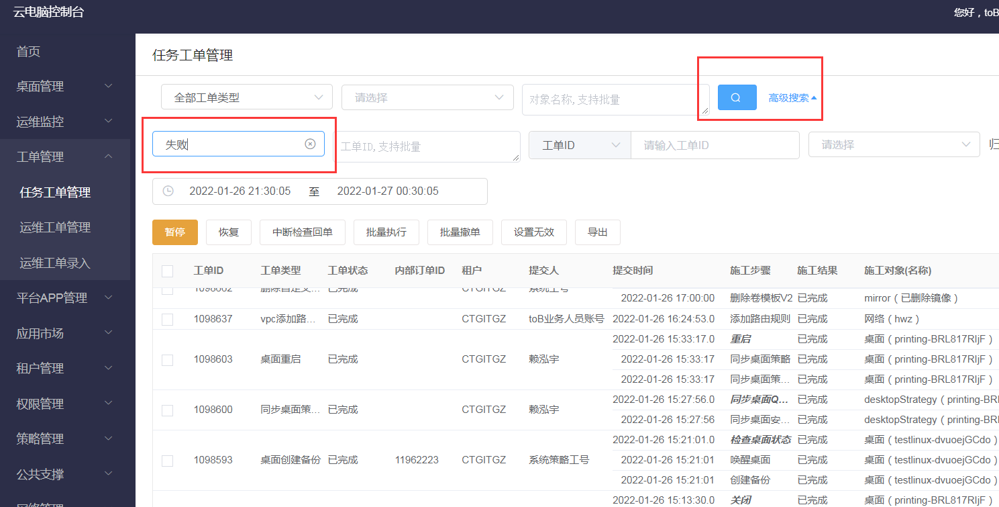
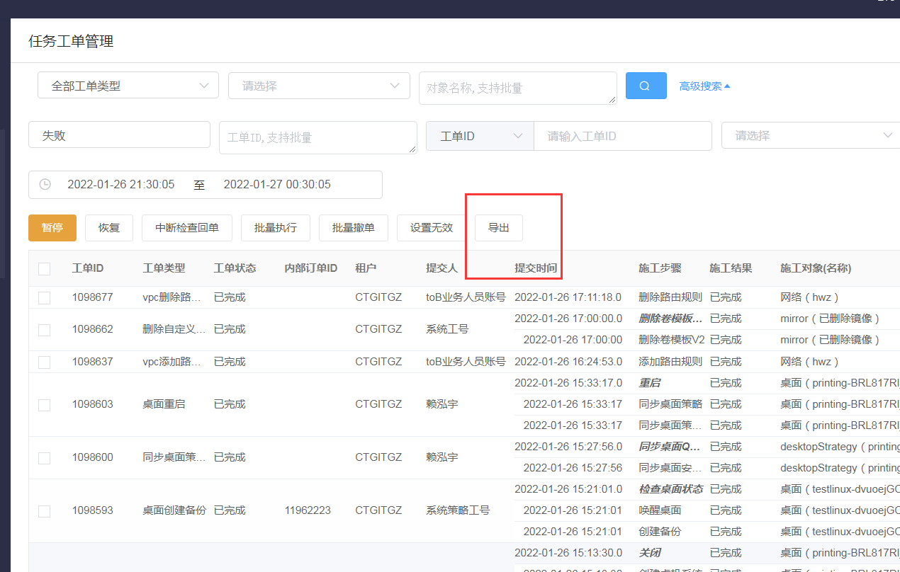

## 3.4  任务工单管理

### 3.4.1 暂停

【操作场景】

​    暂停待调度的工单，不再继续执行。

【准备事项】

任务工单处于“待调度”、“待处理”状态时，可以暂停工单。

【操作步骤】

步骤1 选择菜单，“工单管理”-> “任务工单管理”，打开页面。

步骤2 在指定的工单，点击操作栏的按钮。

步骤3 在下拉选项里，点击暂停。

以上步骤可参考下图

### 3.4.2 批量暂停

【操作场景】

​    批量暂停待调度的一个或多个工单，不再继续执行。

【准备事项】

任务工单处于“待调度”、“待处理”状态时，可以暂停工单。

【操作步骤】

步骤1 选择菜单，“工单管理”-> “任务工单管理”，打开页面。

步骤2 勾选需要暂停的工单。

步骤3 点击表格上方的“暂停”按钮。

以上步骤可参考下图

### 3.4.3 恢复

【操作场景】

​    恢复已暂停的工单，可继续执行。

【准备事项】

任务工单处于“暂停”状态时，可以恢复工单。

【操作步骤】

步骤1 选择菜单，“工单管理”-> “任务工单管理”，打开页面。

步骤2 在指定数据行，点击操作栏的按钮。

步骤3 在下拉选项里，点击恢复。

以上步骤可参考下图

### 3.4.4 批量恢复

【操作场景】

​    批量恢复已暂停的一个或多个工单，可继续执行。

【准备事项】

任务工单处于“暂停”状态时，可以恢复工单。

【操作步骤】

步骤1 选择菜单，“工单管理”-> “任务工单管理”，打开页面。

步骤2 勾选需要恢复的工单。

步骤3 点击表格上方的“恢复”按钮。

以上步骤可参考下图

### 3.4.5 重新执行

【操作场景】

​    执行失败的工单，可以选择重新执行任务。

【准备事项】

任务工单处于“失败”状态时，可以恢复工单。

【操作步骤】

步骤1 选择菜单，“工单管理”-> “任务工单管理”，打开页面。    

步骤2 在指定数据行，点击操作栏的按钮。

步骤3 在下拉选项里，点击重新执行。

以上步骤可参考下图

### 3.4.5 撤单

【操作场景】

​    失败的创建桌面工单、失败的tob管理台规格变更工单、失败的tob管理台新增数据盘工单，可以选择撤单，撤销订单。

【准备事项】

【操作步骤】

步骤1 选择菜单，“工单管理”-> “任务工单管理”，打开页面。    

步骤2 在指定符合撤单的数据行，点击操作栏的按钮。

步骤3 在下拉选项里，点击撤单执行

### 3.4.6 中断检查回单

【操作场景】

​    批量中断检查回单

【准备事项】

【操作步骤】

步骤1 选择菜单，“工单管理”-> “任务工单管理”，打开页面。    

步骤2 在指定符合的数据行，点击操作栏的按钮中断检查回单。

### 3.4.7 任务工单管理支持支持根据报错描述的关键字进行模糊查询

【操作场景】

​    任务工单管理支持支持根据报错描述的关键字进行模糊查询

【准备事项】

【操作步骤】

步骤1 选择菜单，“工单管理”-> “任务工单管理”，打开页面。    

步骤2 点击高级搜索，在错误描述的输入框中，输入失败描述模糊关键字搜索。

### 3.4.8 任务工单导出功能

【操作场景】

​    任务工单导出功能

【准备事项】

【操作步骤】

步骤1 选择菜单，“工单管理”-> “任务工单管理”，打开页面。    

步骤2 搜索出指定数据或全部数据，点击导出按钮

