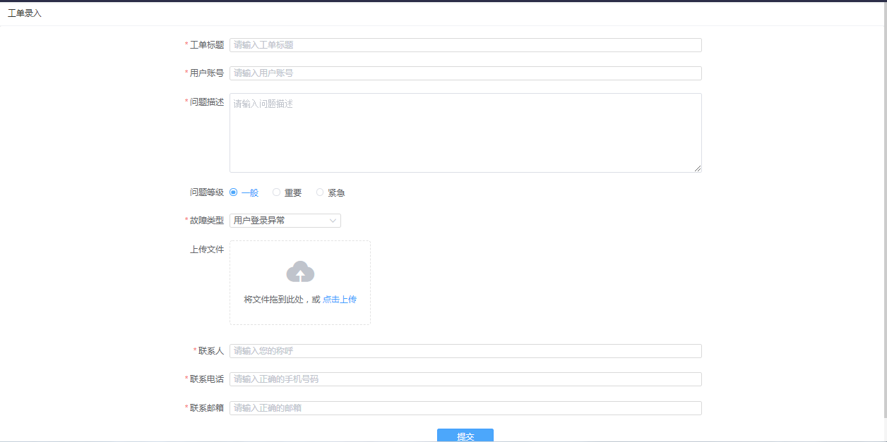
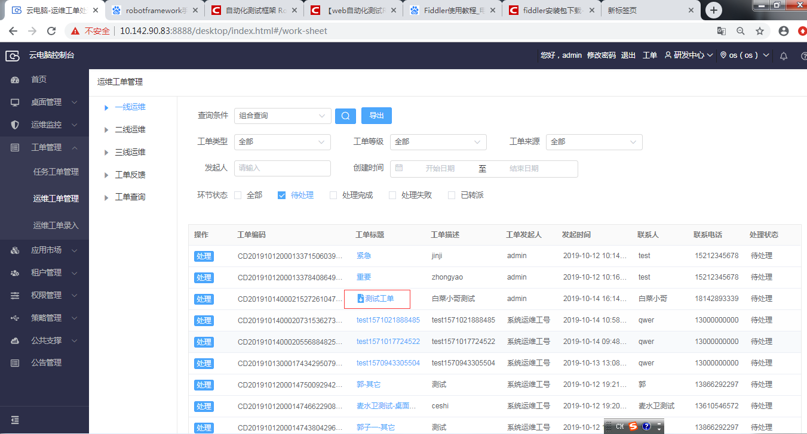
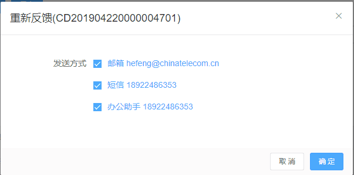
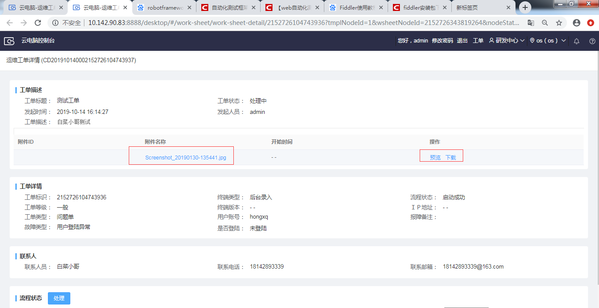
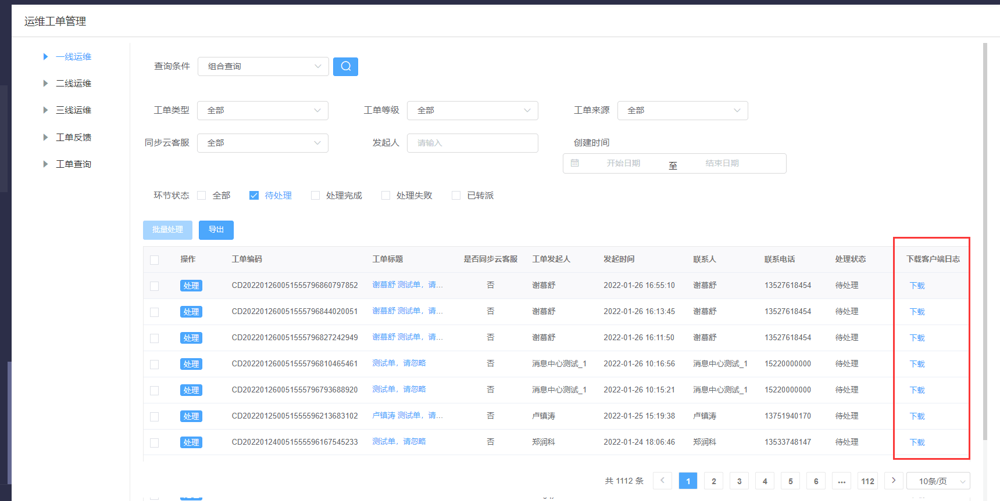

## 3.5  运维工单管理

​    用户登录或使用云电脑异常时，可进行报障。运维人员通过“运维工单管理”查询和处理用户报障。

### 3.5.1 运维工单录入

【操作步骤】

 步骤1：填写工单标题，用户账号，问题描述，故障类型联系人，联系电话，联系邮箱（都为必填项）。

步骤2：上传文件，点击上传，可上传附件（非必填项)。

步骤3：点击提交，会提示工单录入成功，在运维工单管理-工单查询，可查询到相关录入工单。

### 3.5.2 运维工单查询

【操作场景】

​    运维人员根据不同角色权限可以查询运维工单、导出工单。

【操作步骤】

步骤1 选择菜单，“工单管理”-> “运维工单管理”，打开页面。

步骤2 可选择“一线运维”、“二线运维”、“三线运维“、“工单反馈”或“工单查询”

步骤3 根据查询条件：组合查询：工单类型、工单等级、工单来源、发起人、创建时间段、工单状态等条件查询运维工单。

 也可根据工单编码，报障人电话，报障人邮箱等条件查询运维工单。

以上步骤可参考下图

### 3.5.3 运维工单处理

【操作场景】

​    运维人员可对查询到的故障单分配给其他运维人员继续跟进，或处理完成后结束工单。三线运维人员查询出工单后不能再转派其他人员处理。

【操作步骤】

步骤1 选择菜单，“工单管理”-> “运维工单管理”，打开页面。

步骤2 可选择“一线运维”、“二线运维”、“三线运维”、或“工单查询”

步骤3 点击“处理”按钮。

### 3.5.4 运维工单反馈

【操作场景】

​    针对处理完成但是反馈用户不成功的工单，可以通过“工单反馈”手动触发工单处理结果通知用户。

【操作步骤】

步骤1 选择菜单，“工单管理”-> “运维工单管理”，打开页面。

步骤2 选择“工单反馈”查询反馈失败的工单。

步骤3 点击“重新反馈”按钮。发送方式关联的邮箱、号码、办公助手账号为用户信息填写的相关记录。

### 3.5.5 运维工单详情

【操作步骤】

步骤1  选择菜单，“工单管理”-> “运维工单管理”，打开页面。

步骤2 点击相关带有附件的运维工单，可查看运维工单详情。

步骤3 点击附件名称，或者预览可以对相关附件进行在线查看，点击下载可以进行下载。

### 3.5.5 下载客户端日志

【操作步骤】

步骤1  选择菜单，“工单管理”-> “运维工单管理”，打开页面。

步骤2 点击相关客户端的工单

步骤3 带有客户端日志下载，点击下载可以进行下载。

