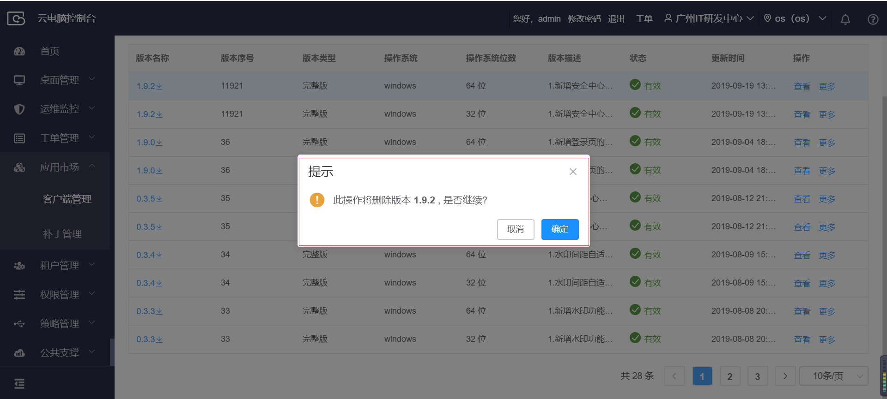

## 3.6  平台APP管理

### 3.6.1 客户端管理

【操作场景】

新增客户端软件进行统一管理

【操作步骤】

步骤1 进入【平台APP管理 -> 客户端管理】列表。

步骤2 点击【新增】按钮，填写软件名称、软件编码、状态、备注信息，点击【确定】按钮

​    

 

【操作场景】

​    查看客户端软件配置信息详情  

【操作步骤】

步骤1 进入【平台APP管理 -> 客户端管理】列表。

步骤2 点击【更多】按钮，弹出详情，点击详情查看

 

【操作场景】

​    编辑客户端软件配置信息详情  

【操作步骤】

步骤1 进入【平台APP管理 -> 客户端管理】列表。

步骤2 点击【更多】-【编辑】按钮，弹出编辑客户端软件窗口

【操作场景】

​    对客户端版本进行管理

【操作步骤】

步骤1 进入【平台APP管理 -> 客户端管理-> 公共版】列表。

步骤2 点击【版本管理】按钮，或者点击软件名称进入版本管理界面

 

步骤3 点击【版本管理】按钮，或者点击软件名称进入版本管理界面

【操作场景】

​    对客户端版本进行新增操作

【操作步骤】

步骤1 进入【平台APP管理 -> 客户端管理-> 公共版】列表。

步骤2 点击【版本管理】，或者点击软件名称进入版本管理界面。

 步骤3 版本管理列表，默认数据为空，点击【新增版本】按钮。

 

步骤4 进入新增版本界面，填写(版本号、版本序号、版本描述)、选择（版本类型、操作系统类型）、勾选（是否灰度）、勾选（是否强制更新、操作系统位数），填写（最低版本号）、上传软件包，点击【确定】按钮

 

 

【操作场景】

​    查看客户端版本信息详情

 

【操作步骤】

步骤1 进入【平台APP管理 -> 客户端管理】列表。

步骤2 点击【版本管理】，或者点击软件名称进入版本管理界面。

步骤3 选择需要查看的版本号，点击【查看】按钮。

步骤4 弹出查看版本信息详情界面。

 【操作场景】

  编辑、下载、删除操作

【操作步骤】

 步骤1  【平台APP管理 -> 客户端管理】列表。

 步骤2    点击【版本管理】，或者点击软件名称进入版本管理界面。

 步骤3    点击更多，选择编辑

 步骤4    点击更多，选择下载

 步骤5    点击更多，选择删除，点击删除弹窗提示是否确认删除

 步骤6   点击删除弹窗提示是否确认删除

【操作场景】

​    对客户端软件配置进行编辑

【操作步骤】

步骤1 进入【平台APP管理 -> 客户端管理】列表。

步骤2 点击【更多 –> 编辑】按钮，弹出编辑客户端软件界面

步骤3在编辑客户端软件界面，修改软件名称、状态、备注信息，点击【确定】按钮

 

【操作场景】

​    对客户端软件配置进行删除

【操作步骤】

步骤1 进入【平台APP管理 -> 客户端管理】列表。

步骤2 复选框勾选需要删除的软件名称，点击【更多 ->删除】按钮

 

步骤3 弹出二次删除确认框，点击【确定】按钮，删除客户端信息，不可恢复，谨慎操作。

 云公司版与公共版操作步骤一致

### 3.6.2 补丁管理

#### 3.6.2.1 补丁管理

【操作场景】

  新增补丁

【操作步骤】

步骤1 进入【平台APP管理> 补丁管理】列表。

步骤2 点击【新增】按钮，跳转到新增补丁页面，上传配置文件、上传补丁更新包，点击确定按钮

【操作场景】

补丁查询

【操作步骤】

步骤1 进入【平台APP管理 > 补丁管理】列表。

步骤2 输入补丁包名称查询按钮。

【操作场景】

查看补丁详情

【操作步骤】

步骤1 进入【平台APP管理 > 补丁管理】列表。

步骤2 点击查看按钮，弹出补丁详情页面

【操作场景】

  编辑补丁

【操作步骤】

步骤1 进入【平台APP管理 > 补丁管理】列表。

步骤2 点击更多，选择点击“编辑”。

【操作场景】

删除补丁

【操作步骤】

步骤1 进入【平台APP管理 > 补丁管理】列表。

步骤2 点击更多，选择点击“删除”。

#### 3.6.2.2 补丁安装查询

【操作场景】

 补丁安装查询

【操作步骤】

步骤1 进入【平台APP管理 > 补丁管理】列表。

步骤2 点击补丁安装查询按钮，跳转到补丁安装查询页面

步骤3 在查询框中输入补丁名称、补丁版本号、桌面名称，点击高级查询输入用户名和更新时间。

#### 3.6.2.3 灰度升级

【操作场景】

灰度升级列表删除

【操作步骤】

步骤1 进入【平台APP管理 > 补丁管理】列表。

步骤2 点击灰度升级，进入灰度升级列表。

步骤3 选择某条数据，点击删除提示“是否确定”删除。

步骤4 批量勾选数据，点击批量删除提示“是否批量删除”。

【操作场景】

灰度升级列表查询

【操作步骤】

步骤1 进入【平台APP管理 > 补丁管理】列表。

步骤2 点击灰度升级，进入灰度升级列表。

步骤3 输入“桌面完整的桌面名称”点击查询。

#### 3.6.2.4 补丁汇总

【操作场景】

 补丁汇总

【操作步骤】

步骤1 进入【平台APP管理 > 补丁管理】列表。

步骤2 点击补丁汇总按钮，跳转到补丁管理列表

【操作场景】

 补丁查询

【操作步骤】

步骤1 进入【平台APP管理 > 补丁管理>补丁汇总】补丁管理列表列表。

步骤2 输入补丁名称，输入补丁编码，点击查询按钮。

【操作场景】

 补丁详情查看

【操作步骤】

步骤1 进入【平台APP管理 > 补丁管理>补丁汇总】补丁管理列表列表。

步骤2 点击查看按钮，弹出补丁详情弹窗页面。

【操作场景】

 查看补丁版本

【操作步骤】

步骤1 进入【平台APP管理 > 补丁管理>补丁汇总>补丁管理列表】列表

步骤2 选择一个补丁，点击补丁名称跳转到查看补丁版本页面。

【操作场景】

 查看版本信息

【操作步骤】

步骤1 进入【平台APP管理 > 补丁管理>补丁汇总>补丁管理列表>查看补丁版本】列表

步骤2 点击查看按钮，弹出补丁版本信息弹窗页面

【操作场景】

 版本查询

【操作步骤】

步骤1 进入【平台APP管理 > 补丁管理>补丁汇总>补丁管理列表>查看补丁版本】列表

步骤2 在查询栏中输入版本名称、版本序号，点击查询按钮

### 3.6.3 管控补丁管理

#### 3.6.3.1 管控补丁管理

【操作场景】

  新增管控补丁

【操作步骤】

步骤1 进入【平台APP管理 > 管控补丁管理】列表。

步骤2 点击【新增】按钮，跳转到新增管控补丁页面，上传配置文件、上传管控补丁更新包，点击确定按钮

【操作场景】

管控补丁查询

【操作步骤】

步骤1 进入【平台APP管理 > 管控补丁管理】列表。

步骤2 输入管控补丁包名称点击查询按钮。

【操作场景】

查看管控补丁详情

【操作步骤】

步骤1 进入【平台APP管理 > 补丁管理】列表。

步骤2 点击查看按钮，弹出管控补丁详情页面

【操作场景】

  编辑管控补丁

【操作步骤】

步骤1 进入【平台APP管理 > 管控补丁管理】列表。

步骤2 点击更多，选择点击“编辑”。

【操作场景】

删除补丁

【操作步骤】

步骤1 进入【平台APP管理 > 管控补丁管理】列表。

步骤2 点击更多，选择点击“删除”。

【操作场景】

补丁发布

【操作步骤】

步骤1 进入【平台APP管理 > 管控补丁管理】列表。

步骤2 点击更多，选择点击“补丁发布”。

步骤3 选择发布维度，勾选可选择资源池/租户/桌面池/桌面，点击“确定”。

【操作场景】

转为通用补丁

【操作步骤】

步骤1 进入【平台APP管理 > 管控补丁管理】列表。

步骤2 点击更多，选择点击“转为通用补丁”。

步骤3 提示框点击“确定”。

#### 3.6.3.2 管控补丁安装查询

【操作场景】

 管控补丁安装查询

【操作步骤】

步骤1 进入【平台APP管理 > 管控补丁管理】列表。

步骤2 点击管控补丁安装查询按钮，跳转到管控补丁安装查询页面

步骤3 在查询框中输入管控补丁名称、管控补丁版本号、桌面名称，勾选是否当前资源池，点击高级查询输入用户名和更新时间。

#### 3.6.3 管控补丁汇总

【操作场景】

 管控补丁汇总

【操作步骤】

步骤1 进入【平台APP管理 > 管控补丁管理】列表。

步骤2 点击管控补丁汇总按钮，跳转到管控补丁管理列表

【操作场景】

 管控补丁查询

【操作步骤】

步骤1 进入【平台APP管理 > 管控补丁管理>管控补丁汇总】管控补丁管理列表。

步骤2 输入管控补丁名称，输入管控补丁编码，点击查询按钮。

【操作场景】

 补丁详情查看

【操作步骤】

步骤1 进入【平台APP管理 > 管控补丁管理>管控补丁汇总】管控补丁管理列表。

步骤2 点击查看按钮，弹出管控补丁详情弹窗页面。

【操作场景】

 查看管控补丁版本

【操作步骤】

步骤1 进入【平台APP管理 > 管控补丁管理>管控补丁汇总】管控补丁管理列表。

步骤2 选择一个管控补丁，点击管控补丁名称跳转到查看管补丁版本页面。

【操作场景】

 查看版本信息

【操作步骤】

步骤1 进入【平台APP管理 > 管控补丁管理>管控补丁汇总】管控补丁管理列表。

步骤2 选择一个管控补丁，点击管控补丁名称跳转到查看管补丁版本页面。

步骤3 点击查看按钮，弹出补丁版本信息弹窗页面

【操作场景】

 版本查询

【操作步骤】

步骤1 进入【平台APP管理 > 管控补丁管理>管控补丁汇总>管控补丁管理列表>查看管控补丁版本】列表

步骤2 在查询栏中输入版本名称、版本序号，点击查询按钮

