## 3.7  租户管理

### 3.7.1 租户信息

【操作场景】编辑租户信息

 

【操作步骤】

步骤1 打开租户管理页面，可开启或关闭该租户的设备绑定、备份、并发桌面功能，还可修改并发度、租户名称、联系人姓名、联系人电话、联系人地址、联系人邮箱、备注信息，点击保存后编辑成功。

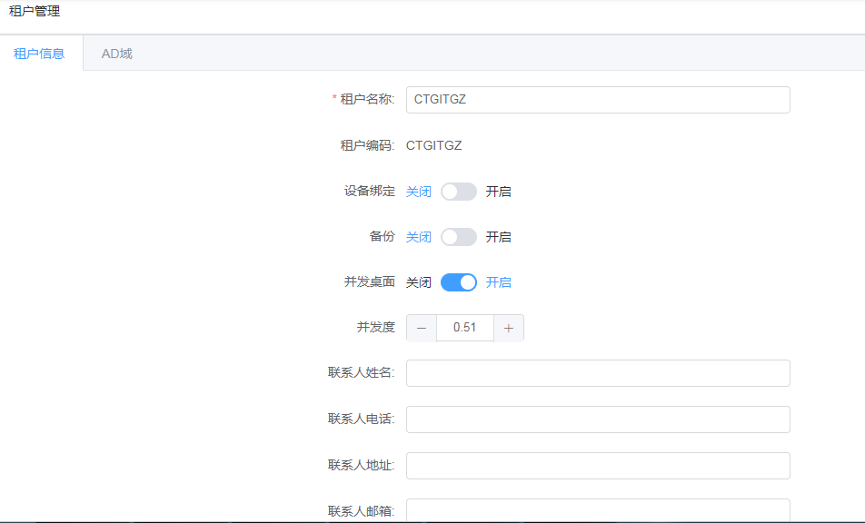

 

【操作场景】查看修改AD域认证信息

 

【操作步骤】

步骤1 点击“AD域”tab菜单页面，编辑后点击保存。

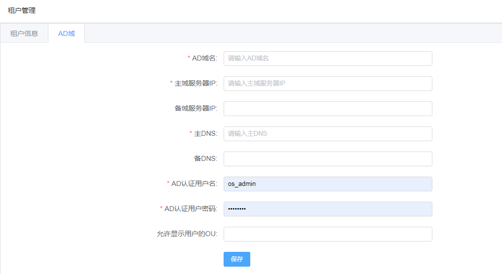

 

### 3.7.1.1 双因子认证-短信认证

【操作场景】双因子认证-短信认证

【操作步骤】

步骤1 登录业务管理台-进入租户管理-进入租户管理-点击开启双因子认证登录 按钮，然后点击保存。

步骤2 双因子开启成功，绑定了手机号码的用户登录客户端需要进行短信验证登录

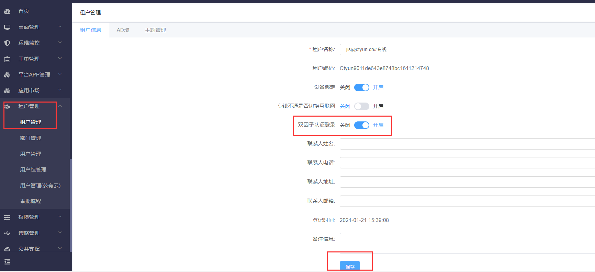

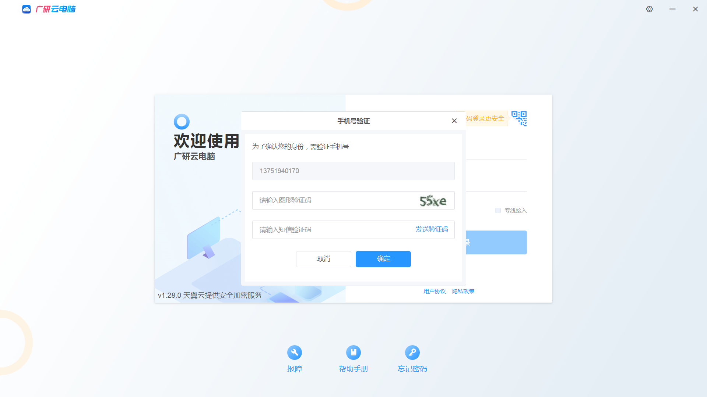

 

【操作步骤】

步骤1 打开租户管理页面，可开启或关闭该租户的设备绑定、备份、并发桌面功能，还可修改并发度、租户名称、联系人姓名、联系人电话、联系人地址、联系人邮箱、备注信息，点击保存后编辑成功。

### 3.7.2 主题管理

【操作场景】编辑默认主题

【操作步骤】[主题设置]选择默认主题，点击确定，用该租户下的用户登录客户端

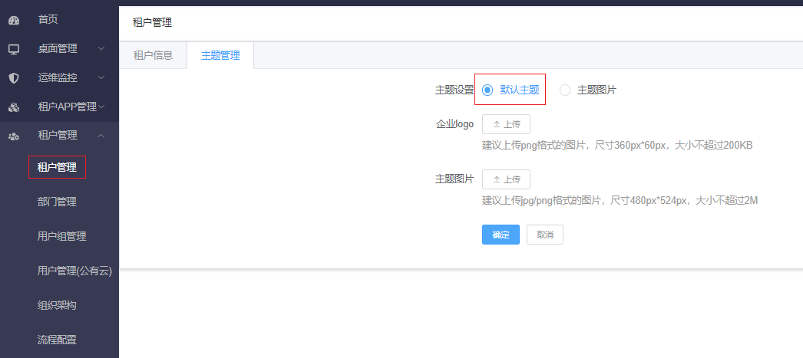

【操作场景】编辑主题图片

【操作步骤】[主题设置]选择主题图片，上传符合要求的企业logo和主题图片，点击确定，用该租户下的用户登录客户端

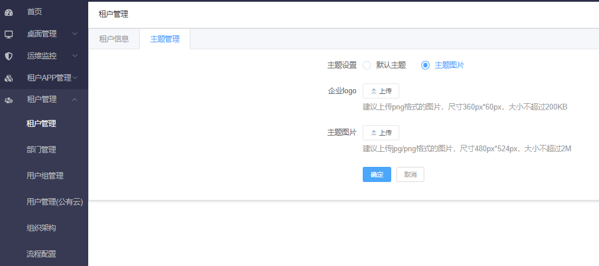

### 3.7.2 部门管理

【操作场景】新建部门

 

【操作步骤】

​    步骤1 打开部门管理页面，点击新建部门。

步骤2 输入部门名称、选择上级部门，输入描述（选填），点击确定按钮。

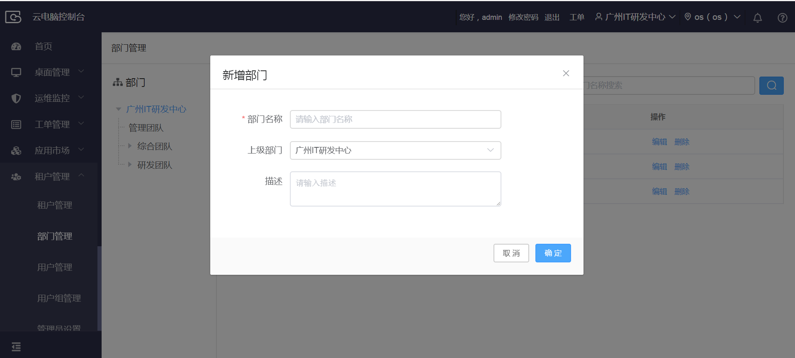

 

【操作场景】编辑部门

 

【操作步骤】

步骤1 打开部门管理页面，对某个部门点击编辑。

步骤2 输入部门名称、描述，点击确定按钮。

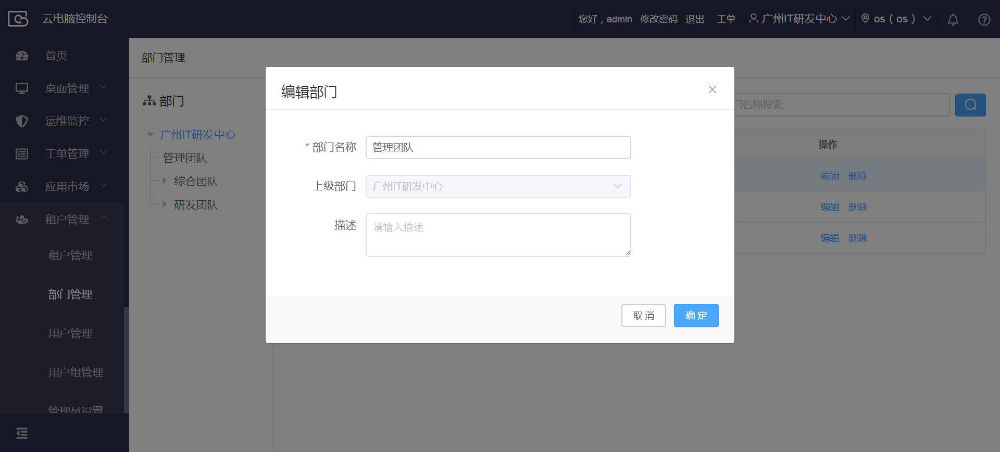

 

【操作场景】删除部门。

 

【操作步骤】

步骤1 打开部门管理页面，对某个部门点击删除，确认删除。

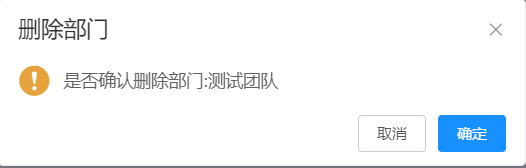

 

### 3.7.3 用户管理

### 3.7.3.1 新建用户

【操作场景】新建用户。

 【操作步骤】

步骤1 打开用户管理页面，点击创建用户。

步骤2 输入姓名、账号，选择密码生成方式。

步骤3 手动生成方式需要输入密码，随机生成方式需要输入接收密码的手机号/邮箱。

步骤4 选择角色（选填），选择是否允许登陆管理平台，勾选密码发送方式，点击提交。

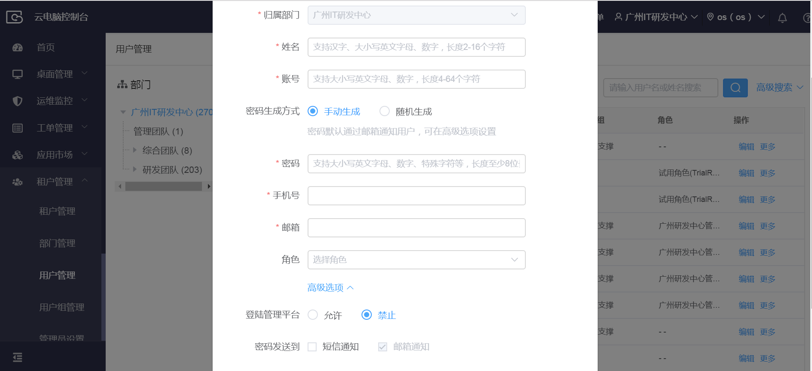

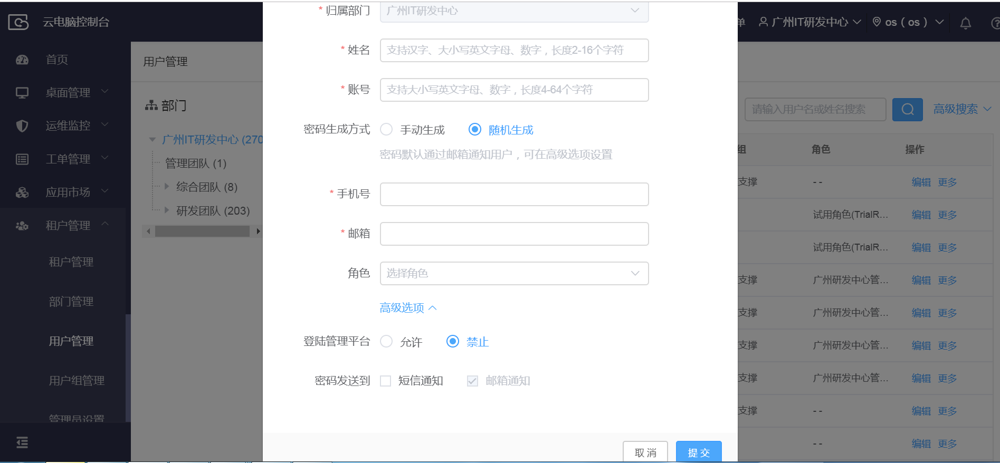

 

### 3.7.3.2 编辑用户

【操作场景】编辑用户

【操作步骤】

步骤1 打开用户管理页面，对某个用户点击编辑。

步骤2 输入姓名、手机号、邮箱，选择是否允许登陆管理平台，点击确定按钮。

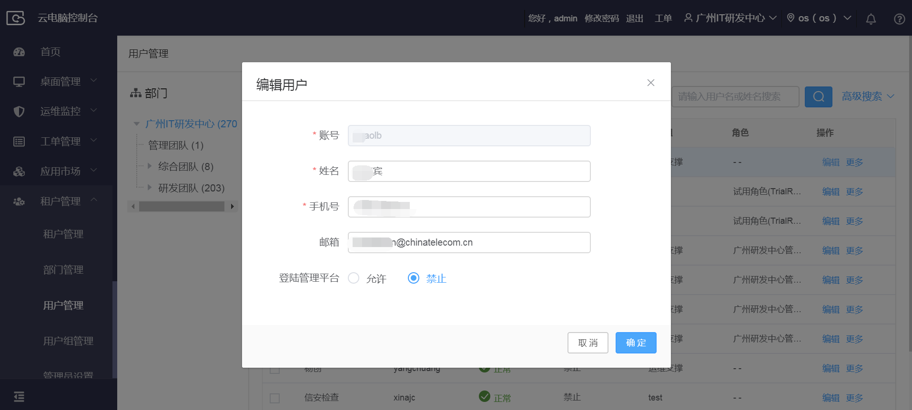

### 3.7.3.3 删除用户

【操作场景】删除用户。

【操作步骤】

步骤1 打开用户管理页面，对某个用户点击更多，再点击删除用户。

步骤2 输入删除原因（选填），点击确定删除。

 

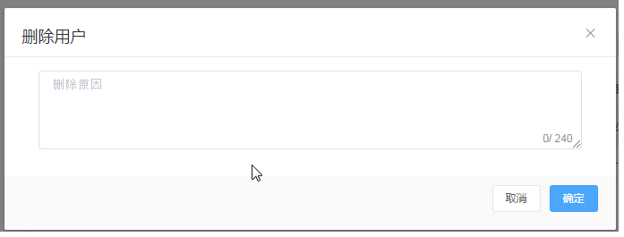

### 3.7.3.4 查询用户

【操作场景】查询用户。

【操作步骤】

步骤1 打开用户管理页面，点击“高级查询”，输入用户名/邮箱/手机号/角色/状态/登录管理台的权限。

步骤2 点击查询按钮。

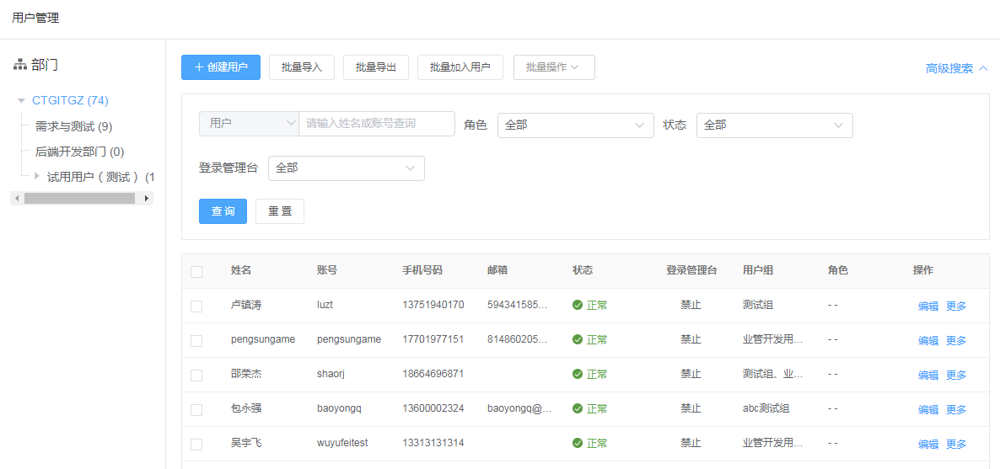

### 3.7.3.5 修改用户密码

【操作场景】修改用户密码

【操作步骤】

步骤1 打开用户管理页面，对某个用户点击更多，再点击修改密码。

步骤2 选择密码生成方式。

步骤3 手动生成方式需要输入新密码和确认密码，随机生成方式则不需要填写。

步骤4 勾选密码发送方式，点击提交。

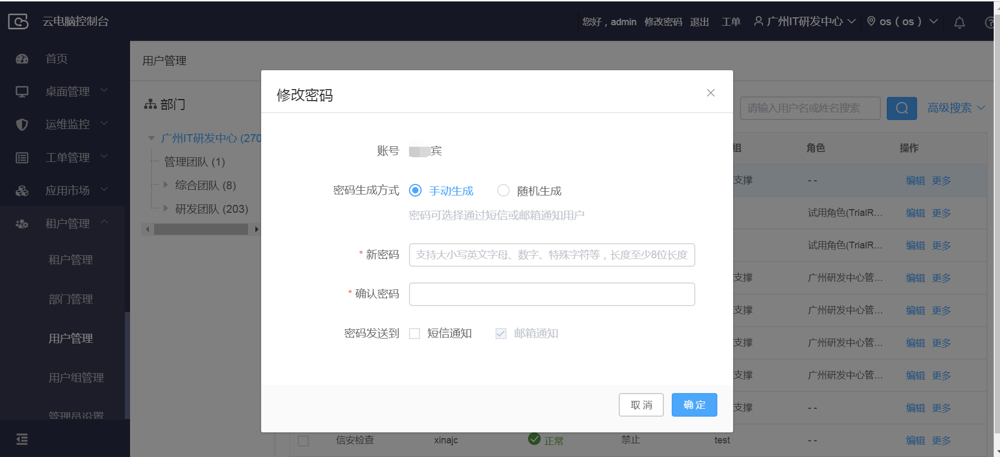

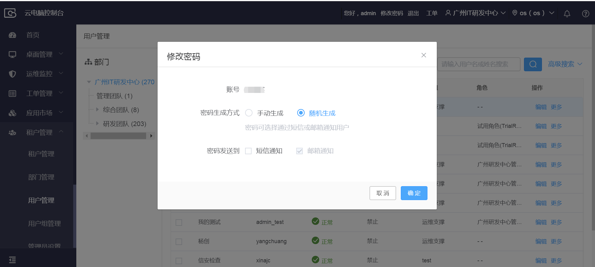

### 3.7.3.6 设置用户组

【操作场景】设置用户组

【操作步骤】

步骤1 打开用户管理页面，对某个用户点击更多，再点击设置用户组。

步骤2 将可选用户组加入到已选用户组，点击确定。

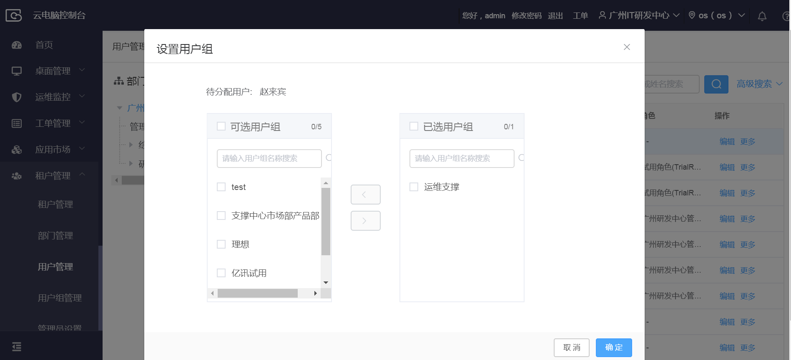

 

### 3.7.3.7 加入部门

【操作场景】加入部门

【操作步骤】

步骤1 打开用户管理页面，对某个用户点击更多，再点击加入部门。

步骤2 选择加入部门，点击确定。

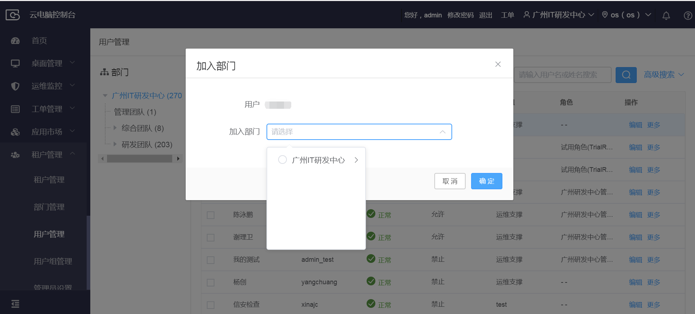

 

### 3.7.3.8 迁移部门

【操作场景】迁移部门

【操作步骤】

步骤1 打开用户管理页面，对某个用户点击更多，再点击迁移部门。

步骤2 选择迁移后部门，点击确定。

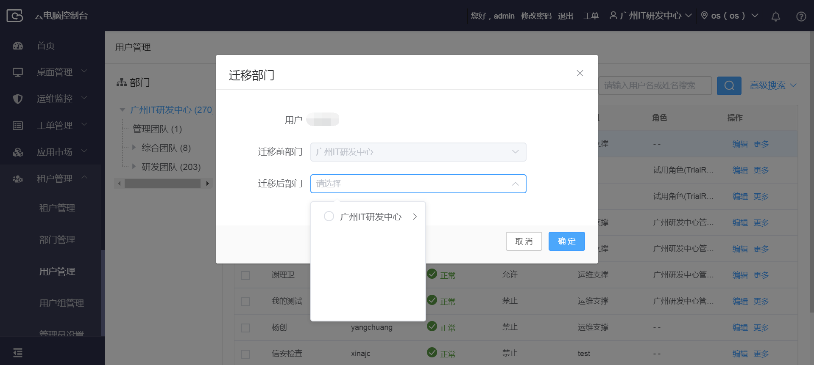

 

### 3.7.3.9 设置角色

【操作场景】设置角色

【操作步骤】

步骤1 打开用户管理页面，对某个用户点击更多，再点击设置角色。

步骤2 选择角色，点击确定。

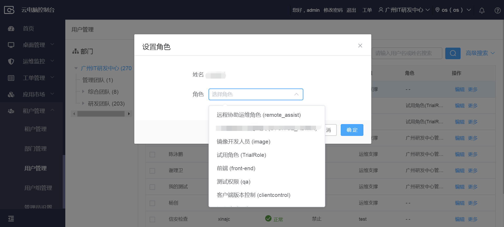

 

### 3.7.3.10 停用用户

【操作场景】停用用户

【准备事项】用户状态为正常。

【操作步骤】

步骤1 打开用户管理页面，对某个用户点击更多，再点击停用，点击确定

步骤2 用户被停用后将不能登录使用云电脑。

 

### 3.7.3.11 启用用户

【操作场景】启用用户

【准备事项】用户状态为停用

【操作步骤】

步骤1 打开用户管理页面，对某个用户点击更多，再点击启用，点击确定。

 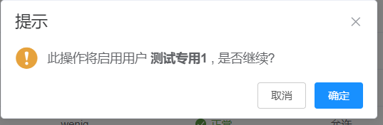

### 3.7.3.12 解锁用户

【操作场景】解锁用户

【准备事项】用户登录短时间内失败5次后，用户状态为锁定。

【操作步骤】

步骤1 打开用户管理页面，对某个用户点击更多，再点击解锁，点击确定。

步骤2 用户状态恢复为正常。

 

### 3.7.3.13 批量导入用户

【操作场景】批量导入用户

【操作步骤】

步骤1 打开用户管理页面，点击批量导入。

步骤2 选择部门，选择密码生成方式，勾选密码发送方式。

步骤3 上传数据附件（数据模板可从页面下载），点击导入。

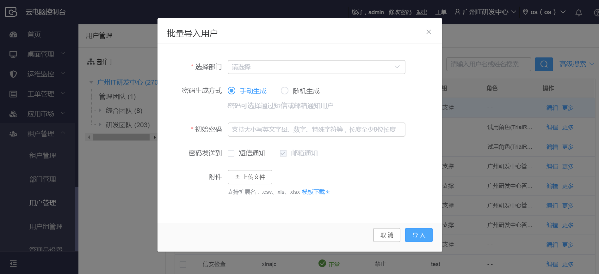

 

### 3.7.3.14 批量导出用户

【操作场景】批量导出用户

【操作步骤】

步骤1 打开用户管理页面，点击批量导出。

步骤2 选择用户状态、选择角色，点击导出。

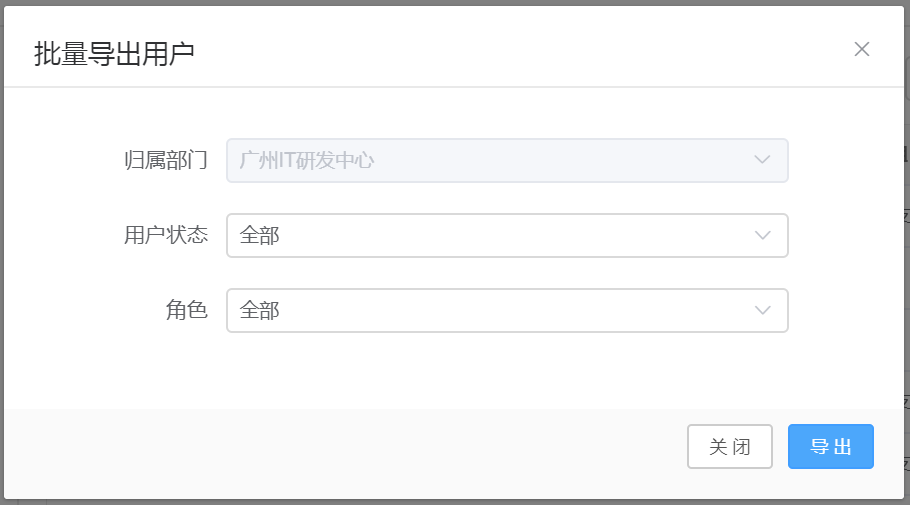

 

### 3.7.3.15 批量操作用户

【操作场景】批量操作用户

【操作步骤】

步骤1 打开用户管理页面，勾选一个部门下的用户，点击批量操作。

步骤2 可以进行批量加入用户组、批量修改密码、批量删除用户、批量加入部门、批量迁移部门、批量设置停用，批量设置启用，功能详情与上述功能相同。

### 3.7.3.16 批量迁移部门

【操作场景】批量迁移部门

【操作步骤】

步骤1 打开用户管理页面，点击迁移部门

步骤2 勾选桌面迁移至新部门

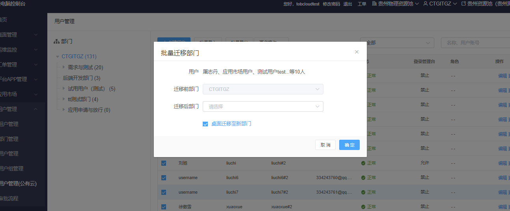

### 3.7.3.17 双因子设置

【操作场景】双因子设置

步骤1 选择一个允许登录管理台的用户，并设置角色

步骤2 点击进入编辑页面，在双因子认证行中，点击开启，并填写手机号码，接收短信认证

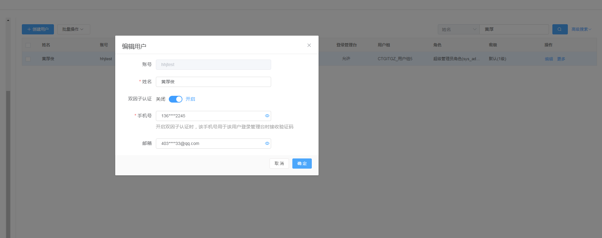

### 3.7.4 用户组管理

【操作场景】新建用户组

 

【操作步骤】

步骤1 打开用户组管理页面，点击创建用户组。

步骤2 输入用户组名称、描述（选填），点击提交。

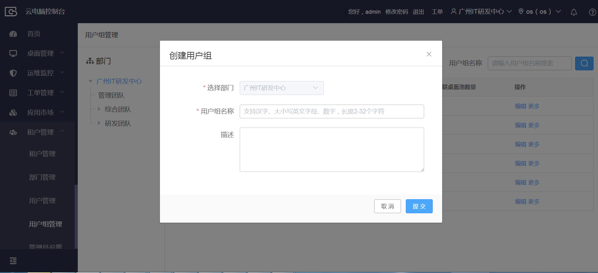

 

【操作场景】编辑用户组

 

【操作步骤】

步骤1 打开用户组管理页面，对某个用户组点击编辑。

步骤2 输入用户组名称、描述，点击确定。

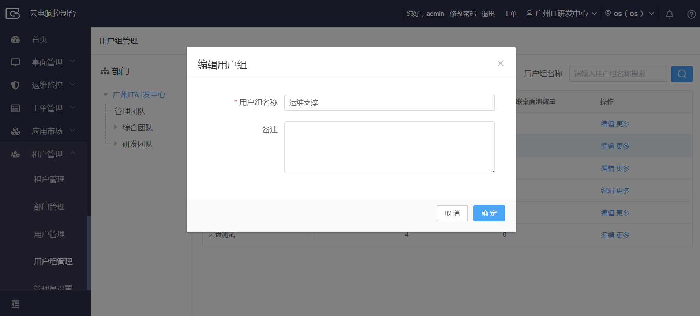

 

【操作场景】删除用户组。

 

【操作步骤】

步骤1 打开用户组管理页面，对某个用户组点击更多，点击删除用户组，确认删除。

 

【操作场景】设置组内用户

 

【操作步骤】

步骤1 对某个用户组点击更多，点击设置组内用户。

步骤2 将可选用户添加到已选用户，点击确定。

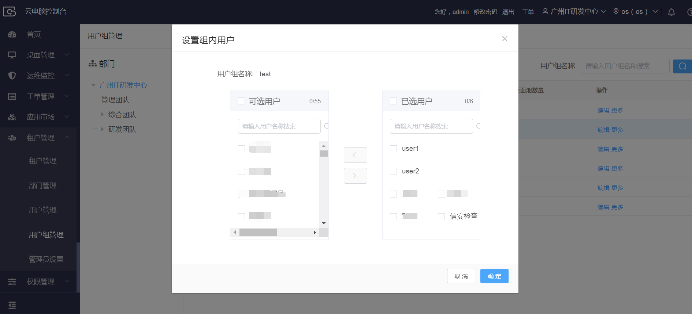

 

【操作场景】设置关联桌面池

 

【操作步骤】

步骤1 打开用户组管理页面，对某个用户组点击更多，点击设置关联桌面池。

步骤2 将可选桌面池添加到已选桌面池，点击确定。

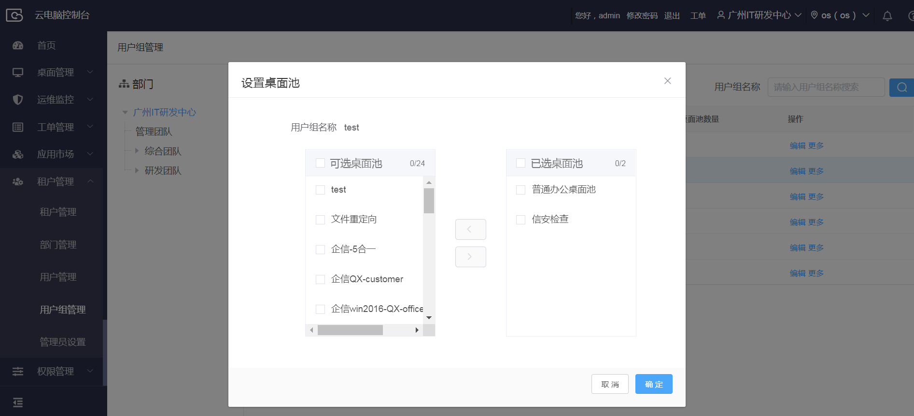

### 3.7.5 管理员设置

【操作场景】新建管理员

 

【操作步骤】

步骤1 打开管理员设置页面，点击创建管理员。

步骤2 输入姓名、账号、密码、确认密码，点击提交。

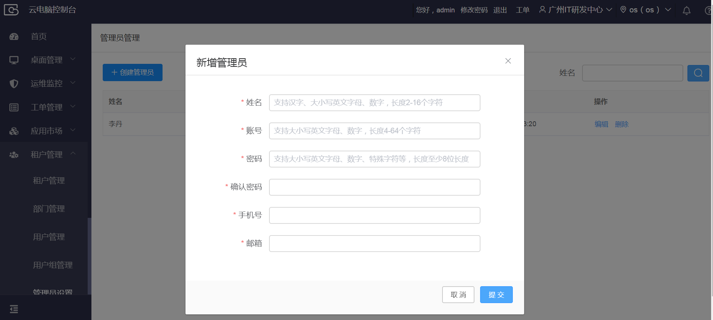

 

【操作场景】编辑管理员

 

【操作步骤】

步骤1 打开管理员设置页面，选择某个管理员，点击编辑。

步骤2 输入姓名、密码、确认密码、点击提交。

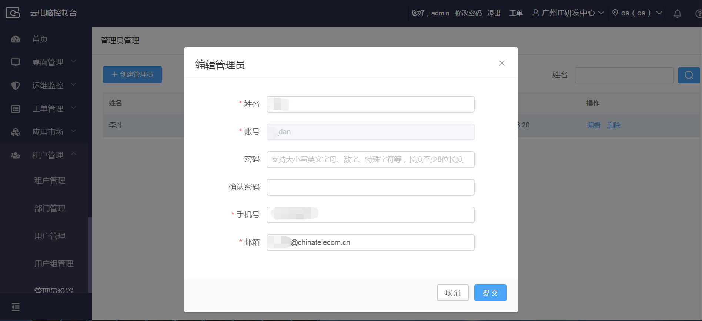

 

【操作场景】删除管理员

 

【操作步骤】

步骤1 打开管理员设置页面，选择某个管理员点击删除，确认删除。

 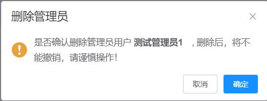

### 3.8.1 用户管理（公有云）

【操作场景】批量迁移部门

【操作步骤】

步骤1 打开用户管理（公有云）页面，更多操作--批量迁移部门。

步骤2 勾选需要迁移部门的用户

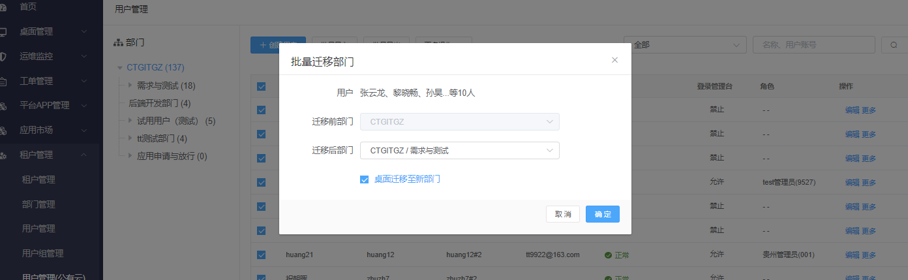

【操作场景】批量删除用户

【操作步骤】

步骤1 打开用户管理（公有云）页面，更多操作--批量删除用户。

步骤2 勾选需要删除的用户

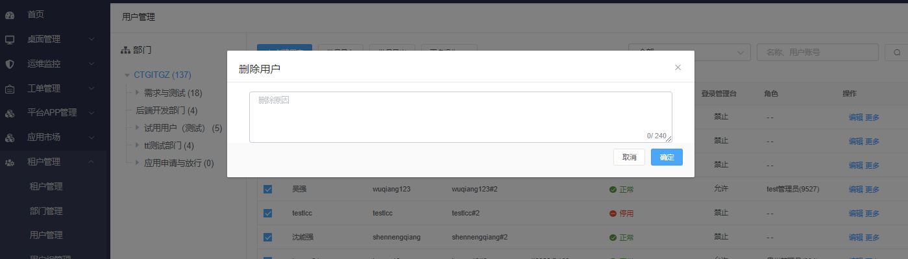