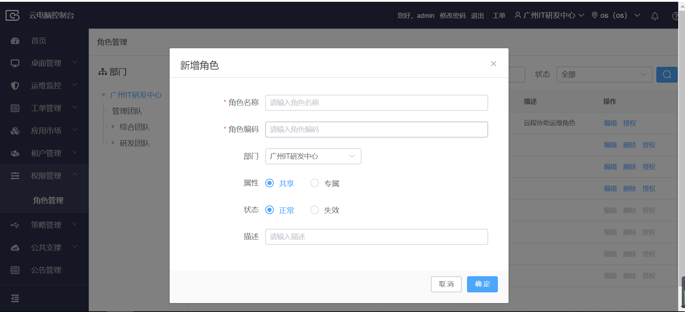
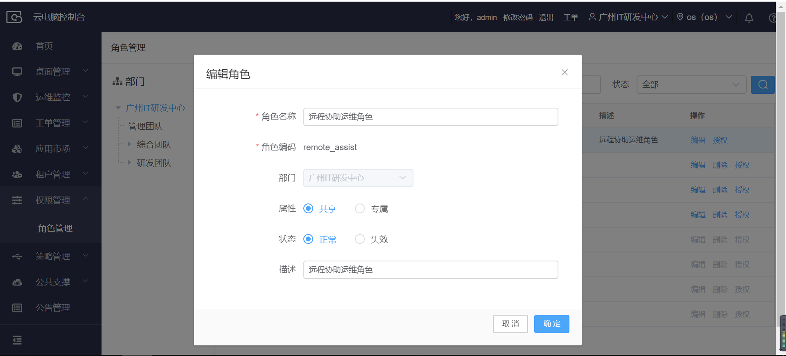
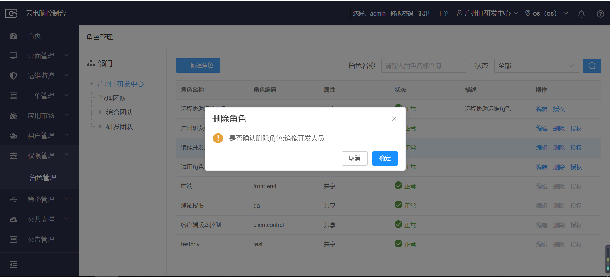
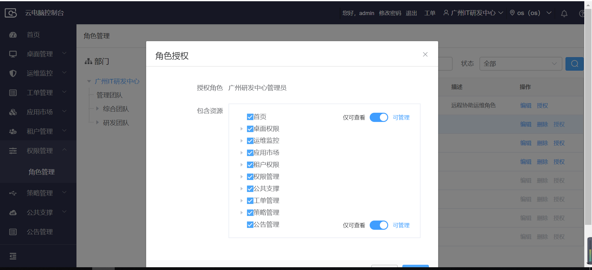
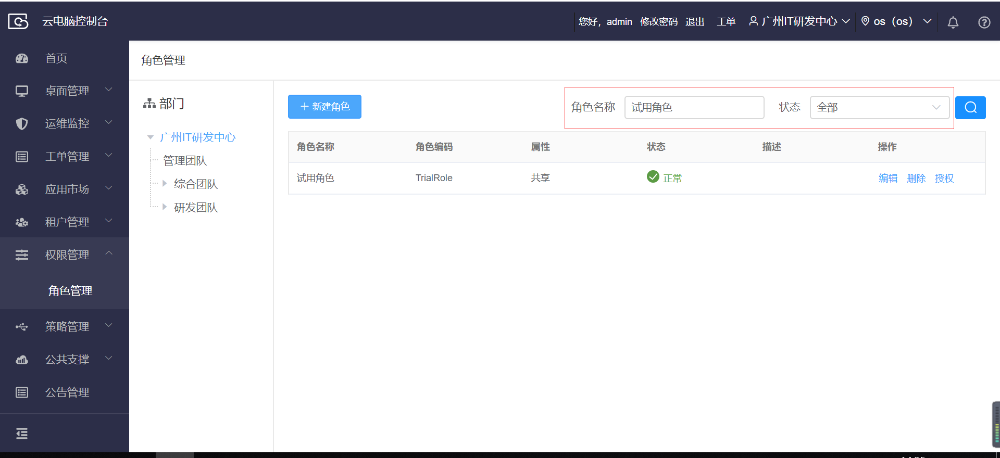

## 3.8  权限管理

### 3.8.1 角色管理

【操作场景】

​	新建角色

【操作步骤】

步骤1 点击权限管理菜单下的角色管理，进入角色管理页面。

步骤2 点击新建角色。

步骤3 输入角色名称、角色编码，选择部门、属性、状态，输入描述（可选），点击确定。

 

【操作场景】

​	编辑角色

【操作步骤】

步骤1 点击权限管理菜单下的角色管理，进入角色管理页面。

步骤2 对某个角色点击编辑。

步骤3 输入角色名称，选择属性、状态，输入描述（可选），点击确定。

 

【操作场景】

​	删除角色

【操作步骤】

步骤1 点击权限管理菜单下的角色管理，进入角色管理页面。

步骤2 对某个角色点击删除，确认删除。

 

【操作场景】

​	角色菜单授权

 【操作步骤】

步骤1 点击权限管理菜单下的角色管理，进入角色管理页面。

步骤2 对某个角色点击授权。

步骤3 勾选可以访问的菜单资源，点击确定。

 【操作场景】

 	角色查询

 【操作步骤】

   步骤1 点击权限管理菜单下的角色管理，进入角色管理页面。

   步骤2  输入角色名称，选择角色状态，点击查询。

