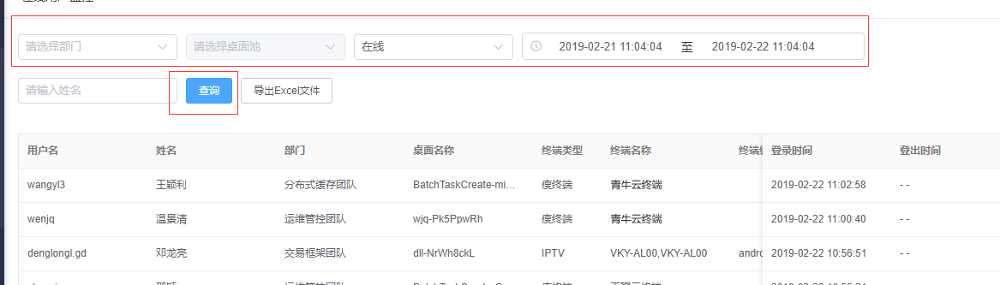
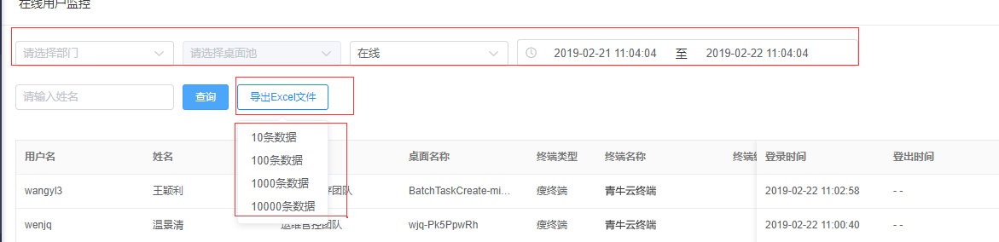
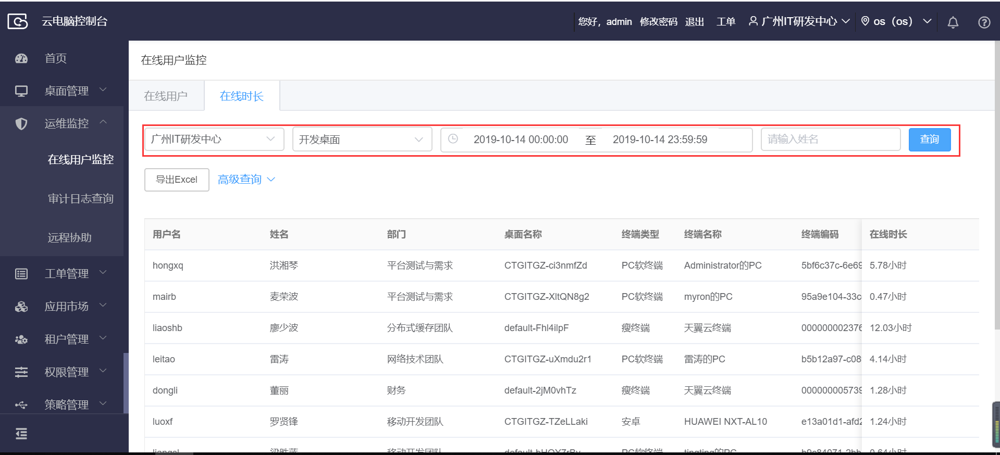
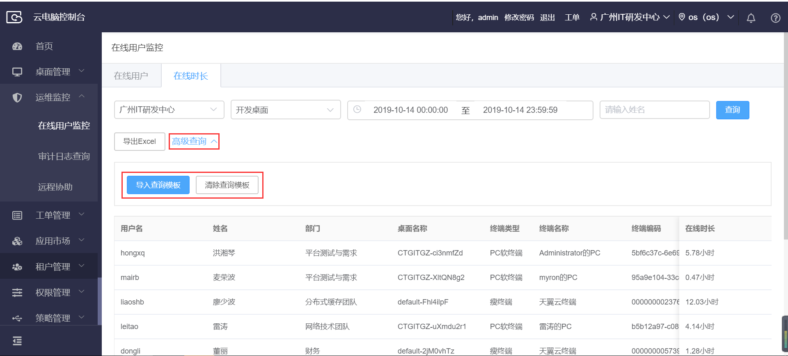
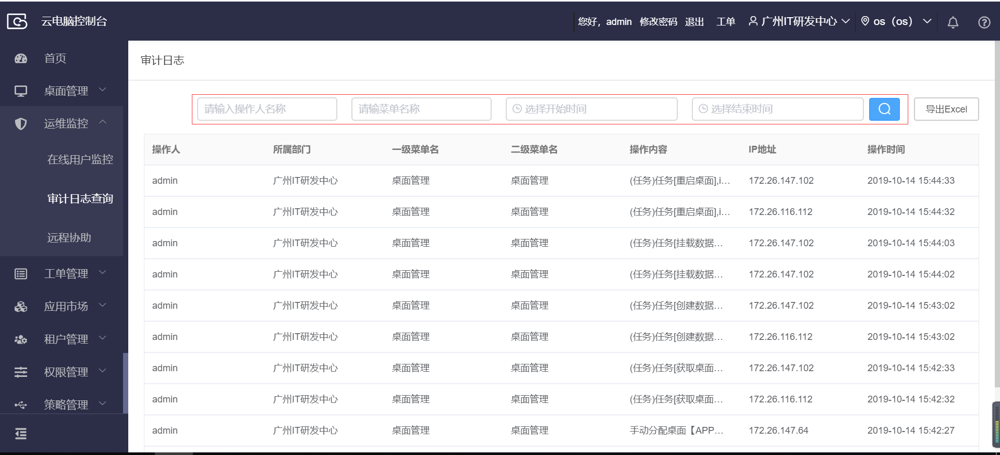
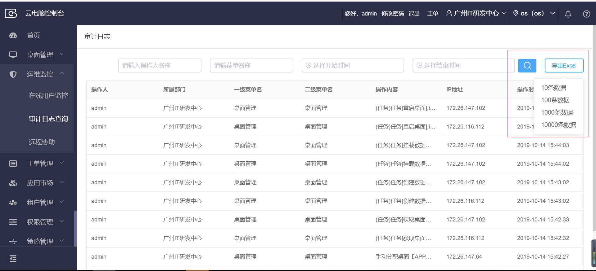

## 3.9  运维监控

### 3.9.1 在线用户查询

【操作场景】

当要查询或统计在线用户、离线用户的数据时，可以使用在线用户查询功能，输入筛选条件，根据条件查询在线、离线用户。

【操作步骤】

步骤1 点击运维监控菜单下的在线用户监控页面。

步骤2 输入部门，在线、离线状态，时间段，用户名等条件。

步骤3 点击查询，根据筛选条件查询符合条件的用户。

### 3.9.2 在线用户导出

【操作场景】

​    当要导出在线用户、离线用户的数据时，可以使用在线用户导出功能，输入筛选条件，根据条件查询出数据，然后选择导出一定数量的数据。

【操作步骤】

步骤1 点击运维监控菜单下的在线用户监控页面。

步骤2 输入部门，在线、离线状态，时间段，用户名等条件。

步骤3 点击查询，根据筛选条件查询符合条件的用户。

步骤4 点击“导出Excel文件”，选择导出前10，100，1000，10000条数据。

### 3.9.3在线时长查询

【操作场景】

​     当要查询或统计在线时长、可以使用在线时长查询功能，输入筛选条件，根据条件查询在线时长用户。

【操作步骤】

步骤1 点击运维监控菜单下的在线用户监控页面。

步骤2 选择部门才能选择桌面桌面池，时间段、用户名等条件。

步骤3 点击查询，根据筛选条件查询符合条件的用户。

【操作步骤】

步骤1 点击运维监控菜单下的在线用户监控页面。

步骤2 点击高级查询

步骤3 导入查询模块，模板下载，上传文件，或选择清除查询模块

### 3.9.4 在线时长导出

【操作场景】

​    当要导出在线时长用户、可以使用在线时长用户导出功能，输入筛选条件，根据条件查询出数据，然后导出查询出数据。或者直接导出全部在线时长用户数据。

【操作步骤】

步骤1 点击运维监控菜单下的在线用户监控页面。

步骤2 点击“导出Excel文件”导出所有在线时长用户。

步骤3 选择部门才能选择桌面桌面池，时间段、用户名等条件。

步骤4 点击查询，根据筛选条件查询符合条件的用户。

步骤5 点击“导出Excel文件”导出符合条件查询出的在线时长用户。

### 3.9.5 审计日志查询

【操作场景】

当要查询某个时间段，某个人做了什么操作时，可以使用审计日志的查询功能，输入筛选条件，根据条件查询出相应的审计日志。

【操作步骤】

步骤1 点击运维监控菜单下的审计日志查询页面。

步骤2 输入操作人名称，菜单名称，开始时间以及结束时间等条件。

步骤3 点击查询，根据筛选条件查询符合条件的审计日志。

### 3.9.6 审计日志导出

【操作场景】

当要导出某个时间段，某个人做了什么操作时，可以使用审计日志的查询功能，输入筛选条件，根据条件查询出相应的审计日志。导出查询出的审计日志，

【操作步骤】

步骤1 点击审计日志查询页面。

步骤2 点击“导出Excel文件”，选择导出前10，100，1000，10000条数据。

步骤3 输入操作人名称，菜单名称，开始时间以及结束时间等条件。

步骤4 点击查询，根据筛选条件查询符合条件的用户。

步骤5 点击“导出Excel文件”，选择导出前10，100，1000，10000条数据。

